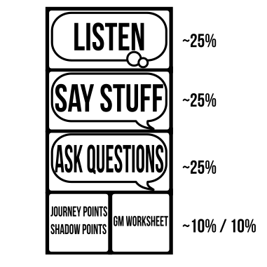
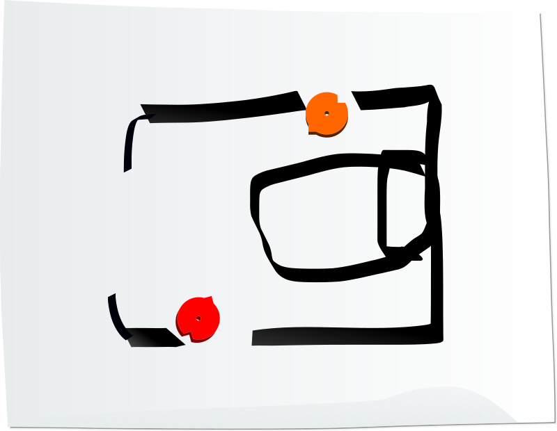
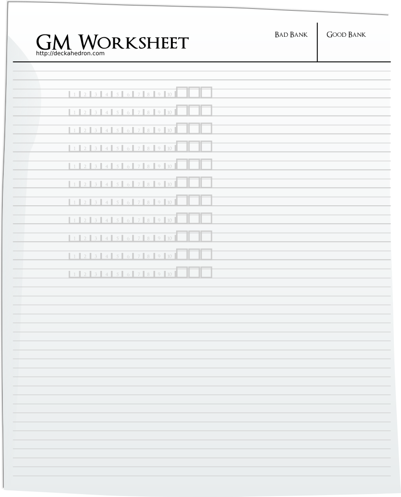
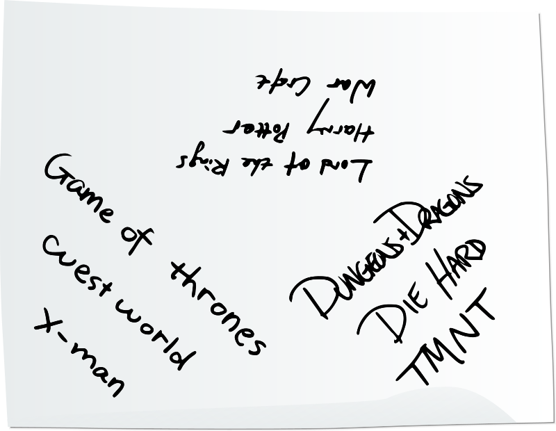
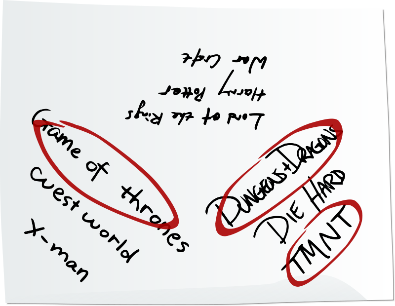
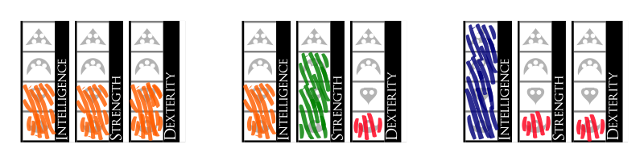
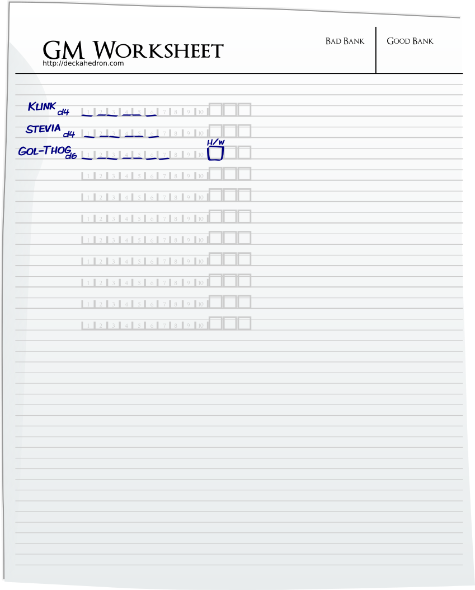

# A Thousand Faces of Adventure: Game Master's Guide

*playtest version* VERSION DATE

*find latest version at https://1kfa.com*

*email sjb@ezide.com*

----

# Should You Read This Guide?

This guide is intended for a Game Master (GM).

Read this guide if you are the volunteer among your friends to run the
game of A Thousand Faces of Adventure (aka 1kFA).

{ width=2.5inch }

Playing as a GM, you will:

 * pitch the idea of playing A Thousand Faces of Adventure to your friends
 * know, teach, and follow the rules
 * describe scenes
 * give Non-Player Characters (NPCs) names, voices, motivations,
   and behavior
 * confront the other players with challenges and dangers
 * ask the other players questions
 * gain and spend Journey Points and Shadow Points
 * take some notes in your GM Worksheet
 * and...

The last responsibility is so important it deserves its own paragraph:

Players will signal the *kinds* of fun they want to have. It is
your responsibility to notice these signals and insert that kind of
fun into the game.

Lastly, *and leastly*, after trying to get unanimous assent from all
players, the GM may *rarely* need to claim final say in a disagreement
so that the game can move forward.

Sometimes the you will meet the above responsibilities with your own
creativity and improvisational skills. For what remains, this book will
help you, particularly the [Guidance](#guidance) section.

# About This Guide

## Definitions: sessions, campaigns, and the narrative

This game is designed to be played in *sessions* which are rougly 3-hour
periods where all the players are sitting together at the table.

During a session, you and your friends will talk about events occurring
in a shared, imagined world. These events, including all the actions taken
by characters, and all descriptions of scenes and assertions of facts are
called *the narrative*.

The entire game-playing-activity that includes the narrative, and also
includes flipping cards and talking about the rules, is called a *campaign*.

There are 3 supported campaign lengths: **One-Shot** -- a campaign that
begins and ends in a single session, **9-hour** -- a campaign that takes
3 sessions, and **30-hour**, which spans up to 10 sessions.

## Organization

This guide covers a lot of ground, from conversations that happen before
the game has even started, to the connection stories have to our inner
humanity, to how many points of damage a trap incurs.

It is recommended that you read the guide once over, and then use it as
reference, picking particular sections to concentrate on one-at-a-time.

If you'd rather start by getting a taste of what this game is all about,
you are recommended start with the [First-time Players](#first-time-players)
section, and then come back to the beginning.

### Examples

To gain a deeper understanding of what to expect, you are invited to visit
[https://www.1kfa.com/examples](https://www.1kfa.com/examples).
There, you will see and hear examples of the game being played.
For all the author's attempt to make this
document clear, brief, and unambiguous, those examples may do a better job
of conveying just what the game is and how it is played.

This guide will equip you with the following information:

 * The Pitch
 * Campaigns: The structure of the narrative
 * Guidance: How to execute your role as GM
 * The procedure to walk first-time players through
 * The procedure for starting a new game
 * Procedures for specific game activities
 * Appendices - extra detail and optional rules

---

# The Pitch

You want to play A Thousand Faces of Adventure with your friends,
but there's lots of other games out there, so what can you say to
bring your friends to the table around *this* game?

Here are some things that make A Thousand Faces of Adventure special. You
know your friends best, so, as you look at this list, think about what they
like and dislike and what they seek from their gaming experience.

 * The Hero's Journey - like the stories told in blockbuster movies, your
   friends will play protagonists who must face adversity to transform
   themselves and their world
 * Players interact with cards and tokens more than sheets of paper,
   which gives a tactile significance and feels familiar to board game
   players
 * Play your favourite universe - use the setting of your favourite
   swords-and-magic universe from pop culture, this game will support it!
 * The "surprise moment" happens for all players simultaneously - the
   moment a card is flipped, the result is *immediately* visible
   to everyone at the table
 * Layered, interlocking mechanisms - player choices move game resources
   and probabilities around - there's depth to explore and skill to build

---

# Campaigns

---

A Thousand Faces of Adventure offers 3 different formats:

 * One-shot Campaign
 * 9-hour Campaign
 * 30-hour Campaign

The narrative you construct by playing will have a beginning, middle,
and end.

If you've played other RPGs that *don't have endings*, ones that go on for
months or even years, this might seem weird to you.
Don't worry, try out a 9-hour campaign and see the results.
You may find your doubts erased.

This game is designed to tell a particular kind of story.
It's called *The Hero's Journey*.

The study of "hero myth" stories was popularized by author Joseph Campbell
in his famous book **The Hero with a Thousand Faces**.

*The Hero's Journey* is a skeleton upon which many successful and popular
movies and books are arranged: Star Wars, Lord of the Rings, The Breakfast
Club, Die Hard, Beowulf, 50 First Dates, the list goes on.
To help you execute a successful and popular *campaign*, the mechanisms
of the game will generate *Journey points* and *Shadow points*.
Generally,
when playing the game causes an event in the narrative to match the next
step of *The Hero's Journey*, a *Journey point* is gained, and when a
player resolves a move with a ✔, (see the section on The Deckahedron in
the Player's Guide), a *Shadow point* is gained.

More specific rules on gaining and using *Journey points* and *Shadow
points* will follow in later sections.

The main premise of *The Hero's Journey* is, characters start out in
a figurative "ordinary world", they go to a "mysterious world", and finally,
they return.

As the narrative is created, you will have opportunities
to shape events. You decide how the world and the NPCs react to the actions of
the PCs, and you have the freedom to describe the "meanwhile" -- all the
goings-on "off-screen".
These are the powers you will need to use to pull the narrative into a
multi-chapter structure, and in each chapter, to earn *Journey points*.

This is the exciting challenge offered to those taking on the mantle of GM.
Using your skills at improvisation and interpretation to cast the actions of
PCs into the desired chapter of the story, finding or inventing hidden
meanings, and tying it all up into repercussions of epic importance is like
solving a living, breathing puzzle.

The game's incentives tie the GM tightly to *The Hero's Journey*.
The other players may just be along for the ride, or they may also want to
contribute to the structure of the narrative. Be on the lookout for signals
that they're into this kind of fun, and use what they express about themes,
relationships, emotional tone, conflicts, and backstory to co-create
the journey.

While you are *incentivized* to produce a narrative with this structure,
due to the unpredictable nature of what other players will say and the
randomness of some game procedures, results may vary.

## It's ok to skip it

You don't need to get every available *Journey point*. You should especially
not try to force it if doing so would sacrifice fun for the players. Remember,
you're not the only author of this story, and while earning points feels nice,
you've got other jobs too, like paying attention to the signals the players
give you about the kind of fun they want to have.

## It's ok to end it

You may find that you and the players have collectively gone as far as you
can. Maybe you've reached the deepest, darkest part of the adventure, and
the characters decide to stay and call it their new home. Maybe they find
a way to destroy something you thought would be permanent, or make permanent
something you thought would be temporary, and that changes the whole conflict
structure of the story. Maybe they found a shortcut or outsmarted the Oracle.

Maybe they all died.

Take a break and ponder. Sometimes you can think of a way to reinterpret
events or move forward with themes while abandoning specifics. Sometimes
you can take a subplot and move it to the forefront.

But sometimes the choice that provides the most fun for everyone is to
just admit that it's over.

Getting *Journey points* is great, but the reason everyone is here
sitting around the table is to *have fun*.

## It's ok to blend it

The boundaries between chapters do not need to be strict, explicitly defined
lines. There may be a natural blending between two adjacent chapters as you
and the players set forth the narrative.

For example, It's common for the 9-hour Campaign to blend chapters 5 and 6.
Maybe the treasure of the dungeon is glimpsed, then the ordeal begins, then
the ordeal gets really serious, and that's the point to really plumb down to
the "dark night of the soul", fully reveal the treasure, and then emerge
to complete the ordeal.

Even when there is a threshold, as in chapters 3 and 7, the different players'
characters might cross over at different times.

## The lengths vary

The final chapter might go very fast, or it might be a long journey home.
The first threshold might be crossed so fast that you only notice after the
fact.
Taking the prize might involve a twisting road of trials, or it might be
one explosive boss battle.

Let the story be what it must be, and *play* to find out the details of what
happens, but also take your opportunities to earn *Journey points* when they
arise.

# One-Shot Campaign

 * Start in a place of normalcy / comfort
 * Cross a threshold with a true choice
 * Take a thing and pay its (mortal?) price
 * Return to the surface, changed.

In a One-Shot campaign, there are 4 potential *Journey points* to earn.

<a name="one-shot-ch-1" />

## Chapter 1: Start in a place of normalcy / comfort

The first *Journey point* is a "gimmie": If you can think of a way to start
all of the PCs in their place of normalcy or comfort, gain a *Journey point*.
The procedure of creating [The Hearth](#the-hearth) in the
[Character Creation](#character-creation) section should virtually guarantee
a *Journey point* here.

Give the players a chance to establish what "normal" is for their characters.
This is an environment that they can manage. They know what to expect here,
and to survive here requires no fundamental change on their part.

Here, the players can get a feel for taking actions and having some dialogue
in-character.
Perhaps they have some interactions with NPCs familiar to them.
Perhaps they describe their character moving through the environment while
describing specific details.
Perhaps the characters get into conflict: social, or physical.

As you are playing this out, you should be looking out for two things:

 1. Opportunities to establish a *need* that will move the story to Chapter 2
    * signs of an approaching threat
    * what about their home annoys, frustrates, or stifles them?
 2. A premise. Listen for a statement or action that asserts a fundamental truth
    * "Nobody bakes a pie like Herbert"
    * "Shelbyville thinks they're so great, but really, they stink"
    * "I'm just a Hobbit, I can't steal from a dragon"
    * "Things will go on like this forever"
    * "As long as there's a tree to climb, I don't have to worry about wolves"
    * "If only you could see things from my perspective"

During [Character Creation](#character-creation), each player will choose a
[Fateful Moment](#choose-fateful-moments) for their character. Pursuit of a
Fateful Moment often produces the *need*.

You should make a note of any premise, so you can use it later when creating
puzzles, monsters and villains.

<a name="one-shot-ch-2" />

## Chapter 2: Cross a threshold with a true choice

As the game progresses, the conversation at the table will start
establishing details about the world and about relationships between
characters. Find areas of tension and try to develop that tension.
Push characters into discomfort. Raise the stakes. Then look for a
*threshold*. Look for some line that, once crossed, they can't simply turn
around and go back.

Importantly, once they cross this line, The Hearth will not be available
to them. It might just be far away, or something could narratively or
symbolically separate them from The Hearth. It could be broken, stolen,
run out of fuel, etc.

The players might enthusiastically seek out a threshold, they might even
cross over before you've figured out what it should be (if so, all that's
left for you is to mark yourself a *Journey point*). More likely though,
you will need to increase the pressures in their "home" to gently nudge
the characters up against that threshold.

But, if you want that *Journey point*, **don't push them through.**

If the players choose to step their characters through the threshold,
if all of them cross the threshold and step away from their ordinary world
into a mysterious world of danger and adventure, gain a *Journey point*.

Otherwise, you'll have to push them through. Create a cave-in, a magical
force-field, or reveal something that unveils mystery
in the world they inhabit: eg, a seeming ally is actually a betrayer,
for the adventure doesn't truly begin until the PCs find themselves inside
the mysterious world, where The Hearth is unavailable to them.

### Hooks

A common way to get players to choose to go through the threshold is to create
a "hook". Here are some things to think about to help you invent a hook:

 * Capture, Obstruct, Prevent
    - What is "loose" and causing trouble?
    - What is in the wrong hands or needs to be brought back into the fold?
 * Chase or Race
    - Who else has already begun seeking out the prize?
    - How long until a threat arrives here?
    - How might the hunter become the hunted?
 * Rescue or Regain
    - Who or what was taken, and where does it rightfully belong?
    - What power does the precious thing posses?
 * Re-order, Rearrange, Fortify
    - What is unbalanced, and what effect does that have on the world?
    - Who is not doing their job?
    - What special protection needs to be put around The Hearth?
 * Forbidden Act
    - What is the rule that must not be broken?
    - Who forbids it?
    - What power structure does the rule support?

<a name="one-shot-ch-3" />

## Chapter 3: Take a thing and pay its (mortal?) price

Here in the mysterious world, players take greater risks, and have an
opportunity to earn something *epic* for their characters.
It can be a great treasure, it can be fame and renown, it can be weaponry, a
magical boon, the elusive respect of an NPC, it can even be an appreciation
for the power of friendship. (Pixar and Disney have some *incredibly*
well-done Hero's Journey stories.)

### Death Is Real Here

This is the chapter of the game where characters are most at risk to lose all
of their Stamina points. In other chapters of the story, the GM may choose to
narrate this as unconsciousness, imprisonment, or something else that
the character will naturally recover from.

But not in this chapter.

If the character loses all their Stamina in this chapter of the story, the GM
should represent this as "death". Death should be handled as a removal of the
character, and by extension, the player from being able to impact the events
of the narrative.

See the Combat section in the Player's Guide for the full rules on Stamina
loss.

Should death happen, Make it epic.
Give the character a final stand that saves the day, or gives the other party
members a chance to survive an enormous threat. A moment of tremendous,
meaningful sacrifice. Look for what the character symbolized, or what niche
they filled in the party's personality, and amplify that symbol or personality
aspect to be everyone's salvation.

Also realize you can give them a second chance at life. If you don't want a
gritty, hardcore vibe in your campaign, you don't have to let the death stand.
For rules on resurrection, see [Using Journey Points](#using-journey-points).

### The Prize

It's important not to create a prize that just seems cool to you, the GM.
The prize should follow from the fiction. It should be something that is
actually wanted or needed by the players' characters. Pay attention to them,
they are the protagonists in an odyssey. What would be miraculous for them to
receive?

Maybe you don't have to *create* the prize at all. What have the players
been talking about, is there already a specific goal? What themes have already
emerged through the action, dialogue, and relationships? Thinking
symbolically, what is something that is equivalent to
[The Hearth](#the-hearth), or might magically cause its rekindling?

The "prize" can be something completely related to the narrative, or it can
invoke the mechanisms of the game, or both.

In revealing the prize, you may "break the rules" by removing
a cost or condition of the Tales of a Weapon move or the Study Under a Master
move. This detour from the rules only applies to this chapter and should be
narratively justified.

Put that prize in a terribly difficult location.

It could be at the end of a road of trials, or inside the cave where they
must conquer their greatest fear, or in the clutches of their most powerful
adversary.

### Allot Shadow Points

After the fictional set-up of the challenge to earn the prize,
draw a circle around **all** of the *Shadow points*.
To earn the *Journey point* of this chapter, all of these *Shadow points*
must be spent before the characters get a chance to Rest.

If you can do this, when they complete the challenge that used up the last of
the set-aside *Shadow points*, give them the prize of this mysterious world
and add a new *Journey point* on your GM worksheet.

Note: after the circle is drawn, players making moves may cause new *Shadow
points* to be added, but the new points should be marked outside of the circle.

<a name="one-shot-ch-4" />

## Chapter 4: Return to the surface, changed.

In the final chapter, find a way to return the characters "home". It need not
be their literal home, nor does it need to be where the adventure started,
geographically. The important thing is: at this stage in the narrative
The Hearth is available again.

You are free to "re-imagine" The Hearth here. If it was previously the song
of the Wood Elves, it can now be the song of the Iron Gnomes. If you keep
the emotional core the same, you can change superficial details. But give
the players enough superficial hints to recognize it.

The heroes are "home", but they are changed. They have been on an adventure,
seen things, done things. They are now masters of a new way of existing,
unafraid of crossing into the previously "alien" world.

By dialogue or action, each player character should exhibit their change.

This can play out in many ways:

 * by using their newfound power to deal with the bullies that previously
   tormented them
 * though they dutifully swore to their holy order to keep this quest secret,
   when they travel back through the badlands, they share the seeds of the
   foreverfruit with the impoverished village that showed them hospitality
 * by not screwing up for once in the eyes of their family, and delivering
   the elves' ointment to cure their grandfather of Medusa's curse
 * by re-igniting the war as they were bade, like a good soldier, but then
   returning to challenge their clan-lord for leadership
 * by being cast out of yet another city, but this time they're on the road
   with mirth in their step and a horse pulling sixteen barrels of mead

Gain your final *Journey point* if you can hit this note.

# 9-hour Campaign

The 9-hour Campaign is a bit more complicated. Committing these 8 points
to memory will make it go a little easier:

 1. You
 1. Need
 1. Go
 1. Search
 1. Find
 1. Take & Pay
 1. Return
 1. Change

This compact formulation of The Hero's Journey is inspired by Dan
Harmon's "Story Circle".

<a name="9-hour-ch-1" />

## Chapter 1: You

**AKA: Start in a place of normalcy / comfort**

Your sacred space is where you can find yourself over and over again.

In the 9-hour campaign, start the game just like you would in the One-shot
campaign. See [Chapter 1 of the One-Shot Campaign](#one-shot-ch-1)

<a name="9-hour-ch-2" />

## Chapter 2: Need

**AKA: Call to adventure**

You must give up the life you planned in order to have the life
that is waiting for you.

In this chapter, the characters still feel safe, but discover that there
is something they need to do soon, or somewhere they need to go.
This is also a great chapter for the characters to express premises.

This chapter is an opportunity for players to elaborate their characters'
relationships, interests, and skills.
Provide a sandbox to play in, let the players establish what their
characters value here in the sandbox. Try to give them some choices that
express themes of the Touchstone List. Will they choose harmony over
freedom? Freedom over peace? Peace over progress?

### The Threat

While this is playing out, reveal that something valuable is threatened.
This valuable thing is often The Hearth itself, but it could be many things,
up to and including the known universe. If you are ever struggling to decide,
just choose The Hearth or ask the table.

The threat might be revealed by an NPC that acts as a "Herald".
This is someone that appears with a message about something from the
mysterious world where it is dangerous to venture. Usually this mysterious
world or one of it's denizens is the force behind the threat.

 * The village medium
 * A raven arrives from the neighboring kingdom
 * A ragged wanderer appears out of the wilderness

The threat might be revealed by using the game rules and playing out a
challenge that the PCs cannot *yet* overcome. If this plays out as combat,
be honest about the size of this threat - the PCs may fight something they
cannot subdue. It may result in their defeat and incapacitation.

### The Mission

Establishing the need serves a purpose for both the narrative and for the *game*.
The characters *need* the things they will get when the players *play* the game.

 * Maybe the characters are defeated in a first encounter
   * The players **need** more power, in a broad sense
 * Maybe a spell or skill would exploit the threat's weakness
   * The players **need** more moves / items
 * Maybe characters' knowledge is lacking
   * The players **need** information from the mysterious world
 * Maybe characters' place of comfort is exposed as insufficient
   * The players **need** a dangerous place to grow / explore / stretch their legs

This unstoppable threat should come alongside a suggestion of hope. NPCs can
be very useful to propose this last thread of hope.

 * "The Oracle will know what to do, she always knows."
 * "Khalrielle perished in the badlands, but maybe her sword survived."
 * The Herald makes a promise or proposes a trade
 * A command from a superior: "Come with me, and do your part. We shall prevail."

When it seems clear that the PCs are aligned towards a common goal, ask the
table to formulate their goal as a 2-6 word phrase. When this is decided, write
the phrase down on the same sheet as the Touchstone List.
If you do this, gain a *Journey point* and aim to move the plot to the next
phase.

This threatening force will progress no matter the characters' choices and will
pervade the narrative. A common narrative device in movies is "The Refusal of
the Call" wherein the protagonists deny the Call to Adventure. If the PCs
refuse their call, continue ramping up the tension and expose the downsides of
that choice. It will lead naturally to Chapter 3.

<a name="9-hour-ch-3" />

## Chapter 3: Go

**AKA: Threshold and Threshold Guardian**

We must be willing to let go of the life we planned so as to
have the life that is waiting for us.

In the 9-hour campaign, run Chapter 3 just like you would in the "Cross a
Threshold" chapter of the One-shot campaign. The *Journey point* is gained
when the PCs cross a threshold with a true choice.
See [Chapter 2 of the One-Shot Campaign](#one-shot-ch-2)

In a 9-hour campaign, the characters might have built up a little more
XP or other resources than they would have in the One-shot campaign. One
way to make the threshold-crossing choice more dramatic is to set up
a resource-depleting challenge that blocks the threshold. This challenge
is called a "Threshold Guardian" and is often expressed in the narrative
as a literal guardian - some kind of monster.

Another way to dramatize the threshold crossing is to make the choice about
whether or not to enter the mysterious world *alone*. Maybe the portal is
closing, maybe their NPC allies are buying them time. Maybe these PC
halflings are the only ones who will fit into the goblin armor.

<a name="9-hour-ch-4" />

## Chapter 4: Search

**AKA: Road of Trials**

**AKA: Fun & Games**

The fates lead him who will; him who won't they drag.

The characters have now entered a situation that is not ordinary, not
comfortable. There is mystery here, unknowns, new people, new territory.
Their old coping mechanisms and skills will not have the same effectiveness
as before. Consequences will change and heighten. New skills will be
learned, new friendships established. New enemies will emerge.

The **Search** should deliver "the promise of the premise". Go back to
your Touchstone List and ask yourself some questions. What is the "juice" here?
What spectacle, what adventure might the players have been fantasizing about
when they chose the titles you see on this list? Don't be shy about copying.

### Allot Shadow Points

To begin the **Search** chapter of the story, circle **half** of your
*Shadow points*.

This new mysterious is dangerous. The circled *Shadow points* represent
this. Show the players that they might need to be smarter now. Problems are
not solved here as easily as in the place of comfort.

### New Problems, New Solutions

At least once during the **Search**, give each player a chance to use the
Study Under a Master or Shop / Procure moves and give each player a chance to
use the skill or item they chose.

### The Power and Magic of the Mysterious World

Make an exhibition of how this world has power unlike their place of comfort.
There are forces here that aren't understood. Those forces can be scary, yes,
but they can also be miraculous.

Use one of your *Journey points* to make this exhibition.

### Finishing the Search

You achieve your GM goal in the **Search** phase if

 * you gave each player a chance to "level up" their character and use their
   new skills or items
 * and you used at least one *Journey point*
 * and you used all the circled *Shadow points* you circled at the beginning

If you do this, gain a *Journey point* and aim to move the plot to the next
phase.

<a name="9-hour-ch-5" />

## Chapter 5: Find

**AKA: Dark night of the soul**

**AKA: Find the Hero within**

When the narrative arrives at a point of relative quiet or peace, maybe
during a Seek Help or Rest move, have an honest conversation with your
players.

This is a time for total vulnerability, weightlessness, and revelation.
It is a time for the entire identity of the protagonists to "hang in the
balance.
Using dreamlike and mystical imagery in your exposition can be a great way
to dress the stage.

Taking a moment to change the background music can be especially effective
in Chapter 5.

Tell your players how you interpret the plot so far. Revisit where they've
been, reinforce where they've arrived and say what it all means to you.
Not as the sole author of a story, but as an interpreter of your shared
authorship. Tell them how you see their characters, what they value, what
they might represent metaphorically.

 And where we had thought to find an abomination, we shall find a god;
 where we had thought to slay another, we shall slay ourselves;
 where we had thought to travel outward, we shall come to the center of our own existence;
 where we had thought to be alone, we shall be with all the world.

Go around to each player and ask them

 * What direction forward does your character see as possible from here, or
   does your character want to just stay right where they are?
 * Will your character sacrifice their life for something valuable in the
   plot? If so, what, and why?
 * Have the events of this journey caused your character to give up a
   "premise" -- a *fundamental* belief or relationship they held at the
   beginning of the game?

Make a note of all the answers.

Next, ask any players still using the "Lucky" Stamina system if they're ready
to switch over to the "Heroic" Stamina system. This is an opportunity for a
player to gain more control in exchange for higher difficulty. If they say yes,
make a note of it.

If each character answered "stay", "sacrifice", or "abandon" to any of the
questions above, or if any player switched from "Lucky" to "Heroic", gain
a *Journey point*.

<a name="9-hour-ch-6" />

## Chapter 6: Take & Pay

**AKA: The Ordeal**

Where you stumble and fall, there you will find gold.

Just before this chapter, if you can give the players an opportunity to gain
new skills or equipment for their characters, you should. They're going to
need it.

The characters have learned something in this mysterious place that is
the key to both worlds. Maybe they learned something about themselves, maybe
they received a great boon or symbol. Maybe they met a goddess that whispered
a secret of the universe. Maybe they met their father. It could be something
very literal, like the skill they just learned or a spear enchanted to pass
through dragon's hide.

This is the thing that will answer the **Need**.

### Allot Shadow Points

When you're ready, set up a challenge in the narrative, then draw a circle
around **all** of the unused *Shadow points* on your GM Worksheet.
To earn the *Journey point* of this chapter, use all the circled points
before the characters get a chance to Rest.

### Death Is Real Here

Just as in the One-Shot campaign's Chapter 3, in this Chapter, the consequence
for full Stamina loss is death.

<a name="9-hour-ch-7" />

## Chapter 7: Return

You must give up the life you planned in order to have the life that
is waiting for you.

This is a time to consider grief and acceptance.

Ask the players what their characters will miss most about the world they're
leaving behind. NPCs left behind? A fellow PC that died? It can be anything.

Then ask the players how their characters will be received when they return.
Was a **Need** established in Chapter 2, and if so, will the characters be
able to answer it? Will the people of the ordinary world accept the characters
back? Will they accept whatever treasure might have been found in Chapter 6?
Will the dragon-piercing spear actually work against the dragon?

What changes have happened in the familiar world, with our heroes being gone
so long?

Did a player's character die in an earlier chapter? Will their friends and
family accept the survivors?

Maybe the answers aren't clear, and you need to set up scenes and get everyone
to flesh them out.

Bring the story to a threshold. A doorway that will seal shut once crossed.
A monster that once slain, will change everything forever. A volcano that must
be extinguished or exploded.

Build one final challenge for your players, a "Threshold Guardian".
This can be a mob of villagers whose minds must be changed, it can be their
cleverest adversary, or it can be that invulnerable dragon.

Gain a *Journey point* if you confront the PCs with a monster, challenge,
or obstacle that embodies:

 * grief: anger, bargaining, depression, denial
 * rejection of how the characters have changed
 * rejection of emotional growth
 * rejection that this story must end

<a name="9-hour-ch-8" />

## Chapter 8: Change

**AKA: Freedom from the fear of death**

We're not on our journey to save the world but to save ourselves.
But in doing that you save the world. The influence of a vital person vitalizes.

When the characters return back to the ordinary world, they will have to
defeat the Threshold Guardian, or if that chapter was skipped, they will have
to come to terms with where they've been and who they are now.
Each character's story resolves differently. Where does their new
power lie? Items? Skills? Relationships? Knowledge? Something else?

### The Chapter 8 Move: Reveal The Hearth

The first time any PC:

 * employs skills or treasures the they attained during their adventure
   to defeat the Threshold Guardian
 * attempts to banish something alien that came through the threshold by
   using a gift they attained in the mysterious world
 * inspires an NPC from the ordinary world to be something more, to cast
   away who they've been historically and to change.
 * wishes for something left behind on the other side of the threshold
 * presumes they are doomed, but chooses to defy death and struggle on

Use a *Journey point* to Reveal The Hearth. The Hearth was the
specific people, food, song, environmental feature, ritual or festival,
or group activity that was identified at the beginning of the game.

Describe how The Hearth which has been inaccessible, snuffed out, or hidden
since the characters crossed the first threshold is now rekindled, reborn,
re-imagined or its inheritor is revealed. All the PCs now have a chance to
fully heal their wounds.

For every wound healed, gain another *Journey point*.

# 30-hour Campaign

A 30-hour campaign is a trilogy of 9-hour campaigns, called "Books", with
slight rules tweaks in the Book 2 and Book 3.

Book 1 will play just the same as the 9-hour campaign. The PCs
will venture from their original home into a mysterious world, and return.

## Book 2

At the beginning of Book 2, make a new GM Worksheet. Copy over any
leftover *Journey points* and *Shadow points* from Book 1 onto
this sheet.

During Chapter 7 of Book 2, the PCs do not return to their original home.
They return to a place that has some elements of their original home,
but it is not where they came from.

These elements may include:

 * Characters (friends and family)
 * Safety and comfort (even if temporary)
 * The Hearth

Only gain a *Journey point* during Chapter 7 if the threshold they cross
brings them to a place like this.

## Book 3

At the beginning of Book 3, make a new GM Worksheet. Copy over any
leftover *Shadow points* from Book 2 onto this sheet. This Book starts
with **zero** *Journey points*.

In Book 3, *Shadow points* grow at double the normal rate:

 * ✅︎ gains you 2 *Shadow points*
 * on *FAST* moves, ✗ gains you 4 *Shadow points*

Chapter 7 of Book 3 can return the PCs to their original home or wherever
makes narrative sense.

In this Book, show downsides of the narrative character changes made earlier.
Will the characters give up their earlier accomplishments or boons to
attempt for even greater ones?

Try creating some monsters with immunities specific to the PCs' strengths.
How will the PCs react if the prizes earned in their earlier adventures are
rendered useless?

# The real juice

When you gather with friends you care about, sit around a table, and tell
stories, you are sharing in a great power.

There is a second journey that happens during play, and that is the journey
that the players are on. Not the *characters*. The *players*.

Every thought, idea, action expressed in the narrative came from a player, one
of your friends. Even the most ephemeral or small contribution is special
because it was unique to that person in that context.

To make a campaign really great, pay attention to
*who* your friends are and guess at *why* they are expressing their character
the way they do. Then use those guesses in the story.

This power, this "juice", this "second journey", is difficult to fully
express in words. The narrative you create together is a means to explore
*the human experience*. To exist *in the moment*. Create a model of
reality, drop an avatar for yourself into it, distance your "real" self from
it, and **play** at being different. Be free to express anger, affection,
pain, the whole field of emotion, even that territory that is kept
walled-off to cope with everyday life and behave harmoniously in society.

Just like the fictional characters who cross over to a mysterious world,
face the unknown, and return to the ordinary world, we players can choose to
cross over and **play**, explore our unconsciousness, and find ourselves
changed by what we confronted, unchained, poked, or set free down there.

# Guidance

The GM is part narrator, part host, part referee. It's a lot! How does a GM
*play* this game?

Crucially, know that the GM is a **player** who *makes moves*.
Primarily, when an ✗ gets flipped, you get to make a move.

You also get to make a move when:

 * Everyone at the table looks to you
 * A PC takes an action that you have especially prepared for

Always **Describe the immediate situation around the characters**. This
is how you start a session, how you get things rolling after a snack break,
get back on track after a great joke: tell them what the situation is in
concrete terms.

Use detail and *senses* to draw them in. The situation isn't just an orc
charging you, it's an orc painted in blood swinging a hammer and screaming
orcish battle prayers. You can leverage a lack of information, too. The
sound of clattering armor and shuffling feet, for instance.

The situation around the players is rarely "everything's great, nothing to
worry about". They're adventurers going on adventures -- give them something
to react to.

----

Here are the 6 main goals a GM pursues in this game.

 * Portray the world of the Touchstone List
 * Fill the characters' lives with adventure
 * Move the spotlight fairly
 * Ask the players questions
 * Make GM Moves
 * Achieve your next *Journey point*

As the conversation at the table unfolds, refer to this list whenever
you find yourself searching for what to say next.

## Portray the World of the Touchstone List

One of the first things your group will do when you begin a campaign is
create a universe -- the fictional setting in which the PCs will be
adventuring. This setting is expressed by something called the
[Touchstone List](#establish-touchstones).

A Thousand Faces of Adventure is about characters who have decided to
take up an adventure in the hopes of fulfilling a strong need. It's your job
to participate in that by showing the players a mysterious and dangerous
world in which their characters can find that adventure.
Without the player characters in the world, calamity would ruin something
precious.
Maybe even the whole world would fall into chaos or destruction -- it might
still, even with them.
It's up to you to portray the fantastic and bizarre elements of that world.
Show the players the wonders of the world they're in and encourage them to
react to it.

Always know that the Touchstone List is there to support you in portraying
this world. Look at the titles written there. Remember those books,
movies and TV shows, and lift something directly from those stories. Lift
animals, characters, environments, situations, lift whole cities if you
want to.
Remember Picasso's words: "Good artists copy, great artists steal".

The main point is to describe and emphasize the fictional situation to the
players at the table. Give the players details so that they can grasp the
stakes of their decisions.
Give the players inspiring material to help them come up with answers when
you ask them questions.

## Fill the Characters' Lives With Adventure

**Filling the characters' lives with adventure** means working with the
players to create a world that's engaging and dynamic. Adventurers are
always caught up in some dangerous situation or another -- encourage and
foster that kind of action in the game.

Always portray a setting in motion -- someplace significant with creatures
big and small pursuing their own goals. As the players come into
conflict with that setting and its denizens, action is inevitable. You’ll
honestly portray the repercussions of that action.

Introduce challenges. Unfriendly NPCs, monsters, puzzles, or the troubles
of the setting should regularly confront the characters.

## Move the spotlight fairly

The general attention of people sitting at the table is called "the
spotlight". Participants tend to talk one-at-a-time, while all others wait in
excited anticipation.

The GM is tasked with managing the "when" of the spotlight. When does one
player's contribution end, and the next player's begin? When has a player
said something that triggers a move? When is it time for the players to all
sit back and suffer or delight as the GM describes the consequences of
their decisions?

Never let a player's time in the spotlight be inconsequential. A player
might wait 10 minutes for their moment to arrive, so if their whole turn in the
spotlight ends with "nothing happens", that player's experience will suffer.
Give them an opportunity for something. This doesn't mean they have to slay
a demon on every turn, merely getting a big laugh can be "something".

Remember, this is a collaborative story.  Laughter and excitement
are the rewards for everyone.

Allow the players to naturally move the spotlight among themselves.

As the GM, you may take a turn in the spotlight:

 * when someone flips ✗ (or sometimes just ✅︎)
 * as specifically instructed by a move a player is executing
 * when everyone looks to you to see what happens
 * when a character encounters something you've been preparing for

Usually your turn in the spotlight will be spent making a **GM move**.
But it may also just be general narration.

## Ask the Players Questions

A Thousand Faces of Adventure is a conversation. The GM is not the only
storyteller at the table. **Ask the players questions**
and use the answers.  Embrace your curiosity.

When you run Sarukkan's Chamber, there are some built-in prompts to give
you some practice asking questions that fill in the details of a scene or
give personality to NPCs.

There are also questions that you will need to ask to establish what rules
apply: "What is your character trying to accomplish?", "Is anyone else
helping?", "Who is taking the lead?".

The easiest question to use is "What do you do?". Whenever you make a GM move,
end with "What do you do?". You don't even have to ask the person you made
the move against. Take that chance to shift focus elsewhere.

The questions that gave the characters flesh during character creation are
examples of asking questions and using the answers. You can always go back
and pull more buckets up from that well. If a character is religious, ask
them what their gods would have to say. If there's a halfling in the party,
ask how hungry the current scene makes them.

Try asking the players to describe outcomes. For example, if a player's
character is in a fight with a goblin and the player gets an amazing *attack
power* roll of 10, the GM might ask the player, "Describe how your character
kills the goblin". This gives the player license to get flowery and really see
their character as a powerful hero in this fantasy world.

When you're stumped for what happens next, ask a player to fill in the details.
Consider where you are in the
[Campaign](#campaigns), and ask a leading question.
Use their answer to describe the next scene or introduce the next challenge.

| Chapter         | Question
|-----------------|------------------------------------------------------
| Home / You      | What's the one rule you're not supposed to break?
| Need            | What do you wish people here could see the beauty of?
| Go              | Who do you hope won't try to get in your way?
| Search          | What strange custom do they practice here?
| Find            | *this stage has it's own set of questions*
| Take / Pay      | A great trembling is felt. What's that sound? / A figure approaches. You thought they were dead, who is it? (engage their fear / grief)
| Return          | *this stage has it's own set of questions*
| Change          | Which old friend or adversary is the first to greet you?

### Lateral Questions

Other questions to ask are lateral questions.
These are questions that have nothing to do with the current scene, but
prompt everyone, especially you, to *think laterally*. These can be great
to inspire you:

 * If you just need a name for an NPC or location
 * If you want to insert a danger into a scene
 * If you want an NPC to respond, but don't have dialogue, voice, or
   personality ready
 * If you need an idea for a puzzle or a monster

Example lateral questions:

 * What's a city in Europe?
 * What vegetable did you eat yesterday?
 * Who is the worst Hollywood director?
 * What was your worst childhood injury or illness?
 * Name a one-hit wonder musical group.
 * Name a shop where women buy clothing.
 * What's something you buy at a hardware store?
 * What's my mother's favourite TV show?
 * What do kids find when turning over stones in a garden?
 * Name something people believe in that isn't real.

### Helping Unsure Players

Sometimes when you ask a player a question, they will simply respond
"I don't know". This can be a signal that the player isn't having fun, and
might need some direction. It can be difficult to just make stuff up about
a character that doesn't really exist moving around in a purely
imagined world.

Think about how this player has signaled what they've found fun. Do they
seem to enjoy the *fictional* parts of the game, or the *mechanical* parts?

If they're enjoying the fiction, ask them what would happen to this character
if this was a movie, or use the titles from the Touchstone List. Ask them if
they're ok with their character being put in jeopardy, or if that makes them
uncomfortable. Ask them what the character's *most immediate* motivation might
be.

If they're enjoying the mechanical game, ask them what resource they're
after: XP? precious items? powerful weapons? move cards? Then ask what they
think the shortest path is to get the thing they're after. Help them see the
necessary steps to get what they want.

In either case, you're nudging them towards making a decision to accomplish
a goal. They might need to accept that getting what they want means taking
a risk. In fact, the game is designed to reward more XP to riskier choices
(triggering lower-level moves is more likely to generate XP than higher-level
moves).

Use this as an opportunity to take feedback as well. Have you made the
situation *clear*? It's ok to have a conversation about the conversation.

## Make GM Moves

Often the players will move the story forward by having their characters
talk and do actions that are certain (you don't call for flips unless actions
or consequences are uncertain), so there may be long stretches where a GM
doesn't need to jump in.

But when your turn comes, here are the options available to shake things up:

 * Escalate the danger
 * Reveal an unwelcome truth
 * Show signs of an approaching threat
 * Deal damage
 * Use up their resources
 * Turn their move back on them
 * Separate them
 * Give an opportunity that fits a player's cards or character's background
 * Show a downside to their appearance, reputation, or equipment
 * Offer an opportunity, with or without cost
 * Tell them the requirements or consequences and ask

During the execution of a GM move, tools may be employed to generate ideas
and make decisions:

 * Ask players questions
 * Ask players to reveal a card from their Deckahedron (this doesn't count
   as a flip, this is just the GM using randomness to help make a decision)
 * Put on some music
 * Use an improv game

Try to keep up the excitement and pace of play with your GM moves, but also
know that it's ok to invest a little in making them significant and to pause
for a second to think through some repercussions. Will the move you make
drive the story toward your next *Journey point*?

Note that the move you execute in play may actually overlap multiple moves
on this list. That's ok, creating honest fictional responses sometimes
demands it. For example, "deal damage" is a move, but other moves may include
damage as well.

### A GM move is not restricted to the player move that caused it

Understand that when a player resolves a flip with ✗, that doesn't always
mean that the thing they were attempting fails.

The GM is free to let the character accomplish the thing, but may use the
flip result to bring new action and intrigue into the story.

Let's say a player's character is a thief infiltrating a stronghold, hired
to steal a fabled yellow amulet. Maybe the character attempts to climb over
a wall to avoid being seen by guards. Consider the following consequences
of an ✗:

 * You fail to get over in time and the guards start yelling and pulling at
   your boots
   (Escalate the danger)
 * You climb over, but as you do so, you overhear the guards in friendly
   conversation with someone that sounds a lot like the fence that hired you
   for this caper
   (Reveal an unwelcome truth)
 * You climb over. You pause for a second to listen for the guards' passing.
   You hear their footsteps slow, then stop. Have they found something?
   Suddenly, one barks an order "Get to the tower and sound the alarm. Run!"
   (Show signs of an approaching threat)
 * You climb over. The camera pans up to the dark sky, we see grey feathered
   beasts with the faces of birdlike wolves, each flap of their wings loud and
   ominous. Their tails end in a glowing yellow shape extremely similar to the
   description of the amulet.
   (Show signs of an approaching threat)

The first example is pretty straightforward, a thing was tried, it
failed, the character suffers the direct consequences.

In the remaining three examples, the character got to the other side of the
wall safely. A fictional cue triggered the move, the mechanisms of the rules
were engaged, and then the GM chose to create new, separate, fictional
badness. The fiction produced by the engaging the rules does not have to be
constrained to the fiction that engaged them.

The last example does something even more strange. It talks about a
disembodied "camera" and portrays a scene to the *players*, but not to the
*characters*. This is a fun stylistic choice, but it may not please every
group. If you describe the world like a movie, you're asking players to be
audience, not actors. Listen to your players to decide if this is right
for your table.

Always be on the lookout for signals from the players for the kind of fun
they want to have.

### Escalate the Danger

The fictional world is full of danger. Adventurers are constantly being
surprised by what's around the next corner or the thing that has been
stalking them from the shadows.

Monsters have special attacks. Use these special attacks.

The location itself can produce danger. Are the PCs on a sinking ship, or
a crumbling tomb? Announce that the deck they're on floods, or that the
passage that led them in is now blocked by tons of rubble.

### Reveal an unwelcome truth

An unwelcome truth is a fact the players wish wasn't true: that the room's
been trapped, maybe, or that the helpful goblin is actually a spy. Reveal
to the players just how much trouble they're in.

### Show signs of an approaching threat

This is one of your most versatile moves. "Threat" means anything bad
that's on the way. With this move, you just show them that something's
going to happen unless they do something about it.

### Deal damage

When you deal damage, choose one source of damage that's fictionally
threatening a character and apply it. In combat with a lizard man?
It stabs you. Fell off the old bridge? Land on a rock.

Failed moves like Mix It Up and Defy Danger can base their damage on
a die roll. When a player takes damage, tell them what to roll. You
never need to touch the dice.

At other times, the amount of damage might be determined by Shadow Points.
See [Using Shadow Points](#using-shadow-points).

### Use up their resources

Surviving in dangerous places often comes down to supplies. With this
move, something happens to use up some resource: weapons, armor, magical
item charges, ongoing magical effects. You don’t always have to use it
up permanently.

A sword might be flung to the other side of the room. Walking across
the shimmering barrier might end any ongoing magic effects, etc.

An easy way to decide on what resource to use up is to look to the cards
in front of a player:

 * End ONGOING effects of magic items
 * Remove green cards from magic items for temporary charge loss
 * Reduce magic item charge capacity
 * Place black-side red cards on mundane items for damage
 * Take away Pack cards
 * Take away Item cards (careful with this one - use only when appropriate)
 * Take away marker tokens (ie, those created by Where It Hurts, etc.)

Note, **a GM cannot take XP from a player**. Use of XP should always be
a player choice.

### Turn Their Move Back On Them

Think about the benefits a move might grant a character and turn them around
in a negative way. Alternately, grant the same advantage to someone who has
it out for the characters.

If Ivy has learned of Duke Horst's men approaching from the east, maybe a
scout has spotted her, too.

### Separate Them

There are few things worse than being in the middle of a raging battle with
blood-thirsty hawkhounds on all sides -- one of those things is being in the
middle of that battle with no one at your back.

Separating the characters can mean anything from being pushed apart in the
heat of battle to being teleported to the far end of the dungeon. Whatever
way it occurs, it's bound to cause problems.

### Give an opportunity that fits a player's cards or character's background

Every character has unique move cards for skills that they shine at, or has a
fictional backstory that can overcome social obstacles or tests of knowledge.

Present an opportunity that plays into one character's domain.

It doesn't have to be a character that's in the current scene though.
Sometimes a locked door stands between you and treasure and there's no
lock-picking expert in sight. This is an invitation for invention, bargaining,
and creativity.

Traps, ambushes, and locked doors are great examples.
Need some Derring-Do to avoid giant clock-tower gears?
Maybe proof of religious or guild affiliation would confer a backstage pass?

### Show a downside to their appearance, reputation, or equipment

Just as every character shines, they all have their unique weaknesses too. Do
orcs have a special thirst for elven blood? Is an ongoing flow of magic
disturbing dangerous forces? The torch that lights the way also draws
attention from eyes in the dark.

### Offer an opportunity, with or without cost

Show them something they want: riches, power, glory. If you want, you can
associate some cost with it too, of course.

Remember to lead with the fiction. You don't say, "This area isn't dangerous
so you can make camp here, if you're willing to take the time." You make it
a solid fictional thing and say, "Helferth's blessings still hang around the
shattered altar. It's a safe area to rest or plan, but the chanting from the
ritual chamber is getting louder. What do you do?"

### Tell the requirements or consequences and ask

"Ok, everyone flees from the hammer-camels, heading towards the water, but
let me ask this first: Samwise is wearing plate armour. If he leaves it
behind on the bank of the river, will someone else provide a distraction so
he can remove it? Or Samwise can keep it on and clumsily swim, but he will
lose 1 Stamina."

This move is particularly good when they want something that's not covered
by a player move, or they've failed a move. They can do it, sure, but they'll
have to pay the price. Or, they can do it, but there will be consequences.

Base the requirements or consequences in the fiction and make them clear
to the characters, not just the players.

This can also be a good move to underscore particularly tricky dangers. Let
the players know that if they attempt to dive between the giant clockwork
gears, you're going to spend a *Shadow point* to increase the difficulty.

## Achieve Your Next Journey Point

When you have time in the spotlight, and the set-up has been established,
take the opportunity to earn a *Journey point* by taking the plot to another
milestone in the Hero's Journey.

Look to the [Campaigns section](#campaigns) and
decide which milestone the current fictional situation is well set-up for.

Remember that the players don't have to bite on every hook. Don't fight it
when things to go sideways. You can always skip it or try again.

---

# First-time Players

To make your job of teaching the rules easier, this guide has
**scripts**. The scripts are written to be read by you to the players
at the table.

> Scripts are formatted like this.

If there is a player at the table who has never played A Thousand Faces of
Adventure before, read the Start Script and play Sarukkan's Chamber.

## Start Script

> Hi everyone! We're going to play A Thousand Faces of Adventure.
> This is going to be really fun, I'm glad you could join me for this!
> I'm reading
> directly from a script that was designed to get us started fast, by
> going over just enough of the rules for our first session, so please
> pay attention now so we can get to the fun of the game quickly!
> 
> A Thousand Faces of Adventure is a *narrative* game.
> 
> It's a storytelling game where we all collaborate and tell the story
> together.
> 
> I'm going to be the GM (it's short for Game Master), so I'm going
> to be responsible for the events in the world and the side characters
> (they're called NPCs or Non-Player Characters).
> 
> Each one of you is going to play a role, kind of like an actor does.
> You're going to control one character. You get to tell us everything
> they think and everything that they say and everything that they do.
> 
> Imagine we're making an awesome adventure movie with swords and magic.
> You're the actors just making stuff up as you go, and I'm a combination
> of director and cinematographer, trying to fill the story with excitement
> and drama and also deciding how the scenes go together and where the
> camera cuts to next.
> 
> But let me pause for a minute and get specific about what I mean by
> "you decide everything your character *does*".
>
> You can't just say "My character Tyrion runs up to the bad guy and
> punches him in the head and his head goes flying off".
> You *can* say "My character runs up to the bad guy and punches him in
> the head", then, because there's uncertainty about the outcome, and the
> degree to which Tyrion succeeds would matter in the story we're creating,
> it's my job as the GM to say you've *triggered a move*.
> The game rules will then answer the question "does it happen?" and
> tell us if the bad guy's head actually goes flying off.
>
> When a *move is triggered*, it's time to use the cards and dice to see
> what happens next. Triggering moves is a lot of fun. It's fun to succeed
> and it's fun to fail, because even in failure, new exciting stuff starts
> happening. When you trigger moves, you impact the narrative, consequences
> happen, and we're all going to get surprises when cards flip and dice roll.
>
> Besides face-punching, some other questions that might be answered by
> triggering moves are:
>
>  * Will the old librarian agree to hide me from my pursuers?
>  * Do I see the giant spider web in my path?
>  * Is there another way out of this burning tavern?
>  * Will this magical scepter work just one more time?
>
> The game isn't all triggering moves though.

Distribute a character sheet to each player.

> Most of this game is talking. That's why "Say Stuff" is written so boldly
> on the character sheets. I'm going to be asking you questions, you'll
> probably have lots of questions for me, and we're going to put everything
> together to make an epic story. It's gonna have adventure, battles, chases,
> discoveries, and magic.
>
> It's a fantasy story, so think dangerous, and take risks.
>
> Be true to your character's personality. Remember it's sort of like acting.
>
> Your character will start out as a scrappy adventurer, and rise in power
> to become a hero. Or villain. Or maybe they'll just die in the attempt.
> And maybe they'll be resurrected after that.
> 
> Each session will be about 3 hours.  We might spend a long time bouncing
> ideas off one another and dealing with each consequence in an
> improvisational way, or we might engage in a long battle with lots of dice
> rolling and card flipping.
> 
> There's no predetermined story, we're all in this together, and we're
> going to play to find out the details of what happens.
> 
> This first session will need about 40 minutes of preparation, though.
> Ten minutes has already gone by with this speech (it's almost over).
>
> Next, we're going to play Sarukkan's Chamber, a pre-made adventure for
> you to get the hang of the rules. It will be short. I'll set a timer
> for 10 minutes and end Sarukkan's Chamber when it goes off.
>
> Then we'll take 10 minutes to create a Touchstone List for our game.
>
> Then we'll do 10 minutes of Character Creation.
>
> And then, the adventure begins.
>
> Let's start!

## Your Deckahedron

Give each player a Deckahedron.

(Print-and-play and mobile app versions are available at www.1kFA.com)

> Here's a stack of 20 cards, it's called a Deckahedron.
> You'll use this to see how successful your character is when moves are
> triggered. It also represents your character's Stamina points, which
> we'll discuss later.
>
> Notice the 4 different colored symbols on the edges. They're named
> Anvil, Blades, Crown, and Dragon. When you *trigger a move*, I'm going
> to instruct you to flip the top card of your Deckahedron, and we'll see
> the result on the flipped-over side. There are 4 possible results:
>
> * ✔✔✔  : this means you succeed at the thing you tried
> * ✔✔  : this usually means something good happens, but maybe with a downside
> * ✔  : this usually means something "ok", or not-so-good happens
> * ✗ : this usually means that I get to say what happens and make my own move
>
> When I ask you to flip, I'm going to say something like "flip Anvil"
> or "flip Blades". That means you find the result on the edge that has
> that symbol.
>
> When you flip it over, please put it down in a way that everyone can clearly
> see the result. Try to orient your cards consistently so that we don't get
> confused about what your result is.
>
> Let's try it: everybody put your Deckahedron on the table and flip Blades.

Step the players through "flipping Blades" using the instructions in the
[Player's Guide](mod_guide_player.md)

Make sure each player understands how to execute a flip before you proceed.

## Your base moves

Give each player a Move Booklet

> Here are the basic moves.  You don't have to read this booklet unless you
> want to. I'll point out moves when they're triggered and we can read them
> together or you can just let me apply them.
>
> It's hard for me to do everything though, so the more you can participate,
> reading the text of your moves, and suggesting narrative outcomes,
> the smoother the game will run. Once we've had some practice, playing the
> game will feel like a collaborative story we're creating together.
>
> The move you'll be triggering the most will probably be Defy Danger, that's
> why it's on the first page. The moves in the back of the booklet are
> "downtime" moves which we won't need until much later.
>
> Let's go through an example of flipping Defy Danger. The move reads from
> top to bottom. First we would establish in the fiction how your character
> is defying danger, are they using their Str, Dex, or Int? Once that's
> decided, we would look at your character sheet to see what value that
> attribute is.  Let's say they were diving to the ground to avoid a spear
> that was thrown at them. That's Dex. Let's say their Dex was rank 3, or
> "Crown". So that's the side of the card we're going to look at.
> Flip your top card.  What result do you see on the "Crown" side?
>
> [Take the result, and if it is ✔s, ask the player to help you interpret
> a potential outcome using the Defy Danger move. If it is ✗, tell them how
> it would be your turn to make a GM move]
>

## Sarukkan's Chamber

You are going to be running a short tutorial game for 2-3 players. One will
control a female protagonist character, and one will control a male
protagonist.  If there is a third player, they will control a prisoner that
the other two characters discover in the first scene.

First, you will need names for the characters and setting of Sarukkan's
Chamber. Ask the players these 3 questions. This is an improvisation exercise.
Its purpose is to get the creative juices flowing and to signal to the
players that they have input over the story.

Ask the players for the name of a medieval fantasy city name.
Simply write down the answer. That will be the name of the setting.

Ask "What's a store where women buy clothing?". This time, twist the answer
a little to create the female protagonist's name. (eg, "Forever 21" might
turn into "Forva", "The Gap" into "Gappalina")

Ask "What's a city in Europe?". Again, twist this answer to create the male
protagonist's name with that. Stretch your creativity muscles.
(eg, "Paris" might turn into "Croissant", Maybe rearrange "London"
to "Donalo")

    This mini-game is a GM tool. Often, the players will look to you to
    come up with names of characters or places on the fly. Instead of
    sitting still and thinking for 30 seconds, you can throw some simple
    [lateral questions](#lateral-questions) like these back at them.

Ask each player to write down the names you just came up with on their
character sheet.

Next, instruct the players to fill out the attribute boxes on their
character sheet like so:

 * Both characters have 1 Intelligence (Anvil)
 * The female protagonist has 3 Dexterity (Crown) and 2 Strength (Blades)
 * The male protagonist has 2 Dexterity (Blades) and 3 Strength (Crown)

### Introduce Sarukkan's Chamber

Begin narrating the set-up.

> [Addressing her]
> _ (female protagonist), you are an acrobat.
> Your troupe of performers set off on the road to perform in the big
> city _ (city name). You were really excited, because your big brother lives
> there, and you haven't seen him since you were 13, and that was 10 years
> ago.
> 
> But your excitement soon turned to horror and despair. On the road, your
> troupe was overrun by masked horsemen. They attacked fiercely and without
> mercy. Your caravan guards fought bravely, but were outnumbered. You and
> your companion, Gwendolyn, were captured.
>
> [Ask the player]
> What was Gwendolyn's role in the troupe?
>
> In the chaos, you remember one phrase uttered by the marauders,
> "Deliver them to Sarukkan's."
>
> You endured days of travel shackled in a box, Gwendolyn tried to
> comfort you both by singing a song from her past,
>
> [Name the song, or do an impression of Gwendolyn singing a few bars.
>  try to make the song have something to do with Gwendolyn's role in
>  the troupe]
>
> Finally, you found yourself imprisoned in a small, dark, musty cellar
> room. Windowless, the only illumination is whatever lamplight filters
> through the cracks of the door.
>
> You could hear sounds from the hallway though, and on the second day,
> you heard Gwendolyn being removed from her cell. After that, only silence.
>
> [Dramatic pause]
>
> [Addressing him]
> _ (male protagonist) you are a thief-catcher.
> You're not too bright, but your boss, Gandlin, has taken you under his
> wing and taught you street wisdom. Merchants employ him to recover stolen
> valuables or they pay for simple retribution against the pilfering
> scoundrels. You provide the muscle. Gandlin provides the brains.
> He sniffs them out, you beat 'em up, and each of you shares in the reward.
>
> That's how it had been. Gandlin has now gone missing.
>
> He was investigating a series of thefts from
> private homes. There was some pattern to it -- artifacts or books taken,
> but no smashed windows or doors. The mystery of it had Gandlin
> obsessed, working sometimes until dawn.
>
> [Ask the player]
> What was Gandlin's favourite breakfast food?
>
> One dawn it was Gandlin that was taken.
> 
> [Describe the scene of Gandlin's disappearance, using the favourite
> breakfast food to paint the picture]
> 
> Following the trail of clues, you came to the locked gate to the yard
> behind Sarukkan's estate. Sarukkan was a powerful player in _ 's (city name)
> noble circles, but not much was known of him.
> 
> After jumping the wall, you didn't get much farther before you were
> surprised from behind and knocked out, waking up in a tiny, dirt-floored
> room in the cellar.
> 
> [Addressing both]
> But tonight, something changed. It was noisy tonight. Footsteps and
> conversations could be heard upstairs. It was some kind of party.
> And there were no guard patrols of the cellars. In parallel, but
> without bumping into each other, you both used the lapse to escape.
> 
> You freed yourself from your cell.
> 
> In some dark corner you grabbed a reveler and took their elaborate
> costume and mask for a disguise. Tonight must be a masquerade ball.
> 
> With no easy opportunity to exit, you kept evading attention by going
> upstairs, until you reached the third floor.
> 
> From different doors, you simultaneously enter an empty bedchamber.

At this point, take out a blank sheet of paper and draw this
incomplete map of Sarukkan's Chamber. Then drop a couple tokens
representing the players' characters on the paper. If you don't have
tokens, you can use coins or nuts or glass beads, anything handy.

{ width=7cm }

This map will let everyone know roughly where their character is
positioned. You don't always need this visual aid, but Sarukkan's
Chamber is a tutorial, so it's good to have some practice.

When you draw out a map of an environment like this, be very loose
and fast. Leave blanks. Rely on the imagination of the players to
fill in the details unless there's something whose position is important
to draw.

For example, a player might tell you that they look around the chamber for
an exit, and you might say "There's a large window at the front of
the room , but it's framed in iron. The ironwork looks old though, maybe
it's no longer sturdy?". That would be a good point to draw a few lines
to show where the window is in the room.

> You turn from the door you carefully and silently closed to see across
> the room, an apparent party guest in full wardrobe.
> 
> [Dramatic pause]
> 
> One last thing, with these masks on, you don't know this, but you're
> brother and sister.
> 
> What do you do?

Start a timer for 10 minutes.

This last question "What do you do?" is very important.

When you describe a situation, always end with this kind of prompt. Portray
a situation that demands a response. Always.

## But now what should I say?

> Where's the *rest* of the script?

If this is your first time being a GM, you might feel intimidated. That's
ok. Remember, this is not high art, this is improv. You are *playing* to
find out what happens.

Preparation is the watchword for first-time GMs.
Read the [Guidance](#guidance) section. Check out some
[examples](#examples) of how other GMs have run their games.

### Sarukkan's Chamber Details - take them or leave them

 * Luxurious canopy bed in the middle
 * Chamber is full of esoterica - bookcases and desks overflowing with books,
   sculptures, candlesticks, and votives
 * Chamber is empty of any adornments, the only feature is a bed and
   a precise circle of white powder in the center of the room
 * A window at the front of the room - an escape route?
 * An alarm triggers when a guard enters the room?
 * A creepy portrait of Sarukkan, whose eyes follow you as you move
 * A trap-door under the bed - where does it lead?

### Goals for Sarukkan's Chamber

Ideally, Sarukkan's Chamber should demonstrate what kind of game
this is.

A Thousand Faces of Adventure creates plot questions for players to answer:

 * Will the brother & sister who haven't seen each other in a
   decade discover each other's identities?
 * Will the brother & sister escape Sarukkan's imprisonment?
 * Will the brother & sister rescue Gandlin or Gwendolyn?
 * (3rd player variant) Will the reluctant guard choose to obey an
   evil master, or rebel?

A Thousand Faces of Adventure creates tension and action:

 * Potential combat against guards or kitchen staff or Sarukkan himself
 * Potential pursuits involving outsmarting or outmaneuvering pursuers
 * Potential to hatch plans and use available resources to set traps or
   defy traps that been set for them
 * Potential to use stealth and social manipulation with guards and
   party guests

Your group's playing of Sarukkan's Chamber doesn't have to *all of this*,
the players will make choices that surprise you. If they surprise you with
something unlikely or risky, be ready to declare that moves are triggered,
but also be ready to say "Yes, and..." to their crazy ideas.

It should also help teach the rules.

 * Work in an opportunity for each player to do a Deckahedron flip
 * If a player flips an XP card, that's an opportunity
   to explain how they earn XP
 * If a player flips the Critical Success card, that's an opportunity
   to explain the Critical Flip move
 * Ideally there will be a combat scene.
   (see the [Combat guidelines](#creating-a-combat-encounter))
   Try to get the PCs to attempt *Mix It Up* or *Volley*
 * When a PC loses Stamina, explain that losing 10 Stamina points
   will mean the character is incapacitated
 * The brother & sister may trigger *Discern* and *I Know This* moves
   when they try to reveal each others' identities
 * The *Discern* move often comes up when having a look around Sarukkan's
   Chamber itself.
 * If any player-versus-player combat happens, remember to use the PvP
   combat rules

It should also be a warm-up for your GM skills.

 * Remember: "Yes, and..."
 * Move the spotlight - be fair, let all players impact the narrative
 * Manage the pace. Let the PCs have some dialogue, but when it feels like
   they're hesitating, push quickly to the approaching dangers.
 * Get some guards into the room for a quick fight.
 * As the PCs gain the upper hand, show signs of another threat (maybe
   the wizard himself approaches - it's ok to tell the story of what's
   happening *off-camera*)
 * Play Sarukkan's Chamber *honestly*. Set the stakes the same as you would
   when you play a campaign
 * Observe your players for signals about what kind of fun they enjoy

After Sarukkan's Chamber, the players should now understand how the
Deckahedron works with character attributes to produce results that affect
the narrative. Ask the players if they get it, and explain again if there's
still any confusion.

### After the timer goes off

When the 10 minute timer goes off, you have a choice.

Take a look at your friends, are they having fun? Are they smiling, are they
looking at you eagerly to see what happens next, are they bantering with
each other about what actions to take, are they having in-character dialogues?

Sarukkan's Chamber is intended as a 10-15 minute tutorial, but if it seems like
everyone wants more, you can keep it going.

Ask the table if they want to keep going with this scenario. If not, just
skip forward to [Begin a Campaign](#begin-a-campaign).

But if they do want to continue, add in the next layer of rules before
jumping back into the action:

 * Any character still wearing their elaborate costume should get a card
   entitled "Costume". This is an Item card.
 * If the characters have acquired any significant items during their
   adventure so far, also make Item cards for those.
 * The characters do not get any Pack cards, as they were just prisoners

### Sarukkan's Chamber 3rd PC variant - The imprisoned guard

If you've got a 3rd player at the table, add a guard character.

Add another 5 minutes to the timer, so now Sarukkan's Chamber will end
after 15 minutes, not 10.

Ask "What's a domestic brand of beer?". Use that to create the 3rd
character's name. The guard can be any gender, has 3 Int, 2 Str, and 1 Dex.

Let them know that they'll get introduced about 5 minutes into the story.

After the first two PCs have had a chance to orient themselves to their
surroundings, and maybe have a dialogue with each other, introduce the
3rd PC

> [Addressing guard]
> _ (guard), you are a guard, but also a prisoner awaiting your doom.
>
> You were the newest hire in Sarukkan's staff, but you didn't even get to
> collect a week's wage before thing went sideways. Even on day one, you
> noticed some sketchy stuff going on around here.
>
> Your supervisor, Yogran the Rat had assigned you the simple duty of yard
> patrol, and when you passed by the cellar you could swear you heard the
> sounds of women crying. Yogran sternly rebuffed the complaint you made,
> and then he set you up.
>
> [Ask the player]
> What employee offense does Sarukkan have zero tolerance for?
>
> [Describe the way Yogran the Rat set up the player's character using that
> offense]
>
> The last thing you remember is being told that your soul will be used
> as fuel in a dark ritual on the night of the ball.
>
> You awaken now in Sarukkan's chamber, roused from your sleep by the sound
> of two voices.  You can speak, but your arms and legs are bound.
>
> [Ask the player]
> Where in the room are they storing you?
>
> What do you do?

---

# Begin a Campaign

## Universe Creation

### 1. Create a GM Worksheet

The GM needs a sheet of paper to make notes and track information.

At the top of the sheet write the headings "Journey Points" and
"Shadow Points".
Leave enough space to track the points under each of those headings.

{ width=7cm }

When a player flips and *resolves a move* with a ✅︎, gain a *Shadow point*.
When a *FAST* move is resolved with a ✗, gain two *Shadow points*.

See the Campaign Guide for rules on when to gain *Journey points*.

### 2. Establish Touchstones

First, the table needs to get on the same page about the adventure's setting,
themes, and tone. Give the players an overview of the steps in creating a
Touchstone List, and tell them its purpose. Then start executing the steps.

Take out a new blank sheet of player.

> Before we start an adventure, we need to figure out what kind of world
> your characters come from.
>
> We'll go through a 3-step process to make what's called a Touchstone List.
>
> The Touchstone List is a tool we use to create the setting for the
> game. I'll also use it for inspiration on tones and themes. And we'll look
> to it together when your characters are pushing the envelope, to answer
> questions like "is that action even possible?"

Note: if you want to use "adventure modules" from your library, this is the
time to introduce and pitch them.

#### Brainstorm Titles

> The first step is for everyone to grab a pen or pencil and write a few titles
> from pop culture on this piece of paper. Think of books, movies, games,
> comics and TV shows whose settings inspire your imagination. Think of ones
> where you've imagined yourself inside those stories and thought about what
> decisions you would have made if you were those characters.
> 
> Don't censor yourself, and don't shoot down anyone else's title down. This
> is brainstorming, and we want the ideas to flow.
> 
> Stop when you've written 3 or 4 titles.

{ width=7cm }

#### Narrow it down

Take a look through the titles for anything that may be in a setting that's
not well-supported by the rules. If there is such a
setting, remind the players that there are rules for swords and
magic, and no rules for machine guns or interstellar travel. So
choosing sci-fi touchstones might help with themes and tone, but won't have
much to offer for establishing setting.

A Thousand Faces of Adventure works best with stories where characters start
out "scrappy", that is to say, without extraordinary powers and privileges,
characters who struggle, who chafe against their current limitations in the
world. So superhero titles or stories where protagonists are genetically
imbued with special abilities might also need to be carefully interpreted.

If a title is not recognized by someone at the table, invite the player
who wrote the title to briefly describe the setting and what about that
title really inspires them.

> For step 2, we're going to narrow it down.
>
> Take a turn and circle one of the titles on this list. You are allowed to
> circle one of your own titles, or any of the other ones.
>
> Only circle one, and don't circle something that's already been circled

Each player gets a chance to circle one of the titles on the list.
The GM gets a turn too, and should take that turn after the others are
finished.

{ width=7cm }

The "Touchstone List" may be consulted when the table needs to make a
judgment about whether facts being proposed make sense in the shared universe
you're creating. It can also be used to simply make calls on whether a
character's attempt at something is uncertain or impossible (remember, the GM
only calls for flips when the outcome is uncertain).

You can ask the question "Did any character accomplish a similar feat
in _ ?" (fill in the name of one of the titles in your Touchstone List).

It's also something to consult for what's *not* special. If the titles on your
list never talk about how their heroes acquire horses or boats, and instead
just spontaneously present the characters on horseback or sailing at sea,
then maybe your game should gloss over questions like "How did you get
that horse?".

The Touchstone List is also an early way that the players can signal
to the GM the kind of fun they want to have.

### 3. Set Expectations

Using your knowledge of the rules, read the list and call out any
potential conflicts between circled titles and the rules.

Will the players expect their characters to pull off the same feats
and use the same powers of the chosen touchstones?

*Die Hard* is a great touchstone for tone, themes, and relationships, but
this game has rules for swords and magic, not helicopters or machine guns.

You should not *reject* any circled titles, just address what's going
to be possible.

Everyone will have more fun if expectations are set at the beginning.

> This is our "Touchstone List": [read the circled titles]
>
> Imagine this mashed-up universe.
>
> What kind of world would be the one where some portion from each circled
> title is mixed together with the others?
>
> What does this world look like?
>
> What are it's dominant features?
>
> What secrets are hidden away in the small places?
>
> Who are the folk that populate it, do their children happily play in the sun?
>
> What monsters lurk, what weakness do the ambitious and powerful exploit?

It's not necessary for anyone to answer these questions, they are mostly to
provoke the imagination. But if the table does start imagining out-loud, keep
that discussion going for as long as it is productive.

> Finally, who will *you* be in this world?
> A Thousand Faces of Adventure is a game about a group of scrappy adventurers
> who grow in power as we play the game.
>
> Your character will start the game with skills and gifts beyond ordinary
> folk, but they'll still have to work and struggle through adversity to
> become really powerful.

## Character Creation

`TODO: include cards as an appendix`

Card reference is
<a href="https://www.1kfa.com/assets/cards_vVERSION/">here</a>.

For a print-and-play experience, the cards can be found in PDF form at
<a href="https://www.1kfa.com/playtest_files/">https://www.1kfa.com/playtest_files/</a>.

### 4. Choose move cards

Get the deck of move cards from the supply. If you are playing a One-Shot
campaign, remove any cards with a "9" or "30" printed in the corner.

Lay out all of the cards with an "A" in the corner. Then select and lay out
(`# of players + 1`) "B" cards. Then select and lay out (`# of players + 1`)
"C" cards.

> These are called move cards. You are going to take turns choosing, and
> I'm here to explain how they work and answer questions.
>
> The "A" cards are usually the most powerful, so, during character creation,
> you can only choose one of those. You can choose up to 2 of the B cards,
> and if you want, you can choose 3 C cards. You will start with 3 move
> cards in total.
>
> To differentiate the characters, you don't get to choose a card that
> someone else has already picked. But later on in the game, you can
> "Study Under a Master" to learn new moves and even choose moves that
> someone else has.
>
> There's a lot of choices here, so don't get overwhelmed. You don't have
> to read all of the instructions on each card, just focus on the titles
> and ask yourself if that sounds like something you want your character
> to be doing during the game. If a title sounds interesting to you, ask
> me about it and I'll explain how it works in the game.
>
> If you're the kind of person that really wants to optimize your character
> you'll probably want to read and understand the rules in the Player's Guide,
> plus all the text of the move cards, and now might not be the best time
> for that. This game is more about improvisation than perfection,
> so listen to your gut and just pick cards that look like fun.

As players choose cards, there may be opportunities to explain some of the
deeper rules.

When a player chooses a card with an Encumbrance Penalty, take that
opportunity to explain how Item and Pack cards impact those types of moves.

When a player chooses a card with the *FAST* symbol, take that opportunity
to explain that players can only trigger two moves per turn in the spotlight,
one normal move and one *FAST* move, and that *FAST* moves don't risk a GM
move if they flip ✅︎ or ✗.

### 5. Choose Dex / Int / Str

{ width=7cm }

Tell the players to choose how to distribute 6 points among the attributes.
No attribute may have a rank of zero. They must all be at least Anvils,
and there's no rank above Dragon.

Looking at which attributes get applied to their chosen move cards will
help the players decide how to distribute these 6 points.

> Now that you've got a few moves, you'll want to fill in your character's
> attributes. There are three: Dexterity, Intelligence, and Strength,
> shortened to "Dex", "Int", and "Str" on your character sheet.
>
> You have six points to distribute among them, and each attribute must
> have at least one point -- you can't have an attribute of rank zero.
>
> Your attributes will affect the degree of success you enjoy when you
> trigger the different moves. You can see what the moves depend on by
> looking towards the upper left side of a move card. A move that depends
> on Str is more likely to get a better result when your Str is really
> high.
>
> If you're interested in the exact statistical breakdown, there's a page
> at the end of your move booklet that lays it all out. For now though,
> you should probably just go with your gut.

### 6. Name your character

When players have finished picking cards, ask them what their character
is called.

> Ok, now think of a name for your character and write it down.
> When you've got it written down, announce it to the table.

Have them write the name on the top of their character sheet
bold and large so that you can read it. Using large print with a felt-tipped
marker is recommended.

### 7. Add flesh

Starting with the first player to announce their character's name, ask the
questions on this list, one-at-a-time, and make notes of the players'
answers. Don't ask each question to each player, address a question to just
one player, then move on, asking the next question to the next player. This
exercise gets the players thinking about their characters, and gets the table
talking, so it's ok for players to blurt out responses out of turn.

For each bulleted question, add a follow-up question of your own. How do the
players' responses relate to the established Touchstone List? What further
detail would you like to know?  Follow your curiosity. This will warm up
your improvisational energy and spark ideas for the opening scene of your
story.

If you can't think of a follow-up question, you can default to this one:

 * Why does that complicate your character's life?

This conversation might also add details to the world, like
what kinds of species and religions exist.

 * What species is your character, human, or something else
   from our Touchstone List?
 * Does your character steal things, or do they respect the
   concept of private property?
 * Before the adventure starts, is your character engaged in
   any kind of profession?
 * Does your character believe in gods? Is there some kind of
   religious practice or religious organization for them?
 * Does your character enjoy the outdoors, or city life? Are
   they extreme in that preference?
 * Roughly how old is your character?  Have they ever killed
   a person before?
 * What's your character's social standing? When they first
   walk into a room full of people, do they provoke any reaction?

Not everyone will get asked every question, but everyone will
*start thinking* about how *each* of these questions applies to their
character. With some depth and dimensionality in mind, a player will
be better able to imagine creative outcomes to the situations their
character is confronted with.

As you're asking the players these questions, listen for how the answers
signal the kind of fun the players want to have and also measure the
expectations they have for the game. This is a game where
characters start off as scrappy adventures.  If a player is telling you
their character is a fire demon or a ten year old shoe-shine boy or a
computer hacker, a conversation is needed to establish how that character
can fit into the rules.

If a player's character reads as too exotic, that might be the player
signaling that the fun they want to have is playing a different game.

### 8. Choose Fateful Moments

> Since this is a game about taking risks, I'm going
> to give you an opportunity to get some bonuses when you get risky.
> We're going to create what are called "Fateful Moment" cards.
>
> On your Fateful Moment will be written some goal for your character to
> achieve in the story. Then I'm going to put 2 XP on the card.
>
> When your character *takes a big risk* to achieve this goal, you get
> to take the 2 XP.
>
> The player on your left is going to look at this list of goals then
> present you with 2 options. You must choose 1 of them. That goal gets
> written on your Fateful Moment.

 * Expose an embarrassment
 * Locate a prize
 * Extract a secret
 * Become enamored
 * Sell your services
 * Break down a barrier
 * Choose a side
 * Be an agent of justice
 * Take pity on the desperate
 * Start a grudge
 * Consort with the unsavory
 * Believe an impossible claim
 * Get called out on your boasting

Write the chosen phrase on a blank card (now called a "Fateful Moment card")
and hand it to the player.
Place two XP on each player's Fateful Moment card.
It's not theirs to spend yet, though.
When their character first *takes a big risk* by the method or for the reason
written on their card, the player takes the XP.

Fateful Moments help players with less experience in role-playing games
decide what to do. If they are very useful at your table, you can do the
Fateful Moment procedure for players after they finish a period of downtime
and head out again for adventure.

### 9. Choose Items and Weapons

> Now lets give your characters some equipment.
>
> We'll start with the mandatory stuff, first of all, everyone gets 2
> Pack cards.  You can use these with the "Good Thing I Brought..." move.

Give each player 2 Pack cards. Pack cards are just white-side green cards.

> Next, does anyone have a Move Card that has a "RECEIVE CARDS" tag on it?

#### RECEIVE CARDS phase

Help them identify the tags on their move cards then give them the items
or the choice of items specified in the rules for those cards.

 * The "Use a Magic Item" card lets them take 1 magic item of their choice
 * The "Channel the Living Light" card lets them take Sigil of the Living Light
 * The "Entreat the Blood Bound" card lets them take Blade of Echoes

#### 2 Item Cards phase

> Next, everyone gets to choose 2 item cards for your character, these can
> be weapons, armour, or any other items that have mechanical significance.
> This game comes with some cards to get us started, but we can
> also write stuff on blank cards.
>
> It's recommended that your character have some kind of weapon. Without
> a weapon, their "attack power" will only be 1. Here are the weapon cards
> that come with the game, but we can also use blank cards and create
> weapons that would be reasonable for a "scrappy adventurer" to have in
> the universe we've imagined in our Touchstone List.
>
> When your character strikes an enemy with a weapon, their attack power
> is 1d4.  You can increase your attack power later in the game by using
> the "Tales of a Weapon" move.

Lay out the weapon cards that come with the game. If two players want
the same kind of weapon, just use a blank card to make a second copy.

If a player wants their character to have an unusual weapon, that's fine.
Explain to them that at the beginning of the game the die they will roll
will be a d4, even if they describe something epic.

> The next recommendation is armour or a shield. Armour works by
> absorbing the attack power of your enemies. Shields work by nullifying
> your enemies' attack power, but only if you can get your guard
> up fast enough, and that will challenge your Dexterity.

Lay out the armour and shield cards that come with the game. If two
players want the same kind of weapon, just use a blank card to make a
second copy.

Players don't have to choose only from weapons, armour and shields.
After the cards due players with RECEIVE CARDS tagged cards are chosen,
each player can choose at most 1 magic item card as one of their 2
starting item cards. They can take one even if they didn't choose
the "Use A Magic Item" move card. But if they choose a magic item, make
sure they understand the difficulty and cost of attempting "Use A Magic Item"
at the "wild" level.

Any time there is a blank on a card, the player should fill it in, so
that you and they know exactly what kind of item the character possesses.

`TODO: link to weapon and armor lists`

#### Magic Items charges and capacity

Instruct every player with a Magic Item card to mark the "3" spot on
the capacity gauge.  Then instruct them to place 3 green cards from the
supply on each of their magic items, white-side-up.

#### Aside: A feather can make you slower

Often during this phase, a player might bring up the issue of why an item
they've called a ring or a pair of boots can have an encumbrance penalty.
How can sliding on a ring make it harder to run away?
How can wearing boots make it impossible to pick a pocket?

The answer is: that's for them to decide.

Play flows between the domain of the fiction and the domain of the rules.
All the players create fiction, which triggers rules, then the rules produce
mechanical results, which the players are challenged to interpret into fiction.
Sometimes that means the GM interprets an attack power roll, and sometimes it
means that a player explains that though their ring looks small, it weighs more
than anyone expects, or that the magical attunement of the boots sends a
chronic tingling sensation up the nerves of the wearer's legs.

Players get to give items descriptive names and dream them into existence,
but do not get to change the rule that the items gained during character
creation incurs encumbrance penalties.

This doesn't mean that every fictional object introduced in the course of
the game reduces a character's speed.
After the adventure begins, the fiction may produce a letter from the king,
or the eggs of a cursed salamander -- things that may not incur an encumbrance
penalty.

### 10. The Hearth

This is a game where the players play together on the same team.

Before the game begins, establish for *every* PC, what makes them feel most
at home, and how the characters already know each other.

Go around the table and ask:

> What makes your character feel most at home, or what activity do they
> find the most comfort or competence in?

Write down the answers.

Then, ask the group to choose by consensus one of these things that they all
have in common, and ask them to describe why this common thing bonds them
together and why it makes them comrades that would risk their lives for
each other.

 * Specific People
 * Food
 * Song
 * Environmental feature
 * Ritual or festival
 * Group activity

> This is a game where you all play together on the same team.
>
> So, let's bring all these characters together. We're going to decide on
> something that exists in the world of our Touchstone List that all of
> these characters value. They value it so much that they are going to
> team up to defend it - maybe even with their lives.
>
> We will call this thing "The Hearth".
>
> The Hearth can be a specific person or people. Maybe each character
> shares a friendly uncle?
> The Hearth can be food. Do all these characters depend on the fruit
> of the quartzberry tree?
> The Hearth can be a song. Is the valley home of these characters always
> humming with the melodies of the wood elves?
> The Hearth can be an environmental feature. Does the village home of
> all these characters depend on the limestone spring for water?
> The Hearth can be a ritual or festival. On the equinox, must every
> tribe send a representative to seal the portal to the netherworld?
> The Hearth can be a group activity. No warrior may abandon the hunt
> until the beast is caught. Nor may they abandon each other.
>
> Those are some examples, but the choice is up to you. What will be
> The Hearth of this band of adventurers?

This answer will be known as The Hearth.  Write it down on the same sheet
as the Touchstone List and label it "The Hearth".

Next, go around the table again and ask:

> Briefly, why would your character risk their life for The Hearth?

Write down the answers.

An important aspect of The Hearth is that it must be something that the
characters can be separated from. When the players are deciding on The
Hearth, keep this in mind. You will soon need to find an opportunity in
the narrative to cause the hearth to be broken, forgotten, moved somewhere
else, corrupted, or otherwise threatened.

The Hearth is necessary, with the Seek Help move, to completely heal from
wounds.

When the party crosses the first threshold, The Hearth will be made
inaccessible, and therefore the characters won't be able to fully heal.
It will be made available again when the second threshold is crossed.
For details on thresholds, see the [Campaign section](#campaigns).

Use what the players describe to get your first *Journey point*,
by starting the story out in a place of normalcy, vitality, and comfort.
Remember, it doesn't have to be a Hobbit hole. Characters might be most at
home in the middle of a bloody battle.

<!--
### GM Prompt

Similar to the "Choose Fateful Moments" process, the players will now help the
GM create the first (maybe the *primary*) plot hook in the story.

The players collectively decide on two of the following plot hooks, and the
GM will decide which one of the two they want to focus on at the beginning
of the campaign.

 * Capture, obstruct, prevent
 * Chase or race
 * Rescue or regain
 * Reorder, rearrange, fortify
 * Forbidden act

Look to [Hooks](#hooks) for more details and
inspiration on each one of these bullets.

The GM does not have to tell the players which of the two was chosen.
Have the players signaled that they want to be surprised by how the
plot unfolds?
Do the players need help getting their characters on the same page?
The answers will help the GM decide whether to disclose the chosen hook.
-->

### Begin

Now that the table has established the initial details, it's time to begin.

Shuffle the blessing cards and place them face down in a deck.
Shuffle the wound cards and place them face down in a deck.
Put a wound token next to the wound deck so you can tell the difference
between the wound and blessing decks.

There are many ways to start the narration, so check out the
[examples](#show-dont-tell) to see some.

Players will probably have a couple questions on their mind when the game
begins:

 * Where am I?
 * Where can I go?
 * Who else is here that I can interact with?
 * How do I start using my special move cards?

Asking the players questions is a tool that's *always* available to the GM.
Might establishing more details about the world spark some plot ideas?
Go around the table and start asking the players for a detail about
their character or their role in the world of the Touchstone List.

One classic way is to start like some movies start, with an establishing
shot that gives us a sense of setting. You could narrate a typical
day-in-the-life scene of NPCs. Or maybe start with the atypical, and narrate
a scene of trouble brewing.

Another way is to zoom in. Start narrating from a bird's eye view of the
continent, zoom in to a specific region, then to a city or town, then to a
neighborhood, then to a building and ending when you're in the room with
the player's characters.

Everybody at the table has seen movies before, you can use that fact to talk
about "the camera". You can use words like "pan" and "fade in", and everyone
will naturally get it.

End your initial narration by confronting them with a problem and asking
"What do you do?"

---

# Session 1 Rules

---

These rules are split up into sessions. During the first 3-hour session,
the players will probably just be getting the hang of the the flow of the
game. In session 2, they will probably experience downtime, and be ready
to understand how moves interact with each other.

# Creating A Combat Encounter

As the narrative develops, the PCs will be faced with challenges and conflicts.
Sometimes they will be confronted with NPCs or monsters who mean to do them
harm. Nonviolent options like negotiation or escape may still be valid in
these situations, but players will often choose to confront their antagonists
with steel.

Combat encounters don't have to be simple zero-sum games. Think about the
narrative stakes as well. When swords are drawn, put something besides life
and limb in jeopardy -- information, resources, social standing, risk of alarm.

When a scene breaks out in violence, you'll need to get your GM worksheet
and write down a few stats for the party's foes.

If the foe is a fear-inducing monster, keep in mind the rules of the
[Monsters](#monsters) chapter as you step through this process.

First, write down the names of each foe.
Beside each name, write the foe's attack power (d4, d6, d10).
Beside that, draw ticks or spaces for their Stamina points.

{ width=7cm }

For monsters or foes with high attack power or stamina, spend *Shadow points*
according to this table.

| Shadow points       | Foe augmentation
|---------------------|------------------
| 2                   | attack power d6
| 4                   | attack power d10
| 1                   | monster has 11-15 stamina
| 2                   | monster has 16-20 stamina
| 1 per               | monster special attack / immunity

Foes' Stamina and attack power should be realistically scaled
to the "scrappy adventurer" level of the players.
Help the players estimate the threat they face by giving the foes fitting
descriptions.
This table should help.

|                   | Stamina points | Attack power
|-------------------|----------------|-------------
| Children          | 2              | 1
| Civilians         | 4              | 1 - 1d4
| Bouncers, Guards  | 5-6            | 1d4
| Trained Soldiers, Elite Guards  | 7-10 | 1d4 - 1d6
| Monsters          | 5-20           | 1d4 - 1d10
| Villains          | 5-10           | 1d4 - 1d10

Generally, human opponents will have 1 attack power when unarmed and 1d4
attack power when armed. Save greater attack power for monsters and special
villains.

Remember that foes' power can be exerted in more ways than just their
Stamina and attack power. Challenges may arise from the antagonist's superior
knowledge of the environment, magical abilities, political connections,
or other types of fictional positioning.

As you spend more time playing, you will find it faster and easier to
create these encounters and write up the stats in the GM Worksheet. If the
players at your table are signaling that they enjoy the challenge of combat
encounters and mastering the combat mechanisms embodied by their characters,
then you can use the appendix
[Mathematical Combat Balance](#appendix-1-mathematical-combat-balance)
to create encounters that are more objectively balanced and satisfy the type
of player that delights in system mastery.

However, If all that math feels a little too "gamey" for your table, just
wing it.
Create encounters as demanded by the established fiction, or take the
following pre-balanced examples as a starting point, and adjust as you please.

## Example combat encounters

### Easy - A pair of guards taken by surprise

`TODO: illustration`

The PCs way is blocked by a pair of guards who are sleeping or distracted by a
game of dice. They have 6 stamina points, and short swords (1d4 attack power).
As long as the PCs don't bungle their approach, they will have an opportunity
to attack first or attack from range.

If the guards believe they have no hope of winning, they will flee or give up
and beg for mercy.

### Medium - A lieutenant and his soldiers

`TODO: illustration`

The PCs turn a corner or open a door and stumble into a planning session
presided over by a lieutenant and his subordinates (there are as many
subordinates as there are PCs).
They are the swords-first, questions-later types and attack immediately at
close range. The 3 soldiers have 6 stamina points and do 1d4 attack power.
The lieutenant has 8 stamina points and attack power of 1d6.

The lieutenant will never surrender, but if the rest of their allies are cut
down, a single soldier left standing may lose his nerve and give up.

### Hard - The swamp beast

`TODO: illustration`

The PCs are surprised by a *thing* that springs up from the muck and launches
a surprise attack.

The beast is introduced when a player flips an ✗, so the GM makes the "Escalate
the danger" move and additionally deals 1d4 damage to one of the PCs as the
beast makes glancing contact with its fierce claws.

This thing fights to the death and has 12 stamina points. It bites and slashes
for 1d10 attack power.

Special attack: the beast can disappear into the muddy terrain and later
spring up behind the most vulnerable PC, as long as that PC is standing in
the beast's territory.

### Give hints

Players will perceive the game as either "fair" or "unfair" partly based
on how the foes are described by the GM before the combat begins. Always
describe the confrontation in a way that hints at the difficulty.

 * The two guards *exchange an unsure look and step forward*
 * The salty pirate flashes his blade, but *simultaneously takes a step
   backwards towards his ship*

 * The golem is *gargantuan and covered in scars from many battles*
 * The *horde* of undead wolves stare at you with *unrelenting hunger*
 * The old woman with the walking stick is *unfazed by your threats* and,
   *after looking you up and down, turns away with an air of dismissal*

## The feel of combat

In combat, it's ok if play gets more formulaic. Some players enjoy
the "abnegation" of a tit-for-tat combat scene that lasts tens of minutes.
This can be a combination of exciting and relaxing. Give your players
opportunities to press their favourite buttons.

That said, some players don't seek abnegation. What kinds of signals are
your players giving you? Maybe they want to get through combat faster. If
so, when you make your moves, you can think cinematically. Continually raise
the stakes for both sides during the scene. Think dangerous. No character
or set piece needs to be safe or sacred.

## The Combat Spotlight

Combat can play out in whatever way feels natural and follows from the
fiction. That said, it can be taxing on a GM to come up with new, creative
responses in combat because flips are happening frequently. So, to relieve
some of that pressure, here are some formats to follow that guide the
table through a combat encounter.

This game doesn't have turns, but it's ok if moving the spotlight
during combat makes it feel that way.

### Format 1

This format is simple, and gives the players the most agency.

  - Give each player a "turn" where they will probably trigger an aggressive
    combat move like Mix It Up or Volley
  - Pay attention to *FAST* combat moves that may have triggered
  - Execute the moves, make cool stuff happen as consequences
  - Go around the table until all the opponents flee or are incapacitated
  - Any ✗ results may usually be interpreted as "your enemies attack". Choose
    some opponents that weren't *just* in a Mix It Up, and declare they
    attack one of the player's characters. Apply attack power against that
    character. Use an attack power die from one attacker, and add 1 attack
    power for each other attacker

### Format 2

This format makes the opponents more of a threat.

 * Give each player a "turn" where they will probably trigger an aggressive
   combat move like Mix It Up or Volley, call that a "player round"
 * Pay attention to *FAST* combat moves that may have triggered
 * After player turns are complete, and the players look to you to see
   what happens next, execute an "NPC round"
 * Identify the opponents that didn't interact during the "player round"
 * Describe how all of those opponents team up on one of the player's
   characters, and call for one Defy Danger flip.
   (move the "danger" spotlight fairly, but also try to put pressure on any
   players with more than 3 unspent XP)
 * Failing the Defy Danger flip results in the player's character suffering
   the opponents' attack. You can calculate attack power thusly:
      * ✗ : one attack power die from the lead attacker,
        and add 1 attack power (not die) for each other attacker
      * ✅︎ : no attack power die is rolled,
        but 1 attack power per attacker (so 3 foes = 3 attack power)

### Format 3

This format imagines the opponents as particularly quick and aggressive.

  - Give each player a "turn" where they will trigger a move
  - Pay attention to *FAST* combat moves that may have triggered
  - When describing the outcome of a player's move, also describe how the
    opponents take aggressive action.
  - Keeping the spotlight on that player, have them respond to the actions
    of their foes, usually by needing to follow their first flip with a
    Defy Danger flip.
  - Allow players to avoid the opponent's aggressive action if their first
    flip specifically provided for it, and it makes sense in the narrative.
    (See Backstab, Bum Rush, Volley)

### Your Format

These combat format suggestions are just that - suggestions. Players often
think up creative solutions or approaches that you won't have predicted
beforehand, and that might break one of the above formats.
The key is to be true to the established fiction. Also realize that you have
power to introduce facts into the fiction. For instance, by the GM move
you choose in response to player's failed flips.

A GM's role is not to be the opponent of the players. You're not trying to
make their characters *die*. On the contrary, you should be a *fan* of the
characters. The best story is one where they struggle, but succeed.

## Loot

After combat, the players may propose that their characters sift through
the battlefield looking for valuables. Let the characters find whatever you
think would be most fun, or something inspired by the Touchstone List, or
ask the players questions to figure out what boons or treasure were won from
their adversaries.

Sometimes nobody will have a concrete idea of what the loot was, and that's
okay too.

If the characters slay a pack of werewolves, and then search the bodies,
and the table can't immediately come up with an idea for what beneficial
gear was dropped by feral, nearly naked humanoids, you can write
"What we found on the werewolves" on a blank card, and give that to one
of the players.

Later in the game, when the rules demand Item or Pack cards be spent, the
"What we found on the werewolves" card may be spent, if the players can
justify it. It can even be considered *precious* if the fiction supports it.

If the loot is a weapon, its power should not be greater than the most
powerful weapon a party member already possesses, unless it is the weapon
created by the Tales of a Weapon move. If the loot has a magical
effect, it should only have charge capacity of 1.

---

# Session 2 rules

---

## Prepare

*Before* your next session starts, you should run through the events of the
previous session in your head. Think especially about signals you got from the
players. What kind of fun did each player seem to seek out or respond to? Was
a player particularly keen to create backstory, to get into combat, to ask
a lot of questions about how the world works? Can you think of things to go
into the next session to provide that kind of fun?

Think about the plot and how you might get your next couple *Journey points*.
Do you think the characters will make certain decisions? You might imagine 2
or 3 key decisions the party will be confronted with. For every fork in the
road, try to imagine how the world and NPCs will respond when the characters
choose either branch.

That's important. Prepare for *either* case.

There is no *correct* answer for the characters. Never punish a player for
making a choice you didn't expect.

Being prepared is different than having a plan. No game ever goes according
to a plan.

The purpose of preparation is to use your imagination to assemble a cabinet
of narrative spices. At the beginning, you won't know if you're baking a pie
or a casserole. You don't even get to see the recipe upfront, it
is slowly revealed to you as each ingredient is added to the bowl.
Have some cinnamon and sugar ready, but also have some salt and chili powder.

Wait until you play to find out the details of what happens.

## Special Move: The Session Opener

From the second session onward, there is a special move that happens once
everyone has sat down to play.

### Story Recap

First make sure everyone is on the same page. Remind the table of the
details of the setting and the characters. Ask the players about what
they learned about the world or to remind the table of a way their
character's expressed their personality in the last session. Give your
recounting of the events that happened in the story so far.

### Ask for Notes

Lead each player through a quick check-in. Everyone, including the GM will
ask if there's any way they could improve their style of play.

> Each time we start a new session, there's going to be an opportunity for
> players to ask the table how they can make a bigger contribution to the
> fun.
> 
> I'm going to give each of you a turn, and if you'd like, you can "ask for
> notes".  You are free to skip it, but this is a great opportunity before
> you get into character to see if there's anything about your play-style or
> any choices your character could make that would amplify the experience
> for everyone.
> 
> When asked to give someone feedback, answer honestly and gently. We are
> giving suggestions for improvement, and these suggestions can be taken to
> heart or completely ignored. No response is ever required of the person
> asking for notes.
> 
> Never say "you are having fun wrong". It's better to say "There are more
> fun parts over here if you want to take a look".
> 
> After everyone, including myself, has had a turn, all the players get a
> free experience point for participating in this exercise.

This move's purpose is to practice an open dialogue and help everyone
*improve* their play. If it feels like bargaining, argumentation,
excuse-creation, litanizing of sins, the move has not been executed
correctly. Just take a deep breath and move on.

GMs should particularly try to improve their ability to listen for signals.
Tell players about the content you added last session in response
to a signal you got from them. Ask what signals you missed.

### Give Notes

Look at your Touchstone List. Is the group playing the setting and the
themes and tones you all wanted when you started? Use this either to
re-focus player decision-making, or to discard / add titles on your
Touchstone List.

If the players are consistently mis-interpreting a rule or forgetting to
use rules when they have an opportunity, now is the time to call those out
and answer their questions.

#### Frequently Given Note: Create Advantages

New players may especially benefit by being reminded about *creating
advantages* at the beginning of their 2nd session.

After session 1, the players may be realizing that they fail often --
more than they'd like. Take the opportunity to talk about the odds, and
what a player can do to improve them.

Some psychological studies have shown that odds feel "fair" only
when players get wins 60% of the time. Now look at the Deckahedron
statistics reference.  You'll see that if your players are mostly doing
standard flips (flips without advantage), they are likely to feel the
game is unfair.

Explain to your players that getting good outcomes often requires
*creating advantages*. There are built-in moves like Discern and
Defend that can be used to create advantages. Explain
each one of these moves.  Discern should be particularly encouraged if
you'd like more opportunities to describe the world, environment, and
NPCs that you're creating.

#### Frequently Given Note: Try Wild Moves

When you begin your 3rd session with new players it might be a good time
to remind them that they can literally try any of the moves that have
Dex, Int, or Str printed at the top of the card.

Even if they don't have the card, they can trigger a move by describing
their character taking that kind of action.

They might even discover their character is good at it (via a Critical Flip).

Another good hint for your players is that a good time to try moves wild is
when they've built up a +2 advantage.

#### Other Frequently Given Notes

Generally, the Session Opener can be used to help the players absorb more
of the rules. As the game progresses, their characters will open up new
ways to be more competent and have a stronger impact on the game world.

This is often a time to open up the Player's Guide and look at one
particular section. Give the players all the details of one small section
and answer questions.

Examples:

 * Gaining new moves
 * Increasing move levels
 * Getting items with More Power
 * Collecting green rings to earn Level Cards

### Apologia

After running through the events of last session in your mind, you may
realize you're painted into a corner. When the characters are in a
situation where you can't imagine a way to keep the game exciting,
you need to have a conversation with your players.

This is a shared narrative, so it's allowed to retroactively edit.
Collaborate. Get consent.

### Ceremonialize

If your gaming session includes food or drink, the Session Opener can be
ceremonialized by refraining from the first bite or the first sip until
the Session Opener has been completed.

Another idea to add some ritual is to start some exciting,
adventure-appropriate music when the Session Opener concludes.
Video game soundtracks, or a soundtrack from one of the titles on your
Touchstone List are great for this.

### Reward Yourselves

If every player has had a chance to get satisfactory feedback it's time
to dole out XP. Give a new one to each player.

## The Core Game Loop

This game has 2 main types of activities, "downtime" activities,
and "adventure" activities. The game transitions from downtime to
adventure and back again to downtime, repeating in a "loop".

Adventure activities involve risk, exploration, and confrontation.
Adventuring will incur costs on the characters in the form of injury,
damage to items, and spent magical charges, but it will also
let the players build up resources like XP and loot.

Downtime activities are less risky. In these activities, the costs and
benefits are known upfront, like shopping, healing, and studying.
When injuries and treasures have built up, the players will seek a
**town** (any place whose inhabitants offer services and trade)
to salve their hurts, exchange their loot for exciting new
gear, and learn new skills.
With that done, the players should be hungry to put their new skills
and gear to use, and thus head out again for adventure.

Each transition gives the GM a lot of opportunity to shape the narrative,
so when possible, these transitions should be exploited to earn
a *Journey point*.

The core loop is not a rule, nor something a GM needs to enforce, the
incentives built into the game should cause it to happen naturally.

### Downtime

If the characters are not in a town, the moves available during
downtime are:

 * Rest
 * Sharpen and Stitch
 * Seek Help (only if it makes narrative sense)
 * Tales of a Weapon

In a town, three additional moves are available:

 * Study Under a Master
 * Shop / Procure
 * Obsessive Contemplation

There is an important choice that a player must make during downtime, and
that is, what to spend their time doing. Their character can't do everything
in one day. In particular, in one day these moves are mutually exclusive:

 * Rest
 * Study Under a Master
 * Shop / Procure
 * Obsessive Contemplation

Additionally, Sharpen and Stitch can only be done while resting, so it is
effectively mutually exclusive with the latter 3 moves.

If the GM wants to give the players' characters a second day in town before
any action takes place, a *Journey point* must be spent.
(See [Using Journey Points](#using-journey-points))

Otherwise, on the second day, the GM should present some situation that
demands immediate attention. Put something at risk if necessary. Remember,
this is a world of danger, nothing is safe or sacred.

The players may still ignore the situation and keep performing downtime moves
on the second day -- in that case, narrative consequences should be honestly
described. What opportunity has been forever lost? What did the evil forces
accomplish because the heroes lingered?

### Adventure

The adventure activities are where the PCs take risks and get
into conflicts. To get out of their literal comfort zone, they must have
motivations.

If the players at the table are not yet inventing their own motivations for
their characters, Fateful Moment cards can be assigned again -- when the
transition from downtime to adventure happens, choose Fateful Moments
using the procedure [described above](#choose-fateful-moments).
(If they still had a Fateful Moment, the new Fateful Moment replaces the old)

# Using Journey Points

*Journey points* are used to create certain kinds of "Deus Ex Machina"
situations to benefit the players' characters.

## A Second Day of Peace

In order to give the PCs a second day of peace and quiet
in a town, so that multiple time-consuming downtime actions can be
made in a row without any bad consequences happening in the narrative,
a *Journey point* must be spent.

## An Unexpected Arrival

When the heroes find themselves in a situation that looks dire:

 * There's no hope and no way out
 * They're surrounded and outnumbered
 * They've lost the majority of their Stamina points and the foes
   in the scene are still healthy and looking to fight
 * The villain's plot is a hair's breadth from completion
 * There's a puzzle they need to solve, but haven't got a clue

Spend a *Journey point* to have an allied NPC enter into the scene,
just in time to save the day or spoil the plot.

The NPC should be someone (or some thing) the PCs have met before and who
has an honest reason, based on the fiction, to assist the PCs.

This could be a love interest mentioned in someone’s backstory, a local
page boy from the last town, or a double-crossing wizard who had a change
of heart. Their arrival changes an otherwise established fate, a victory
or defeat.

If combat is underway, as you move the combat spotlight around the scene,
the NPC should get a turn to act as often as a PC. However the NPC does
not *trigger moves*, so each turn in the spotlight is limited to a few
possible actions:

 * The NPC may assist any player character's attack, adding an appropriate
   die to the attack power
 * The NPC may get into a scuffle with one foe, effectively preventing that
   foe from acting as the combat spotlight moves around
 * The NPC may convey or reveal information valuable to the players

## Brought Back to Life

If a PC dies, you may spend a *Journey point* to bring them back to life.

You may not resurrect PCs without spending a *Journey point*.

Take care to be honest to the fiction. Try not to degrade or insult any
emotional journey that the death provoked.

Resurrection can have many forms.

Resurrection can come at a high cost.

## A Heroic Spark / A Place Transformed

These two are variations on a theme of *change*, and so are best suited
for the final chapters of the story.

Let the players *see* the ways that their scrappy-adventurers-turned-heroes
have impacted the fantastical world around them.

### A Heroic Spark

The heroes have made an indelible mark on the life of someone they
encountered, we see the seed of heroism planted in that individual.
We know that their destiny is forever altered.

 * A young girl practicing with the signature weapon of one of the PCs.
 * Townsfolk singing the song of The Hearth with a new verse
   inserted - a verse about the escapades of our heroes

### A Place Transformed

Somewhere previously visited is now magnificently and symbolically changed.
This is an opportunity to demonstrate the *scale* of the PCs actions.

 * A once-oppressed hamlet now rebuilding and revitalized.
 * A lich king’s castle repurposed as a friendly settlement.
 * The forest that was being decimated now verdant with a new kind of
   tree, that had never been seen before.

## Reveal the Hearth

In the 9 and 30-hour campaigns, there is a special GM move called [Reveal
the Hearth](#the-chapter-8-move-reveal-the-hearth)

# Using *Shadow Points*

## Fictional Disadvantages

In real life, some actions are more difficult than others. The GM has some
tools to reflect this in the game.

There are strict rules.  Be realistic *and* work within the boundaries.

Let's say the party of adventurers is in a dark cave at nighttime and
no torches are lit.
A multi-winged bat creature swoops down at them, claws slashing. The first
player declares they're going to dive out of the way (Defy Danger with DEX).
Because of the set-up, it makes sense that this will be more difficult than
if the character could clearly see the creature and the cave floor they're
diving into.

 * You can spend 1 *Shadow point* to create one level of disadvantage

This level of disadvantage should now be applied *consistently* whenever any
character attempts to avoid the creature's swooping attack in a dark
environment. No further expenditure of *Shadow points* is needed.

Consistency prevents players from feeling the game is unfair or that you are
especially aiming negative consequences at one player.

## Traps

When the characters are investigating a set piece or entering a new
area, it can be trapped to cause instant damage. Inflict damage equal to
the amount of *Shadow points* spent.

## The Enemy Strikes First

When an enemy surprises or was otherwise ready for a PC, they can attack
without giving the player an opportunity to Defy Danger. The attack power
will be equal to the amount of *Shadow points* spent.

## Deadly Pursuits

When a player uses the Bravely Run Away move, spend 1 *Shadow point*
and either:

 * land them in a situation where they are again in immediate danger
 * start the Pursuit Mini-game

## Augmenting Combat Encounters

As specified in the [Combat](#creating-a-combat-encounter) chapter,
*Shadow points* can be spent to increase attack power, stamina, and
outfit fear-inducing monsters.

# Creating Challenges for Players

## Puzzles

Puzzles are obstacles described in the fiction that are overcome with
cleverness.
The cleverness can come from the players, by analyzing the facts of the
situation out-of-character, or the cleverness can come from the characters,
by their fictional actions and by using moves like *Discern*
and *I Know This*.

Here are some things to think about when presenting a puzzle in your game.
(with thanks to The Art of Game Design by Jesse Schell)

### Goal

The puzzle's goal should be easy to understand, and the players should
be motivated to solve it. Use human instinct and familiar artifacts.

 * an obvious symmetry is broken
 * pieces that should line up are askew
 * a pattern has an interruption
 * a narrative cliche is slightly off

### Ramp

Make it easy to get started interacting with the puzzle. The players should
want to examine and touch the mechanisms that solve it.

Does it look inviting to touch? Does it look attractive? Does it look like
something they've seen before? (This might be an opportunity for *I Know
This*)

Don't make it dangerous to interact with. The danger should be in *not*
interacting with the puzzle.

### Progress

How is progress visible when they are interacting with the puzzle?  Consider
the difference between a Sphinx-like riddle and the game of "20 Questions".

What feedback is given when they are making positive versus negative
progress?

Can you introduce sub-elements of the puzzle the players can act on while
they're stumped on a larger element?

### Stumps, Hints, Giveaways

If you make a puzzle, you must be prepared for your players to be stumped.

Know beforehand a couple ways that hints will emerge. Your tools
of narration can include more than just plain visual descriptions. You can use
NPC dialogue, move "the camera" and engage all of the senses.

Lastly, be open to simply give away the solution. Giving away the answer
still lets players have "Aha!" moments.

## Monsters

### Monsters are part of the fiction

Monsters represent something about the theme, usually the fear that must be
overcome, or the anti-premise.

If a monster is used as the threshold guardian during the
[Return chapter](#9-hour-ch-7), it should be a realization of the Big
Fear of the story, or the anti-premise. If the players cross the first
threshold on the premise of "We will save the village", the monster should
be the thing that will destroy the village and many villages after it. If
the premise is "We will return richer than the king", the monster is the
thing that destroys the concept of wealth, maybe by turning the surface of
the world into a hellscape where the only currency is suffering.

### Monsters are puzzles

Monsters are [puzzles](#puzzles) that can be brute-forced with violence.
Monsters have a weakness or a preferred strategy. That may also include
something about the environment in which the monster is encountered or
interesting items the characters have previously acquired.

Be ready to follow the fun. A monster's weakness might be something
that a player invents that you weren't expecting!

For a threshold guardian monster, blocking the characters' escape out of
the unknown world, the weakness or successful strategy should demonstrate the
*change* integrated by the heroes during
the [Find chapter](#9-hour-ch-5).

### Monsters can be fought

Monsters can be defeated in combat, and work like regular foes, except that
they can have more than 10 stamina points and they have special attacks and
special immunities.
See the [Combat](#creating-a-combat-encounter) chapter for how to spend
*Shadow points* to determine its combat stats.

You get to choose the special attacks and immunities of your monsters.
Simplicity and staying on-theme are the way to go here.
If your monster is inspired by an animal, ask yourself how that animal would
attack in a unique way. If the monster embodies a specific fear, what attack
would induce the maximum amount of that kind of fear?

It is recommended to telegraph the special attacks and immunities somehow.
Let the players know what kind of threat they're dealing with and the stakes
of their decision to fight this creature.

### Making monsters

The easiest monsters to include in your story are ones you've already seen
before. Look at your Touchstone List -- what can be plucked out of one of
those universes and dropped into the path of the adventurers?

Otherwise, it can be a lot of fun to invent your own. Monsters can be
generated by mixing two or more concepts, as long as one of those concepts
invokes fear.

 * giant
 * tiny
 * multiple
 * airborne
 * you know it's there, but can't see it
 * seeks out your nostrils, eyes, ears
 * constricting
 * drowning
 * surrounding
 * fire
 * blood
 * amputation / missing parts
 * sharp or thorny
 * fat
 * related to corpses or rot
 * related to excrement or egg-laying
 * signs of disease or infestation
 * evoking mucus or slime
 * ancient
 * brainless
 * holes
 * beyond comprehension, mind-bending
 * taboo or forbidden
 * wet and against your skin
 * soulless mimicry of human behavior or appearance
 * drains potency or causes sleep

Any animal, but especially ones humans are instinctively afraid of

 * scorpions, spiders, mosquitoes, wasps
 * wolves, jackals, big cats
 * elephants, rhinos, hippos
 * birds, bats
 * crocodiles, alligators
 * snakes, eels, worms
 * cephalopods, jellyfish
 * sharks, killer whales
 * lizards, dinosaurs

For a "classical" effect, mix up two or three of the animals - eg, a snake
with the wings of a bird, an octopus with scorpion tails for tentacles.

Some monsters are scary because they include an aspect of goodness, nobility,
or innocence. This can emphasize corruption, be used as a trap or a trick,
or just create contrast.

 * babies, children
 * gold, wealth
 * sexual attractiveness
 * mimics a character they love / admire
 * religious symbols

If you want more inspiration, there are many great resources in books or
on the Internet.  Here's a very small sample:

 * [Dungeon World](https://dungeon-world.com)
 * [Hot Springs Island](https://shop.swordfishislands.com)
 * [Carried by Creatures](https://www.patreon.com/carriedbycreatures/overview)

## Villains (aka "Bosses", aka "The Big Bad")

A villain or arch-enemy is not necessary, but can be a very useful tool.
Having one "mastermind" behind all the badness in an adventure creates a
very focused point of attention when the characters make decisions about
what to do next.

Villains have desires. Usually a desire is fundamentally simple, but a story
is interesting (and provides more interaction options for the players) if the
*means to achieve* the desire is *complicated*.

<!-- TODO: remove trademarked references -->
Voldemort wants *control*, but doesn't run for office, instead he hides 7
horcruxes behind monsters and puzzles, then buries himself as a parasite
underneath his sycophant's turban.

<!-- TODO: remove trademarked references -->
Darth Vader wants *order*, so must build a moon-sized laser beam, blow up
all the rebellious planets, promote and demote military subordinates, and
convince his estranged son on the value of theocratic rule.

Some fundamentally simple desires:

 * freedom
 * revenge
 * orderliness
 * control
 * love / infatuation
 * satiation

Other useful ideas for villain desires can be found in
the [Hooks section](#hooks).

Think about your villain as a full person. You will have to improvise their
actions and decisions, so use empathy. Are they driven by reason, dangerously
erratic, or myopic and compulsive? When you know who they are, and how
they make decisions, you will be able to quickly make calls about how they
react to the player-characters' actions.

A meaningful villain often represents a mirror image or "shadow-self" of the
story's heroes, with the thematic difference being that the villain stays
constant, rejecting the change that a hero must accept to truly be a hero.

---

# Signals From Players

---

Your job as a GM is to listen and look for signals from the players about
what *kind* of fun they want to have, and then to insert that kind of fun
into the game.

## Signals From Components

An easy signal to notice is the physical material sitting in front of each
player. If it's in front of a player, their choice has put it there, and
*players want their decisions to matter*.

Look at the Dex, Int, and Str on a player's character sheet. Is the fiction
providing opportunities for them to use their greatest attribute? Are there
opportunities for them to get into trouble with their weakest?

What move cards and items are sitting in front of a player? Are they getting
opportunities to use them all? What kinds of names have been written on the
items? Have they sketched or doodled on the cards? How can those names or
drawings be used to amplify themes or tones of the narrative?

What is the state of a player's Deckahedron and XP? Is there opportunity to
play with the tension of stamina and wounds? Is the player waiting to spend
XP during epic action sequences?

## Subtler Signals

Catching signals is different for every GM. It's a skill that develops with
time and its never expressed in quite the same way. Being sensitive to your
friends' behavior can help you catch signals that are much less explicit
than the physical components.

The most obvious thing to pay attention to is body language - how is a
player holding themself? Are they smiling? Laughing? Do they become animated
when they describe their character's actions or when they act out dialogue?

How long is a player taking to make a particular decision? A long duration
often indicates that the decision is *important* to the player, so agree
with them by creating big consequences from that decision.
Keep the other players in mind though, when one player is taking a while,
gauge how the delay is affecting others at the table.

Do the players argue with each other? Argument indicates that they believe
that there are important stakes of a particular decision. This can be a
tricky social dynamic to navigate. As long as arguments stay friendly, a
great way to use this signal is to cement those stakes. The good thing
happens, but the bad thing happens too. The price is paid. Someone wins,
someone loses.

This is just a brief list of suggestions. There are more signals and more
ways to interpret them. Also, people will change during the course of the
game -- it's an *ongoing* conversation. Remember, you can always ask players
questions. Your table is be unique, and you're all working together to
create the kinds of fun that are most rewarding.

---

# Appendix 1 - Mathematical Combat Balance

This is a simple 3-step process.

 1. Calculate Party Power
 2. Create the foes
 3. Augment the foes

## Calculate Party Power

Party Power is an estimate of the PCs' combined effectiveness in combat.
The fundamental premise is that if a 10-stamina-1d4-damage PC repeatedly
triggered the Mix It Up move against a 10-stamina-1d4-damage foe, the 
result would be a tense battle that could go either way.

Party Power is an easy number to calculate, based on each PC in the scene.

` Party power = (10 × (# of PCs)) + (# of XP the PCs have) `

## Create the foes

Use the Party Power to figure out the number of foes the PCs will face
and what attributes those foes will have.

Use this table to allocate Party Power among the foes:

|                                                | Party Power cost
|------------------------------------------------|------------------
| One stamina point                              | 1
| A weapon that does 1d6 damage                  | 3
| One armor square                               | 3

The first step will be figuring out *how many* foes the PCs face. A fast
way to do this is to roughly divide Party Power by the average Stamina of
the foes (6 if the foes are human, or 10 if the foes are monsters).

    Example: a group of PCs with Party Power 40 faces some dungeon guards.
    40 ÷ 6 is roughly 6, so there are 6 foes. Giving each dungeon guard 6
    Stamina points allocates 36 Party Power, so only 4 more of the Party
    Power needs to be allocated.

    Example: a group of PCs with Party Power 40 faces some earth elementals.
    40 ÷ 10 is 4, so there are 4 foes. All of the Party Power has been
    allocated into Stamina points.

## Augment the foes

After deciding how many foes the PCs face, continue to use the above table
to allocate the remainder of the Party Power.

    Example: 4 Party Power remains to be allocated to the dungeon guards.
    So, one of the guards will be the "leader", who gets an extra Stamina
    point and one armor square.

Foe augmentation then proceeds by spending Shadow points as described in
[Creating A Combat Encounter](#creating-a-combat-encounter).

---

# Attribution

Some of this text is from Dungeon World Copyright 2012,
Sage Kobold Productions; Authors Sage LaTorra and Adam Koebel.

See LICENSE.txt

Special thanks to Avery Alder.

Additional Consultation Adam Koebel.

---

# Optional rules

## Character Creation: Choosing move cards

For experienced players, moves can be chosen by drafting cards.

Shuffle the A, B, and C piles, keeping them separate.

Put the B pile on top of the A pile, then put the C pile on top of that,
creating a deck. Take that deck in your hand. Don't shuffle it.

Deal out a hand of cards for each player at the table. Some players might
get more cards than others, that's ok -- there doesn't need to be the same
number of cards in each hand.

Now the draft begins. Each player should look through their hand, take
one card from it, then pass the remaining cards to the player on their left.
They can take at most 1 A card, and at most 2 B cards.

They do that 3 times.

Any amount of table-talk is allowed during the draft.
After the draft is over, if someone doesn't have an A card, they may
additionally choose any C card that wasn't chosen in the draft.

