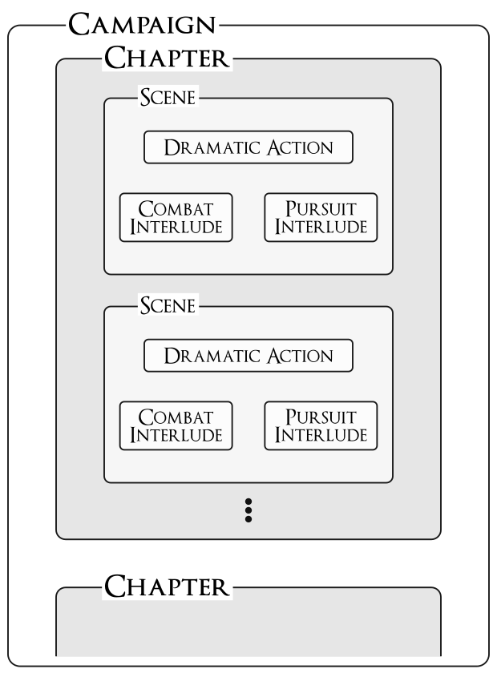

<style type="text/css">
.note {
  border-left: solid thick #ffffa0;
  padding: 0em 1em 1em;
  margin-left: 5em;
  margin-right: -5em;
  float: right;
}
.note:after {
  clear: both;
}
.floatimage {
  float: right;
}
.floatimage:after {
  clear: both;
}
img {
  transition: transform .4s;
}
img:hover {
  transform: scale(2.0);
}
h1 {
  clear: both;
}
h2 {
  clear: both;
}
</style>
# A Thousand Faces of Adventure: Game Master's Guide

*playtest version* VERSION DATE

*find latest version at https://1kfa.com*

*email sjb@ezide.com*

----

# Should You Read This Guide?

This guide is intended for a Game Master (GM). You should have already
read the Table Guide before you start this one.

Read this guide if you are the volunteer among your friends to run the
game of A Thousand Faces of Adventure (aka 1kFA).

{ width=2.5inch }

Playing as a GM, you will:

 * know, teach, and follow the rules
 * describe scenes
 * give Non-Player Characters (NPCs) names, voices, motivations,
   and behavior
 * confront the PCs with challenges and dangers
 * ask the other players questions
 * gain and spend Journey Points and Shadow Points
 * administer the Narrative Authority Waterfall
 * deeply practice Ludic Listening

<div class="note" style="font-size:smaller">

Lastly, *and leastly*, after trying to get unanimous assent from all
players, the GM may *rarely* need to claim final say in a disagreement
so that the game can move forward.

</div>

# What This Guide Is

## Definitions: sessions, campaigns, and the narrative

This game is designed to be played in *sessions* which are roughly 3-hour
periods where all the players are sitting together at the table.

During a session, you and your friends will talk about events occurring
in a shared, imagined world. These events, including all the actions taken
by characters, all descriptions of scenes, and assertions of facts are
called *the narrative*.

The entire game-playing-activity that includes the narrative, and also
includes flipping cards, managing resources, and applying rules,
is called a *campaign*.

There are 3 supported campaign lengths: **One-Shot** -- a campaign that
begins and ends in a single session, **9-hour** -- a campaign that takes
3 sessions, and **30-hour**, which can span up to 10 sessions.

New players should start with a One-Shot campaign.

## Organization

This guide covers a lot of ground, from the stance to take when playing
as a GM, to the connection stories have to our inner humanity,
to how many points of damage a trap incurs.

Read the guide once over, and then keep it handy so you can refer to
the rules, picking particular sections to concentrate on one-at-a-time.

<div class="note">

## Examples

To gain a deeper understanding of what to expect, you are invited to visit
[https://www.1kfa.com/examples](https://www.1kfa.com/examples).
There, you will see and hear examples of the game being played.
For all the author's attempt to make this
document clear, brief, and unambiguous, those examples may do a better job
of conveying just what the game is and how it is played.

</div>


## The Role of the GM in A Thousand Faces of Adventure

The GM is part narrator, part host, part referee. It's a lot! How does a GM
*play* this game?

Crucially, know that the GM is a **player** who *responds to questions
asked by the game*. Each of the procedures prompts the GM with questions.
When an ✗ gets flipped, the GM Move deck will prompt you with questions.
When a scene begins, you are prompted with a list of questions.

Additionally, a GM will gather and spend 2 resources: Shadow Points
(representing looming dangers and difficulties) and
Journey Points (representing divine favor, miracles, and supernatural
balance).

These are currency of the narrative marketplace, they're the syntax of
satisfying drama.
Just as players narrate their character's moves and manage their resources
to overcome danger, you answer questions and manage points to shape the
world, heighten tension, and evoke myth.

As a GM, playing well is not just measured in the abundance of points you
spend, but how you use them to shape the story.

The way you apply your resources and answer your questions should always aim to:

**Portray the world of the Touchstone List**

Players are called to the table to inhabit a fantasy world shaped by the
stories on the Touchstone List. When the GM speaks, we should see echoes of
the chosen titles, whether grim kingdoms or cartoonish bombast. Use references,
set up identical love triangles or political chain reactions, steal entire
set pieces.

**Fill the PCs' lives with adventure**

As you answer questions, keep the world in motion.
Push the characters toward hard choices, dangerous crossroads, and surprising truths.
Let their actions matter. Let their foes
grow bolder. Let the moon rise red over a broken peace, and put the PCs at
the crux.

Introduce challenges. Unfriendly NPCs, monsters, puzzles, or the troubles
of the setting should regularly confront the characters.

When in doubt, escalate. Put the reward of meaning behind the gate of action.
Enshrine narrative resolution at the journey's end, but put risky choices along
that path.

**Play to Find Out What Happens**

GMing is not recitation. Do not deliver a prewritten tale.
You are at the table, along with the other players, to discover the myth as it unfolds.

The rules will guide. The cards will provoke. The players will surprise.
Welcome all of it. Build scenes that ask questions you do not already know
the answers to. Let the story shift when players make a bold choice, or
when fate turns a card against them.

You will have ideas ready to summon, and theories for how the mysteries
might resolve. You will anticipate monsters and prepare situations drawn from
the Touchstone List. That is good. Use this cache to support play, selecting
what fits when providence calls.
Let them give way when play reshapes the course of the story.


---

# PART 1: TOOLBOX

---

# Lift From Touchstones

One of the first things your group will do when you begin a campaign is
create a universe -- the fictional setting in which the PCs will have
their adventure. This setting is called the [Touchstone List](#establish-touchstones).

A Thousand Faces of Adventure is about characters who choose to
take up an adventure in pursuit of something they deeply need. It's your job
to show the players the mysterious and dangerous world where their PCs
find that adventure.
Without the brave actions of the PCs in the world, calamity will certainly
ruin something precious.
Without the PCs, maybe the whole world would fall into chaos or destruction
-- and maybe it still will, even with them.
It's up to you to portray the fantastic and bizarre elements of that world.
Show the players the wonders of the world they're in and encourage them to
react to it.

The Touchstone List is here to support you in portraying
this world. Look at the titles written there. Remember those books,
movies and TV shows, and lift something directly from those stories. Lift
animals, characters, set pieces, environments, situations,
lift whole cities if you want to.
Remember Picasso's words: "Good artists copy, great artists steal".

Always give the players details they can work with.
 * Describe fictional situation at multiple zoom levels
 * Emphasize the details that are important to, and graspable by, the PCs
 * Offer cool, weird, inspiring material, so when players are asked questions,
   their minds are already swimming with ideas

Show a Touchstone-inspired world worth saving, and let the players show you
what kind of heroes they want to be.

# Apply Authority

In *A Thousand Faces of Adventure*, the GM holds certain narrative authority.
Like a chorus, this game sings with collaboration, but to keep the rhythm,
someone must conduct the swells and silences. That's you.

The Table Guide introduced the *Narrative Authority Waterfall*: even when
the GM is answering the game's questions, you are not alone. You can pose
those questions to the table, then harvest what comes up from the
responses, riffs, and digressions. But in some moments of play,
authority rests with the GM alone.

## Call for flips

As a player describes their PC's action, it is your judgement that decides
when that matches the trigger for a move.  **You call for the flip**.
Players should feel empowered to suggest that they're triggering a move, and
Buttons and Beats lets them request help in framing their PC's actions so that
it aligns with the move, but you decide when the player's description, the
fictional positioning and the required conditions for the move are all aligned.
This is essential, because flips invoke mechanics: card draws, resource changes,
and fictional momentum.
Without a referee to declare when the flip begins, the game can stall, or the
mechanisms can disengage from contact with the story.

So listen for move triggers. Name them aloud. Tell the player which move they've
triggered, and guide them through the flip.

## Transition Scenes and Interludes

Combat and Pursuit interludes have bright borders.
Mechanical procedures fire when they begin and end.
You declare their start and end and let the other players know that it's time to
invoke the rules assigned to those transitions.

When there is administrative work to be done, like the creation of foes on blank
cards, it may help to enlist the other players.  Ask each player to take a blank
card and what foe to identify on each, along with the size of the foe's progress
bar.  This keeps everyone engaged, and speeds things along.

## Break ties

When there's disagreement at the table, whether about tone, about rules, about what's
possible in the world, the ultimate decision lies with you.

You should listen. You can offer to resolve by consensus or even vote.
But at the end of the day, *you must be able to break the tie*.

This applies when:

* There's ambiguity about whether a move was triggered.
* Two players imagine a scene continuing in different directions.
* A PC tries to act in a way that feels "out of bounds" for the Touchstone List.

In order to keep the game's momentum, adjudicate fairly, but quickly. When you
are called to break a tie, do it decisively and then keep moving.


# Journey Points

Journey Points are the GM's rarest resource, gained when the story resonates
with a specific note of the Hero's Journey. Each Chapter (see Campaigns) holds
an opportunity to gain a Journey Point when a specific narrative condition is
met.
The conditions vary chapter by chapter. For example:
 * In Chapter One of the One-Shot Campaign, gain a Journey Point when the
   PCs cross a threshold by making a true choice.
 * In Chapter Two, gain one if you hold zero Shadow Points when the chapter
   closes.

Journey Points are a reward for weaving meaningful, resonant narrative beats
into the campaign's arc. But remember that the players don't have to bite on
every hook. Allow the story to surprise you. Don't fight it when things to go
sideways. You can always skip it or try again.

Spending Journey Points allows you to make bold, mythic interventions:
A dead hero stirs, gasping. A chariot of starlight streaks through the sky.
A fearful community finally takes up arms in alliance.

Find the full rules for gaining and spending Journey Points in PART 2: PROCEDURES.


# Shadow Points

Where Journey Points reflect the epic arc, Shadow Points are much more
grounded, and much more volatile. Shadow Points are gained during play as
an output of certain card flips (usually when a player’s fate takes a
darker turn).

They're the GM's moment-to-moment currency, spending them lets you
 * Strengthen the foes and monsters confronting the PCs
 * Spring ambushes and load traps
 * Wrest narrative control with a sudden GM Move

Shadow Points are meant to be spent freely and often. They are the teeth
of the hidden horrors. They are the fuel strethening the shadow.

The rules for gaining and spending Shadow Points are in PART 2: PROCEDURES.


# Move the spotlight

The table's locus of attention is called "the spotlight".
Participants tend to talk one-at-a-time, while all others wait in
excited anticipation.

Turn-taking is not rigid, instead the GM is tasked with managing the
"who and when" of the spotlight.
When does one player's contribution end, and the next player's begin?
When has a player said something that triggers a move? When is it time
for the players to all sit back and suffer or delight as the GM describes
the consequences of their decisions?

Never let a player's time in the spotlight be inconsequential. A player
might wait 10 minutes for their moment to arrive, so they won't be having
fun if their whole turn in the spotlight ends with "nothing happens".
Give them an opportunity to impact the table. This doesn't mean they have
to slay a demon on every turn, merely getting a big laugh can be "impact".

Remember, this is a collaborative story.  Laughter and excitement
are the rewards for everyone.

Allow the players to naturally move the spotlight among themselves.

As the GM, you yourself will take a turn in the spotlight:

 * when someone flips ✗
 * as specifically instructed by a move a player is executing
 * when everyone looks to you to see what happens
 * when a character encounters something you've been preparing for

Usually your turn in the spotlight will be spent making a **GM move**.
But it may also just be general narration. Remember the Narrative Authority
Waterfall - you can always lean on other players to improvise the answers
called for by the game.

Move the spotlight fairly around the table -- make sure each player feels like
they get to contribute evenly with the others.


# Hooks

Hooks are seeds of story.
They are places for players to hang their attention.
A good hook is something that tugs at the characters (and players) emotionally,
mythically, or viscerally.

Use them to kick off a session (while answering the questions of Scene creation),
shift a quiet scene into motion (while resolving a GM move), or deepen a player's
investment in the world (during table-talk or Diegetic Dialogue).

 * Capture, Obstruct, Prevent
    - What is "loose" and causing trouble?
    - What is in the wrong hands or needs to be brought back into the fold?
    - What message or delivery must not be allowed to reach its destination?
 * Chase or Race
    - Who else has already begun seeking out the prize?
    - How long until a threat arrives here?
    - How might the hunter become the hunted?
 * Rescue or Regain
    - Who or what was taken, and where does it rightfully belong?
    - What power does the precious thing posses?
    - Who's identity or status is tied to the missing thing?
 * Re-order, Rearrange, Fortify
    - What is unbalanced, and what effect does that have on the world?
    - Who is not doing their job?
    - What special protection needs to be put around The Hearth?
 * Forbidden Act
    - What is the rule that must not be broken?
    - Who forbids it?
    - What power structure does the rule support?
    - How do the elite grant themselves secret exceptions?
 * Contrast the Mundane with the Fantastic
    - What impossible ability or beauty is displayed by a creature or NPC?
    - What region or artifact is breaking the rules of the universe?
    - How does the incursion of a dreamworld manifest in reality?

Use this list when searching for an answer to one of the game's questions, or
during your preparation between sessions.


# Ask Questions

A Thousand Faces of Adventure is a conversation. The GM is not the only
storyteller at the table. **Ask the players questions**
and use the answers.  Embrace your curiosity.

There are also questions that you will need to ask to establish what rules
apply: "What is your character trying to accomplish?", "Is anyone else
helping?", "Who is taking the lead?".

The easiest question to use is "What do you do?". Whenever you make a GM move,
end with "What do you do?". You don't even have to ask the person you made
the move against. Take that chance to move the spotlight.

The questions that gave the characters flesh during character creation are
examples of asking questions and using the answers. You can always go back
and pull more buckets up from that well. If a character is religious, ask
them what their gods would have to say. If there's a halfling in the party,
ask how hungry the current scene makes them.

The scene-creation questions can always be revisited after the Dramatic Action
has begun.  Maybe the actions of the players have changed something in the
scene.  Pick something from the scene-creation question list and ask the players
that question again, focusing on what's changed.

Try asking the players to describe outcomes. For example, if a player's
character is in a fight with a goblin and the player deals a full 10 points
of Might, the GM might ask the player, "Describe how your character
dispatches the goblin". This gives the player license to get flowery and really see
their character as a powerful hero in this fantasy world.

When you're stumped for what happens next, ask a player to fill in the details.
Consider where you are in the
[Campaign](#campaigns), and ask a leading question.
Use their answer to describe the next scene or introduce the next challenge.

| Chapter         | Question
|-----------------|------------------------------------------------------
| Home / You      | What's the one rule you're not supposed to break?
| Need            | What do you wish people here could see the beauty of?
| Go              | Who do you hope won't try to get in your way?
| Search          | What strange custom do they practice here?
| Find            | *this stage has it's own set of questions*
| Take / Pay      | A great trembling is felt. What's that sound? / A figure approaches. You thought they were dead, who is it? (engage their fear / grief)
| Return          | *this stage has it's own set of questions*
| Change          | Which old friend or adversary is the first to greet you?


## Helping Unsure Players

Sometimes when you ask a player a question, they will simply respond
"I don't know". This can be a signal that the player isn't having fun, and
might need some direction. It can be difficult to make stuff up on the spot
about purely imagined characters moving around in purely imagined worlds.

Think about how this player has signaled what they've found fun. Do they
seem to enjoy the *fictional* parts of the game, or the *mechanical* parts?

If they're enjoying the fiction, ask them what would happen to this character
if this was a movie, or use the titles from the Touchstone List. Ask them if
they're ok with their character being put in jeopardy, or if that makes them
uncomfortable. Ask them which of the established stakes the character is most
likely to pay attention to. Or, independent of the stakes, ask what the
character's *immediate, intrinsic* motivation might be.

If they're enjoying the mechanical game, ask them what resource they're
after: XP? precious items? powerful weapons? new moves? Then ask what they
think the shortest path is to get the thing they're after. Help them see the
necessary steps to get what they want.

In either case, you're nudging them towards making a decision to accomplish
a goal. They might need to accept that getting what they want means taking
a risk.

Use this as an opportunity to take feedback as well. Have you made the
situation *clear*? It's ok to have a conversation about the conversation.

# Pre-Session Prep

A Thousand Faces of Adventure is designed to just sit down and start playing.
For a One-Shot campaign, you'll be able to just read the rules and then be
able to play a full game once the players assemble around the table, without
any additional preparation.

But for the 9-hour and 30-hour campaigns, there will be time between sessions,
and that can be used to ready some drama and surprises. The preparation a GM
does ahead of a new session is a key tool in a GM's belt.

Between sessions, run through the
events of the previous session in your head. Use a Ludic Listening perspective
-- what signals were players sending last session?
What kind of fun did each player seem to seek out or respond to? Was a
player particularly keen to create backstory, to get into combat, to ask
a lot of questions about how the world works? Can you think of things to
go into the next session to provide that kind of fun?

Think about the plot and how you might get your next couple *Journey points*.
Do you think the characters will make certain decisions? You might imagine 2
or 3 key decisions the party will be confronted with. For every fork in the
road, try to imagine how the world and NPCs will respond when the characters
choose either branch.

That's important. Prepare for *either* case.

There is no *correct* answer for the PCs. Never punish a player for
making a choice you didn't expect.

Being prepared is different than having a plan. No game ever goes according
to a plan.

The purpose of preparation is to use your imagination to assemble a cabinet
of narrative spices. At the beginning, you won't know if you're baking a pie
or a casserole. You don't even get to see the recipe upfront, it
is slowly revealed to you as each ingredient is added to the bowl.
Have some cinnamon and sugar ready, but also have some salt and chili powder.

Wait until you play to find out the details of what happens.


---

# PART 2: PROCEDURES

---

# Gather Around The Hearth

This is a game where the players play together on the same team.

Before the game begins, establish for *every* PC, what makes them feel most
at home, and how the characters already know each other.

Go around the table and ask:

> What makes your character feel most at home, or what activity do they
> find the most comfort or competence in?

Write down the answers.

Then, ask the group to choose by consensus one of these things that they all
have in common, and ask them to describe why this common thing bonds them
together and why it makes them comrades that would risk their lives for
each other.

 * Specific People
 * Food
 * Song
 * Environmental feature
 * Ritual or festival
 * Group activity

> This is a game where you all play together on the same team.
>
> So, let's bring all these characters together. We're going to decide on
> something that exists in the world of our Touchstone List that all of
> these characters value. They value it so much that they are going to
> team up to defend it - maybe even with their lives.
>
> We will call this thing "The Hearth".
>
> The Hearth can be a specific person or people. Maybe each character
> shares a friendly uncle?
> The Hearth can be food. Do all these characters depend on the fruit
> of the quartzberry tree?
> The Hearth can be a song. Is the valley home of these characters always
> humming with the melodies of the wood elves?
> The Hearth can be an environmental feature. Does the village home of
> all these characters depend on the limestone spring for water?
> The Hearth can be a ritual or festival. On the equinox, must every
> tribe send a representative to seal the portal to the netherworld?
> The Hearth can be a group activity. No warrior may abandon the hunt
> until the beast is caught. Nor may they abandon each other.
>
> Those are some examples, but the choice is up to you. What will be
> The Hearth of this band of adventurers?

This answer will be known as The Hearth.  Write it down in the space provided
on the GM Sheet.

Next, go around the table again and ask:

> Briefly, why would your character risk their life for The Hearth?

As each player answers this question, have them write the answer down
on their character sheet, and move a Shadow Point onto the GM Sheet.

An important aspect of The Hearth is that it must be something that the
characters can be separated from. When the players are deciding on The
Hearth, keep this in mind. You will soon need to find an opportunity in
the narrative to cause the hearth to be broken, forgotten, moved somewhere
else, corrupted, or otherwise threatened.

The Hearth is necessary, with the Seek Help move, to completely heal from
wounds.

When the party crosses the first threshold, The Hearth will be made
inaccessible, and therefore the characters won't be able to fully heal.
It will be made available again when the second threshold is crossed.
For details on thresholds, see the [Campaign section](#campaigns).

Use what the players describe to get your first *Journey point*,
by starting the story out in a place of normalcy, vitality, and comfort.
Remember, it doesn't have to be a Hobbit hole. Characters might be most at
home in the middle of a bloody battle.


<!--
### GM Prompt

Similar to the "Choose Fateful Moments" process, the players will now help the
GM create the first (maybe the *primary*) plot hook in the story.

The players collectively decide on two of the following plot hooks, and the
GM will decide which one of the two they want to focus on at the beginning
of the campaign.

 * Capture, obstruct, prevent
 * Chase or race
 * Rescue or regain
 * Reorder, rearrange, fortify
 * Forbidden act

Look to [Hooks](#hooks) for more details and
inspiration on each one of these bullets.

The GM does not have to tell the players which of the two was chosen.
Have the players signaled that they want to be surprised by how the
plot unfolds?
Do the players need help getting their characters on the same page?
The answers will help the GM decide whether to disclose the chosen hook.
-->

## Paint the Opening Image

Now that the table has established the initial details, it's time to begin.

Shuffle the blessing cards and place them face down in a deck.
Shuffle the wound cards and place them face down in a deck.
Put a wound token next to the wound deck so you can tell the difference
between the wound and blessing decks.

There are many ways to start the narration, so check out the
[examples](#show-dont-tell) to see some.

Players will probably have a couple questions on their mind when the game
begins:

 * Where am I?
 * Where can I go?
 * Who else is here that I can interact with?
 * How do I start using my special move cards?

Asking the players questions is a tool that's *always* available to the GM.
Might establishing more details about the world spark some plot ideas?
Go around the table and start asking the players for a detail about
their character or their role in the world of the Touchstone List.

One classic way is to start like some movies start, with an establishing
shot that gives us a sense of setting. You could narrate a typical
day-in-the-life scene of NPCs. Or maybe start with the atypical, and narrate
a scene of trouble brewing.

Another way is to zoom in. Start narrating from a bird's eye view of the
continent, zoom in to a specific region, then to a city or town, then to a
neighborhood, then to a building and ending when you're in the room with
the player's characters.

Use everyone's familiarity with movies to talk about "the camera". Cinema
jargon like "pan" and "fade in", can be effective at lining up the
imaginations of the table.

Narrate this opening image, then move on to constructing the first scene
and its stakes.  Consult the standard "Scenes and Stakes" procedure and
the instructions from the guidance for Chapter 1 of your chosen campaign
length.


# Nesting Structures and Transitions

The gameplay of A Thousand Faces of Adventure unfolds in nested layers:

{ width=7cm }

The diagram shows how gameplay zooms in from large arcs (Campaigns)
to moment-to-moment choices (Dramatic Action, Combat, Pursuit),
with each layer connected by structured transitions.

Campaigns are made up of chapters.  Chapters are made up of scenes.
Scenes always open with Dramatic Action (decisions, roleplay, investigation).
From there, based on cards and Fictional Positioning, they transition
into Combat or Pursuit Interludes and cycle back to Dramatic Action.

Each tranisition has some small set of procedures.  Scenes open and close.
Stakes and foes get introduced.

In addition, the 9-hour and 30-hour campaigns cointain "Downtime scenes",
wherein characters rest, develop skills, and research lore. Downtime scenes
provide space for transformation: characters heal, train, and set course for
new goals between the more action-demanding scenes.

The following few chapters will introduce these concepts starting from the
most granular (Dramatic Action, Combat and Pursuit Interludes) and ending
with the broadest (Chapters).


# Dramatic Action

**Dramatic Action** is the part of the scene where PCs are in the thick of
the story. It's the circulatory system of a scene,
it contains the conversations, investigations, schemes and other decisive
steps of the PCs. Questions are taken in turn with revelations and cycle
back and forth, unless and until a chase or combat gets invoked.

In this most versatile and open-ended mode of play, PCs might:

 * **Debate** a suspicious village elder.
 * **Ransack** a ruined library for forbidden texts.
 * **Cast spells** to divine an enemy’s true nature.
 * **Bargain** with a reluctant god.
 * **Forge a plan** in hushed whispers behind enemy lines.

Think of Dramatic Action as the ground state of a scene, where the
scene settles to between moments of intense violence or chaos. It's where
characters pursue their goals through cleverness, magic, skill, or social
pressure, setting up tension, transformation, and surprise. If Combat and
Pursuit are the game's storms, Dramatic Action is the weather before and
after.

During Dramatic Action, players will trigger specific moves, but much
will also unfold via roleplay and Diegetic Dialogue. The next section will
guide you through the GM Moves of Dramatic Action, outlining the specific
ways the GM can shake things up when it's their turn.

## Dramatic Action GM Moves

The players will execute plans and anticipate challenges.  Their characters
will make progress and overcome obstacles. But stories of excitement and
adventure must not be without surprise: schemes gone awry, dangers unforseen,
and occasional calamity. That's where GM Moves come in.

GM Moves are typically invoked when a player flips an ✗, but you can also
spend a Shadow Point to perform one when you decide, interrupting
the rhythm of player moves like a sudden trumpet blast.  When an ✗ is flipped,
you'll reveal two cards from the GM Deck and pick one.  When using a Shadow
Point to perform a GM Move, you can choose any of the moves from the GM Deck
or the GM Discard Pile.

During Dramatic Action, these are the available GM Moves:

 * Escalate the danger
 * Deal damage
 * Pivot
 * A price too dear
 * A threat approaches
 * All eyes upon them
 * Use up their resources
 * Separate them

These will be detailed in an upcoming section.

When selecting a GM Move, remember to follow the fiction and consider what
you might add to the narrative to drive the story toward your next
*Journey Point*.

### Escalate the Danger

`TODO: an image of the card`

```
Answer: 
    What aspect of the environment or the arrayed adversaries puts the
    party in more danger? 
Choose one: 
 * Remove an advantage-granting token from the party 
 * Use a special ability of a foe (that doesn't deal damage) 
 * Establish fictional positioning for an obstruction or restriction 
 * Start a combat interlude 
```

The fictional world is full of danger. Adventurers are constantly being
surprised by what's around the next corner or the thing that has been
stalking them from the shadows.

Monsters and foes have special attacks. Use these special attacks.

The location itself can produce danger. Are the PCs on a sinking ship, or
a crumbling tomb? Announce that the deck they're on floods, or that the
passage that led them in is now blocked by tons of rubble.


### Deal Damage

`TODO: an image of the card`

```
By default, deal 1-4 damage.  Optionally use a Shadow Point to bump it
up to 1-6, or 2 Shadow Points to bump it up to 2-10.

Shuffle the GM Move Deck
```

When you deal damage, choose one source of damage that's fictionally
threatening a character and apply it. In combat with a lizard man?
It stabs you. Fell off the old bridge? Land on a rock.

### Pivot 

`TODO: an image of the card`

```
Take narrative control.
Answer: 
    What actions transpire that drastically alter the dramatic action? 
Choose: 
 * Transition to combat interlude 
 * Transition to pursuit interlude 
 * Rename any existing stakes and reintroduce the scene 
Then: 
Shuffle the GM Move Deck
```

This is your "blank canvas" move.
"Suddenly Ogres"
"Ambush Launches, Trap doors swallow"


### A price too dear

`TODO: an image of the card`

```
If they refuse to pay it, flip a new GM move 
Answer: 
    What obstacle or complication arises, and what is the unfair price a PC can pay to overcome it? 
If they pay it, they can choose whether the GM deck gets reshuffled 
```

Show them something they want: riches, power, glory. If you want, you can
associate some cost with it too, of course.

Remember to lead with the fiction. You don't say, "This area isn't dangerous
so you can make camp here, if you're willing to take the time." You make it
a solid fictional thing and say, "Helferth's blessings still hang around the
shattered altar. It's a safe area to rest or plan, but the chanting from the
ritual chamber is getting louder. What do you do?"

"Ok, everyone flees from the hammer-camels, heading towards the water, but
let me ask this first: Samwise is wearing plate armour. If he leaves it
behind on the bank of the river, will someone else provide a distraction so
he can remove it? Or Samwise can keep it on and clumsily swim, but he will
lose 1 Stamina."

This move is particularly good when they want something that's not covered
by a player move, or they've failed a move. They can do it, sure, but they'll
have to pay the price. Or, they can do it, but there will be consequences.

Base the requirements or consequences in the fiction and make them clear
to the characters, not just the players.

This can also be a good move to underscore particularly tricky dangers. Let
the players know that if they attempt to dive between the giant clockwork
gears, you're going to spend a *Shadow point* to increase the difficulty.


### A threat approaches 


`TODO: an image of the card`

```
Add a shadow point. And: 
Add a new floating stake or foe card, not yet in this scene 
Answer: 
What negative consequence will arise if the party does not deal with this threat? 
Use a shadow point. And: 
Add an existing floating stake or floating foe adversary NPC to the scene 
Answer: 
What activates this threat, and how does it initiate contact with the party 
```
This is one of your most versatile moves. "Threat" means anything bad
that's on the way. With this move, you just show them that something's
going to happen unless they do something about it.


### All eyes upon them 

`TODO: an image of the card`

```
Answer: 
What downside of the PC's appearance, reputation or equipment arises? 
Place a disadvantage token on the player's: 
 * Deckahedron
 * Item card 
 * Move card 
That will take effect for their next flip that involves it 
```

Just as every character shines, they all have their unique weaknesses too. Do
orcs have a special thirst for elven blood? Is an ongoing flow of magic
disturbing dangerous forces? The torch that lights the way also draws
attention from eyes in the dark.


### Use up their resources 

`TODO: an image of the card`

```
Answer: 
What supply got used up, or what hand of the shadow rested away a PC's resource? 
Choose: 
 * End ONGOING effects of magic items
 * Remove green cards from the magic items 
 * Reduce magic item charge capacity 
 * Damage mundane items 
 * Spend a shadow point and take away an item card 
 * Spend a shadow point and take away an item card. Then choose to spend a Shadow point and make a second choice
```

Surviving in dangerous places often comes down to supplies. With this
move, something happens to use up some resource: weapons, armor, magical
item charges, ongoing magical effects. You don’t always have to use it
up permanently.

A sword might be flung to the other side of the room. Walking across
the shimmering barrier might end any ongoing magic effects, etc.

An easy way to decide on what resource to use up is to look to the cards
in front of a player:

Note, **a GM can never take XP from a player**. Use of XP should always be
a player choice.


### Separate them

`TODO: an image of the card`

```
???
```

There are few things worse than being in the middle of a raging battle with
blood-thirsty hawkhounds on all sides -- one of those things is being in the
middle of that battle with no one at your back.

Separating the characters can mean anything from being pushed apart in the
heat of battle to being teleported to the far end of the dungeon. Whatever
way it occurs, it's bound to cause problems.


### A GM move is more than an outcome of move that caused it

Understand that when a player resolves a flip with ✗, that doesn't always
mean that the thing they were attempting fails.

The GM is free to let the character accomplish the thing, but may use the
flip result to bring new twists into the story.

Let's say a player's character is a thief infiltrating a stronghold, hired
to steal a fabled yellow amulet. Maybe the character attempts to climb over
a wall to avoid being seen by guards. Consider the following narrative
consequences of a player flipping ✗:

 * You fail to get over in time and the guards start yelling and pulling at
   your boots
   (Escalate the danger)
 * You climb over. But there are more guards patrolling on this side of the
   wall! You see the tower where the amulet is stored. Either make a dash
   now, and an alarm will be raised throughout the stronghold, or climb back
   over and confront the original guards.
   (A Price Too Dear)
 * You climb over. The camera pans up to the dark sky, we see grey feathered
   beasts with the faces of birdlike wolves, each flap of their wings loud and
   ominous. Their tails end in a glowing yellow shape extremely similar to the
   description of the amulet.
   (A Threat Approaches)

The first example is pretty straightforward, a thing was tried, it
failed, the character suffers the direct consequences.

In the remaining examples, the character got to the other side of the
wall safely. A fictional cue triggered the move, the mechanisms of the rules
were engaged, and then the GM chose to create new, separate, fictional
badness. The fiction produced by the engaging the rules does not have to be
constrained to the fiction that engaged them.

The last example does something even more strange. It talks about a
disembodied "camera" and portrays a scene to the *players*, but not to the
*characters*. This is a fun stylistic choice, but it may not please every
group. If you describe the world like a movie, you're asking players to be
audience, not actors. Ludic Listening can help you decide if this technique
is right for your table.


# Adventure Scenes and Stakes

In storytelling - whether in novels or film - scenes are the building blocks
of the narrative. Each scene presents a specific situation where
protagonists want something, face opposition, and either succeed, fail, or
pivot toward a new goal.
Stakes are the assets (physical, social or informational) that will be won or
lost as the scene progresses. Stakes are central to scenes: they define what’s
on the line and give the events emotional weight.

The adventure scenes are where the PCs take risks and get
into conflicts.

The following procedures translate those narrative principles into a
collaborative, mechanical structure, helping the table build a dynamic story
together.

Scenes form around a shared dramatic question: What do the characters want,
and what might happen if they get it - or don’t?

Winning or losing stakes always shifts the story forward. They're
not abstract goals - they’re tangible, achievable objectives like "secure the
alliance" or "find the back door into the castle."
Winning or losing the stakes determines how the next chapter will begin for
the protagonists - whether they will meet that chapter open-eyed and
prepared, or be dragged into its pages by cruel fate.

As you create and play through scenes, remember: every scene matters, risks
should feel real, and both triumphs and failures carry story weight.
Everyone at the table is co-authoring a plot full of tension, consequence, and change.


## Combat Interludes

As the narrative develops, the PCs will be faced with challenges and conflicts.
Sometimes they will be confronted with NPCs or monsters who mean to do them
harm. Nonviolent options like negotiation or escape may still be valid in
these situations, but players will often choose to confront their antagonists
with steel.

Combat encounters don't have to be simple zero-sum games. Think about the
narrative stakes as well. When swords are drawn, put something besides life
and limb in jeopardy -- information, resources, social standing, risk of alarm.

If the PCs engage with a fear-inducing monster, use the guidance in the
[Monsters](#monsters) section as you step through this process.


### When a combat interlude begins

 * Prepare and shuffle the GM Combat Move Deck. As indicated by the bottom of
   each card, remove any cards that are not intended for the current Chapter.
 * Have a small stack of index cards for foes and hazards.

Like during Dramatic Action, when a player resolves a move with an ✗,
the GM will draw 2 cards from the GM Combat Move Deck and choose 1 to
invoke. Using them is a bit more straightforward, as there are no skull
cards.

 1. Deal damage / Expend stamina & reshuffle this deck.
 1. Use a special ability / attack & reshuffle this deck.
 1. Reinforcement - a new threat appears
 1. Disarm - a PC's weapon or item is damaged, stolen, or has a magical charge wasted
 1. Imperiled Beloved - an NPC or Macguffin is endangered by one of the
    threats. If the threat is not engaged this round that beloved is forfeited.
 1. Tactical Advance - place two tokens on threat card(s), indicating a
    level of disadvantage any player faces when dealing with that threat
    (max of 2 per card)
 1. Echo the Mythic Fear - a foe takes on a terrifying aspect or makes a baneful promise.
    place a red token on a player's deckahedron, indicating a disadvantage that must
    be taken on their next flip.
 1. Glory in the Violence - a foe rallies its allies against the party. Add 1 stamina
    to each of the arrayed threats, but add one gray progress and a token to the
    glorying foe so that the next PC to act against it takes an advantage.
 1. (only in some chapters) Separation Trigger - targetted PC can not act for 1 round
 1. (only in some chapters) Revelation Trigger - temptation - targetted PC gets a 
    threat called "tempted" (infinite stamina) put on them, subsequently,
    they can only defy danger until they hit ✔✔.
 1. (only in some chapters) Reunion Trigger - the father or family held hostage

Take a number index cards. By default, take one fewer than the number
of PCs. Each card represents a foe or hazard. More can be added by
spending Shadow Points, per the table below.

The combat interlude can include a mix of foes and hazards, categorically
called "threats". Foes are NPCs or monsters intending to harm the PCs.
Hazards are aspects of the environment that threaten the PCs (eg, fire,
collapsing ceilings, toxic mud, panicked crowd).  There must be at least
one foe in a combat interlude.

Remember to let the fiction lead.  Start with what the scene promises:
cultists, the ogre, the collapsing bridge, the whispering glyphs.
Use what feels congruent to the facts of the scene already established,
but remember that you're also allowed to surprise the players.

For each foe or hazard, write some details on a blank card:
First, write down a name.
Beside each name, write the Might (d4, d6, d10), d4 being the default.
Beside that, draw a progress bar for their Stamina. Each foe gets 5
Stamina by default, optionally increased with Shadow Points per the
table below.

Each foe may have a special ability. Either choose one from this list,
or invent your own:

 * **Cleave**: When this foe deals damage, also deal 1 damage to another
   PC within range
 * **Entrap**: Add a "Trapped" hazard to the targetted PC, which prevents
   them from fleeing
 * **Thieve**: Move one of the PC's items to any foe in the scene, or
   destroy one of the PC's PACK
 * **Heal**: Restore 2 stamina to any foe in the scene
 * **Poison**: Place a token on the PC's Take a Breather move. Until the
   token is removed by a Rest or Seek Help, Take a Breather regains one
   fewer Stamina for the PC
 * **Magical Taint**: Place a token on any PC's magical item. Until the
   end of the scene, apply a disadvantage to using that item.
 * **Command**: Choose two of this foe's minions and for each, either move
   it to endanger a PC or deal its damage if a PC is already endangered by it.
 * **Explode**: Deal damage equal to this threat's remaining Stamina to
   all PCs within range. Remove this threat.

To augment a combat interlude, spend *Shadow points* according to this table.

| Shadow points       | Foe augmentation
|---------------------|------------------
| 2                   | Raise Might to d6
| 3                   | Raise Might to d10
| 1                   | Raise Stamina to 10
| 2                   | Raise Stamina to 15
| 3                   | Raise Stamina to 20
| 1                   | Add a special ability
| 2                   | Add another hazard
| 3                   | Add another foe


Remember that foes' power can be exerted in more ways than just their
Stamina and Might. Challenges may arise from the antagonist's superior
knowledge of the environment, magical abilities, political connections,
or other types of fictional positioning.

Next, place the cards either in the middle of the table, or adjacent to
a player's character sheet. Use this placement to indicate whether a
PC is currently *endangered* by that threat. Follow the fiction here, paying
mind to how near and present the threats and PCs had been previously
described.

When the index cards have been filled and placed, paint the combat scene.
Describe the threats that present to the PCs.

From this point forward,
the party is in combat and the game shifts to one-at-a-time turn-taking.
In each round, the party of players will first take their turns, choosing
the order among themselves, then the GM will take a turn. Rounds proceed
until all foes or all PCs are defeated, or until a Pursuit Interlude is
triggered.

### Player Combat Turns

On a player's turn, they may make one or two moves, but only two if one of
them is labelled *FAST*.

When a PC is *endangered* by a threat, the player has a choice to make when
their turn comes: either make their moves and then suffer the Might of the
threat at the end of their turn, or use Defy Danger as one of their two moves.
If they successfully defy the danger, they do not suffer the threat's Might
on their turn.  If their Defy Danger succeeds with ✔✔, they can choose to move
the threat's card away from their character sheet, back to the center of
the table, and their PC is no longer *endangered*.

If a PC is *endangered* by mutliple threats, a single Defy Danger move will
apply to all of them.

### GM Combat Turns

After each player has had a turn in a round, the GM takes their turn.

On the GM's turn, they first apply the Might of any one threat that is
currently *endangering* a PC.  As the Might is applied, the GM describes
how the threat has harmed the PC. If there are no *endangering* threats,
the GM may instead trigger a special ability of any of the threats in
the table center. If none of these abilities are relevant or applicable,
this first part of the GM turn is skipped.

Then, the GM can take half (rounded up) of the threats in the scene and move
them to *endanger* PCs. Threats can be moved from the table center or from
positions adjacent to other PCs. At each movement of a threat, the GM shall
describe how the threat newly applies to the targetted PC.

Finally, the GM can declare that any of the foes in the scene are fleeing. The
cards for those foes are moved adjacent to the GM Sheet. If the players decide
to pursue the fleeing foes before the round ends, a Pursuit Interlude begins.
Otherwise the fleeing foes are removed from the combat at the end of the next
round.

If any of the fleeing foes are carrying an item, this item will be lost if the
foe successfully flees, perhaps to become a Stake for a later scene of the game.


### Example combat encounters

`TODO: illustration`
`TODO: text`


### Ludic Listening: The feel of combat

In combat, it's ok if play gets more formulaic. Some players enjoy
the "abnegation" of a tit-for-tat combat scene that lasts tens of minutes.
This can be a combination of exciting and relaxing. Give your players
opportunities to press their favourite buttons.

That said, some players don't seek abnegation. What kinds of signals are
your players giving you? Maybe they want to get through combat faster. If
so, when you make your moves, you can think cinematically. Continually raise
the stakes for both sides during the scene. Think dangerous. No character
or set piece needs to be safe or sacred.


### Closing a combat interlude

 * All players may use the Take a Breather move, flipping Str.
 * Put away the Combat GM Move Deck and return to the Dramatic Action GM
   Move Deck
 * If *any* of the PCs have survived the Combat interlude without being
   incapacitated, one ✔ token is added to a ✔ progress bar, players choice
 * If *all* of the PCs survived, add one more ✔ token

Note, The GM Move decks are shuffled going into and exiting from a combat
interlude, so triggering combat is a valid way for players to avoid an
upcoming Shadow or Death card.

#### Loot

After winning combat, the players may propose that their characters sift
through the battlefield looking for valuables. Let the characters find
whatever you think would be most fun, or something inspired by the
Touchstone List, or ask the players questions to figure out what boons or
treasure were won from their adversaries.

Sometimes nobody will have a concrete idea of what the loot was, and that's
okay too.

If the characters slay a pack of werewolves, and then search the bodies,
and the table can't immediately come up with an idea for what beneficial
gear was dropped by feral, nearly naked humanoids, you can write
"What we found on the werewolves" on a blank card, and give that to one
of the players.

Later in the game, when the rules demand Item or Pack cards be spent, the
"What we found on the werewolves" card may be spent, if the players can
justify it. It can even be considered *precious* if the fiction supports it.

If the loot is a weapon, its power should not be greater than the most
powerful weapon a party member already possesses, unless it is the weapon
created by the Tales of a Weapon move. If the loot has a magical
effect, it should only have charge capacity of 1.


## Pursuit Interludes

`TODO`

### Entering Pursuit Interludes

`TODO`

### Closing a Pursuit Interlude

`TODO`


# Scenes

This game has 2 types of Scene, "downtime" and "adventure".
The game transitions from downtime to adventure and back again to
downtime, repeating in a "loop".

Adventure activities involve risk, exploration, and confrontation.
Adventuring will incur costs on the characters in the form of injury,
damage to items, and spent magical charges, but it will also
let the players build up resources like XP and loot.

Downtime activities are less risky. In these activities, the costs and
benefits are known upfront, like shopping, healing, and studying.
When injuries and treasures have built up, the players will seek a
**town** (any place whose inhabitants offer services and trade)
to salve their hurts, exchange their loot for exciting new
gear, and learn new skills.
With that done, the players should be hungry to put their new skills
and gear to use, and thus head out again for adventure.

Each transition gives the GM a lot of opportunity to shape the narrative,
so when possible, these transitions should be exploited to earn
a *Journey point*.


## Adventure Scenes

### Components for an Adventure Scene

 * The scene page
   * Title
   * primary ✔ progress bar
   * index cards ready for floating stakes
   * skull progress bar
   * (optional) notes
 * Names of the stakes
 * ✔ tokens
 * shadow ✓ tokens
 * GM Move deck

The progress bars track rising and falling tension. Success earns
narrative control and resolution; failure introduces complications, twists,
and setbacks.

The GM Move Deck acts as a tool for escalating drama, injecting new
developments, or adding pressure when things go wrong - mirroring the kind of
beats you'd see in a screenplay’s midpoint reversal or at a novel’s crisis.


### Procedures for an Adventure Scene

1. A "scene" is created and described by using the Narrative Authority Waterfall to
answer the following questions:

 * What do the PCs need to advance the story?
 * Where is an interesting location of the setting to pursue this need?
 * What content from the Touchstone List is present here?
 * What significant set pieces are in front of the characters?
 * What obstacles (if any) are blocking the obvious routes?
 * Besides the characters, who else is present?
 * What details of this location are obvious and notable to the characters?
 * What is the ambiance? Which environmental subtleties might the characters notice? Lighting? Weather? Sounds? Smells?

All questions must be answered at the beginning of *each* new scene.
Additional questions and rules for creating scenes will be found in the Campaign
Guide for the specific chapter the story is in.
Those sections will inform:

 * The size of the primary ✔ progress bar
 * The size of the skull progress bar
 * What an appropriate primary "stake" would be

When all the questions are answered, the table should share an
understanding of where the PCs are situated, and players will start
forming ideas on how to contribute to the upcoming Dramatic Action.

Create a title for this scene using the information you now have from answering
the questions above.

Create the "scene page" from a blank sheet of paper, write the scene's
title at the top of the page.  Then draw the primary ✔ progress bar and the skull
progress bar.

Shuffle the GM Move Deck just before beginning a scene. Typically this deck has
thirteen cards, but its composition can be modified by chapter-specific rules.
Check the Campaign Guide if any modification is necessary.

2. One "stake" is attached to the primary ✔ progress bar

To ensure a focused and impactful scene, a Primary Stake is defined.
The Primary Stake is the central goal the party aims to achieve within
that scene. Think of it as the driving question: "What must the heroes
accomplish *here* to progress on their quest?"

 * Information
   * eg, learning the villain's plans
 * A McGuffin / a tool / a key
   * eg, components for a magic ritual must be gathered
 * An ally / an alliance
   * eg, rescuing someone from a trap to earn their loyalty
 * Neutralization of a threat
   * eg, sabotaging the enemy's war machines
 * Access to a location or path
   * eg, navigating through a treacherous swamp
 * Reputation or social status change
   * eg, being initiated into a secret organization

Follow these steps to set the scene's Primary Stake:

 * Consult the list of categories and suggestions above
 * Consult the chapter-dependent rules
 * Consider applying the Narrative Authority Waterfall and Diegetic
   Dialogues tools
 * The GM will declare when the stake has resolved in their mind.
 * Allow some time for clarifying questions, if necessary.
 * Everyone at the table should now understand "what's at stake".
 * Create a short name for the stake and write it next to the
   primary ✔ progress bar

The stake and its name can get re-worked or refined as the narrative develops
during a scene. Such revision should increase the specificity of the stake.
For example, it can start as "castle information" and get updated to
"castle backdoor secret".

A well-defined Primary Stake provides direction, creates tension, and makes
the outcome of the scene meaningful. While smaller objectives may arise,
the Primary Stake remains the core focus.

3. The Dramatic Action begins

With the scene and stakes understood, it's time for the players to take
the reins and initiate the dramatic action. Begin by situating the
characters' position within the scene. Are they charging into battle?
Surveying the landscape from afar? Once established, the GM will
direct the spotlight to a player, prompting them with the inciting
question: "What do you do?"

The PCs' actions and dialogue drive the plot and trigger Player Moves 
(see SECTION `TODO`). The results of these moves, in turn, determine how the
scene evolves, in several ways:

 1. Some moves resolve with green progress tokens added to a progress bar
    * The player may choose any progress bar (primary or floating) that is
      present in the scene
 3. Some moves resolve with a gray progress token added to a progress bar
    * Like green tokens, players may choose where to apply these. But these
      tokens turn into Shadow Points if a ✗ is flipped before the stake is
      achieved.
 4. When a move resolves to ✗:
    * all gray progress tokens are removed from all progress bars and put in the
      GM's collection of Shadow Points
    * Trigger the GM Move Deck (which may increment the skull progress bar)

Thus, as the scene plays out, the progress bars gradually fill.  The scene ends
when either the scene's primary progress bar or the skull progress bar are
completed.


### Triggering The GM Move Deck

The GM has a deck of cards that they draw from when a Player hits an ✗.

Depending on chapter rules, there are about 3 skull cards in the deck.
The other cards are:

 1. Deal damage / Expend stamina & Reshuffle the GM Move Deck
 2. Show signs of an approaching threat
 3. Escalate the danger / Trigger a combat interlude
 4. Reveal an unwelcome truth
 5. Offer an opportunity, with a cost
 6. Turn their move back on them
 7. Tell them the requirements or consequences and ask
 8. Show a downside to their appearance, reputation, or equipment
 9. Use up their resources
 10. Separate them
 11. Shadow
 12. Shadow
 13. Shadow
 14. (Only in certain chapters) Shadow
 15. (Only in certain chapters) Death
     * Only causes a character death if flipped *with* another Shadow card,
       otherwise, it kills a friendly NPC, if no such NPC, it just acts as
       a Shadow card.

On an ✗, two cards are revealed from the GM Move Deck, and either:

 1. Any of the revealed cards is a Shadow card:
    * Ignore the revealed 1-10 card (if any)
    * Increment the skull progress bar 
    * Invoke the chapter-specific rules from the Campaign Guide
 2. Two of the 1-10 cards are revealed
    * Using Narrative Authority Waterfall, choose *one* of the two cards and
      narrate events into the scene that interpret the card
    * Refer to PAGE X for additional guidance and suggestions for interpreting
      the narrative effects of these cards.

When the skull progress increments, something negative happens, determined
by the Chapter rules, and can include such things as:

 * Addition of a floating stake with its own progress bar
 * Replacement of the primary stake with a less valuable stake
 * Loss of the primary stake
 * Jeapordizing something the characters already posess by making it a stake
 * The forced start of a combat
   * See PAGE X for rules on starting a combat


### Filling the primary ✔ progress bar

There are two ways the primary stake of the scene can be won:

 * When the players fill the primary progress bar
   * When this happens, the achievement of the stakes and a scene epilogue
     shall be narrated using the Narrative Authority Waterfall
 * When demanded by the state of the narrative
   * Narrative is primary.  If the facts of the scene are such that there's
     no other outcome than the achievement of the stakes, those become the
     facts of the story
   * In this case, a new stake or boon may be created for the party to
     achieve in this scene.  This is likely some "bonus" or "treasure" not
     tightly tied to the needs of the story


### Filling a floating stake's ✔ progress bar

When a floating stake's progress bar is filled, the party achieves
that benefit.

### Filling the skull progress bar

When the skull progress bar is filled, the scene is "blundered" by the party.

How can a scene end in a bad outcome while the plot still moves forward?

 * The stake is only partially won
   * It is fragmented or corrupted
   * It will take additional resources to realize its benefits
 * Betrayed by a supposed friend
 * Permanent loss of one or more of the stakes
 * One of the lost stakes moves forward to a future scene
 * Death of an ally
 * Betrayal - new shadow force
   * In all future scenes, "overcome _blank_ force" stake card is added
   * With a progress bar of 3.
 * Ironic reversal - what the characters sought in a stake gets reversed
 * Haste - the party loses their next opportunity for Downtime
 * Trigger an Fallout combat interlude
 * An overpowering force transports the party to a new location


### Closing an Adventure Scene

 1. Clear any tokens from Unfold Mystery
 2. For any unfinished floating stake, move it near the GM sheet. The GM answers one question:
   * In what location is this lost or buried?
   * What foe now posesses or controls this?
   * Behind what riddle is this hidden?


## Downtime Scenes

If the characters are not in a town, the moves available during
downtime are:

 * Rest
 * Sharpen and Stitch
 * Seek Help (only if it makes narrative sense)
 * Tales of a Weapon

In a town, three additional moves are available:

 * Study Under a Master
 * Shop / Procure
 * Obsessive Contemplation

There is an important choice that a player must make during downtime, and
that is, what to spend their time doing. Their character can't do everything
in one day. In particular, in one day these moves are mutually exclusive:

 * Rest
 * Study Under a Master
 * Shop / Procure
 * Obsessive Contemplation

Additionally, Sharpen and Stitch can only be done while resting, so it is
effectively mutually exclusive with the latter 3 moves.

If the GM wants to give the players' characters a second day in town before
any action takes place, a *Journey point* must be spent.
(See [Using Journey Points](#using-journey-points))

Otherwise, on the second day, the GM should present some situation that
demands immediate attention. Put something at risk if necessary. Remember,
this is a world of danger, nothing is safe or sacred.

The players may still ignore the situation and keep performing downtime moves
on the second day -- in that case, narrative consequences should be honestly
described. What opportunity has been forever lost? What did the evil forces
accomplish because the heroes lingered?


# Campaigns

To help you execute a successful and popular *campaign*, the mechanisms
of the game will generate *Journey points* and *Shadow points*.
Generally, when the narrative comes into alignment with the next
step of *The Hero's Journey*, a *Journey point* is gained, and when
the cards don't come up in the players' favour, a *Shadow point* is gained.

More specific rules on gaining and using *Journey points* and *Shadow
points* will follow in later sections.

The main premise of *The Hero's Journey* is, characters start out in
a figurative "ordinary world", they go to a "mysterious world", and finally,
they return.

As the narrative is created, you will have opportunities
to shape events. It is primarily the GM who decides how the world and the
NPCs react to the actions of the PCs, and they also have opportunities to
describe the "meanwhile" -- all the goings-on "off-screen".
Use these powers to influence the narrative into a multi-chapter structure,
and in each chapter, to earn *Journey points*.

This is the exciting challenge offered to those taking on the mantle of GM.
Using your skills at improvisation and interpretation to cast the actions of
PCs into the desired chapter of the story, finding or inventing hidden
meanings, and polishing it all up into repercussions of epic importance.
Serving as GM should feel like solving a living, breathing puzzle.

The game's incentives tie the GM tightly to *The Hero's Journey*.
The other players may just be along for the ride, or they may also want to
contribute to the structure of the narrative. Use Ludic Listening to
co-create the journey, noting what players express about themes,
relationships, emotional tone, conflicts, and backstory.

While you are *incentivized* to produce a narrative with this structure,
due to the unpredictable nature of what other players will say and the
randomness of some game procedures, results may vary.

## It's ok to skip it

You don't need to get every available *Journey point*. You should especially
not try to force it if doing so would sacrifice fun for the players. Remember,
you're not the only author of this story, and while earning points feels nice,
you've got other jobs too, like paying attention to the signals the players
give you about the kind of fun they want to have.

## It's ok to end it

You may find that you and the players have collectively gone as far as you
can. Maybe you've reached the deepest, darkest part of the adventure, and
the characters decide to stay and call it their new home. Maybe they find
a way to destroy something you thought would be permanent, or make permanent
something you thought would be temporary, and that changes the whole conflict
structure of the story. Maybe they found a shortcut or outsmarted the Oracle.

Maybe they all died.

Take a break and ponder. Sometimes you can think of a way to reinterpret
events or move forward with themes while abandoning specifics. Sometimes
you can take a subplot and move it to the forefront.

But sometimes the choice that provides the most fun for everyone is to
just admit that it's over.

Getting *Journey points* is great, but the reason everyone is here
sitting around the table is to *have fun*.

## It's ok to blend it

The boundaries between chapters do not need to be strict, explicitly defined
lines. There may be a natural blending between two adjacent chapters as you
and the players set forth the narrative.

For example, It's common for the 9-hour Campaign to blend chapters 5 and 6.
Maybe the treasure of the dungeon is glimpsed, then the ordeal begins, then
the ordeal gets really serious, and that's the point to really plumb down to
the "dark night of the soul", fully reveal the treasure, and then emerge
to complete the ordeal.

Even when there is a threshold, as in chapters 3 and 7, the different players'
characters might cross over at different times.

## The lengths vary

The final chapter might go very fast, or it might be a long journey home.
The first threshold might be crossed so fast that you only notice after the
fact.
Taking the prize might involve a twisting road of trials, or it might be
one explosive boss battle.

Let the story be what it must be, and *play* to find out the details of what
happens, but also take your opportunities to earn *Journey points* when they
arise.


# One-Shot Campaign

 * Start in a place of normalcy / comfort
 * Cross a threshold with a true choice
 * Take a thing and pay its (mortal?) price
 * Return to the surface, changed.

In a One-Shot campaign, there are 4 potential *Journey points* to earn.

<a name="one-shot-ch-1" />

## Chapter 1: Start in a place of normalcy / comfort

> Your sacred space is where you can find yourself again and again.
> - Joseph Campbell, The Power of Myth (with Bill Moyers), 1988

The first *Journey point* is a "gimmie": If you can think of a way to start
all of the PCs in their place of normalcy or comfort, gain a *Journey point*.
The procedure of creating [The Hearth](#the-hearth) in the
[Character Creation](#character-creation) section should virtually guarantee
a *Journey point* here.

Give the players a chance to establish what "normal" is for their characters.
This is an environment that they can manage. They know what to expect here,
and to survive here requires no fundamental change on their part.

Here, the players can get a feel for taking actions and having some dialogue
in-character.
Perhaps they have some interactions with NPCs familiar to them.
Perhaps they describe their character moving through the environment while
describing specific details.
Perhaps the characters get into conflict: social, or physical.

As you are playing this out, you should be looking out for two things:

 1. Opportunities to establish a *need* that will move the story to Chapter 2
    * signs of an approaching threat
    * what about their home annoys, frustrates, or stifles them?
 2. A premise. Listen for a statement or action that asserts a fundamental truth
    * "Nobody bakes a pie like Herbert"
    * "Shelbyville thinks they're so great, but really, they stink"
    * "I'm just a Hobbit, I can't steal from a dragon"
    * "Things will go on like this forever"
    * "As long as there's a tree to climb, I don't have to worry about wolves"
    * "If only you could see things from my perspective"

During [Character Creation](#character-creation), each player will choose a
[Fateful Moment](#choose-fateful-moments) for their character. Pursuit of a
Fateful Moment often produces the *need*.

You should make a note of any premise, so you can use it later when creating
puzzles, monsters and villains.

### Chapter 1 Scene procedures

During scene establishment, use the Narrative Authority Waterfall to **answer
3 of the following questions**:

 * What details show the characters are in control of their environment?
 * What subtle signs suggest the world may not stay this way?
 * Which NPCs embody safety, comfort, or routine in this place?
 * What’s one unwritten rule here that, if broken, would shake everything?
 * Who or what do the characters love most in this place?

Using the Fateful Moments of the PCs and the Hearth, create the primary
stake with a dramatically appropriate amount of detail. It can start out
as vague as any of these:

 * Knowledge of the means to overcome a threat or defeat an enemy
 * A plan to re-establish the Hearth
 * Location of a distant resource to recruit to our cause

And it may develop into something more specifc, eg:

 * Secure a rare ingredient or heirloom that rekindles the hearth
 * Resolve the inter-clan dispute so the festival may proceed
 * Bring each elder's piece of the ancient map together

The progress bar for the primary stake should be **7 units long**

The skull progress bar should be **3 units long**

**When the skull progress bar increments**, answer one of the following
questions:

 * What violence pierces the illusion of peace? What ambush or fight erupts?
   * Start a Combat Scene
 * Who among the Hearth's allies is now captured, transformed, or killed?
 * What sudden divide or betrayal shatters the community’s trust?
 * Which innocents were swindled, vows were broken, or alliances shattered?


<a name="one-shot-ch-2" />

## Chapter 2: Cross a threshold with a true choice

> The cave you fear to enter holds the treasure you seek.
> Joseph Campbell, Reflections on the Art of Living, 1991

As the game progresses, the conversation at the table will start
establishing details about the world and about relationships between
characters. Find areas of tension and try to develop that tension.
Push characters into discomfort. Raise the stakes. Then look for a
*threshold*. Look for some line that, once crossed, they can't simply turn
around and go back.

Importantly, once they cross this line, The Hearth will not be available
to them. It might just be far away, or something could narratively or
symbolically separate them from The Hearth. It could be broken, stolen,
run out of fuel, etc.

The players might enthusiastically seek out a threshold, they might even
cross over before you've figured out what it should be (if so, all that's
left for you is to mark yourself a *Journey point*). More likely though,
you will need to increase the pressures in their "home" to gently nudge
the characters up against that threshold.

But, if you want that *Journey point*, **don't push them through.**

If the players choose to step their characters through the threshold,
if all of them cross the threshold and step away from their ordinary world
into a mysterious world of danger and adventure, gain a *Journey point*.

Otherwise, you'll have to push them through. Create a cave-in, a magical
force-field, or reveal something that unveils mystery
in the world they inhabit: eg, a seeming ally is actually a betrayer,
for the adventure doesn't truly begin until the PCs find themselves inside
the mysterious world, where The Hearth is unavailable to them.

A common way to get players to choose to go through the threshold is to create
a "hook".  See the (Hooks)[#hooks] section.


### Chapter 2 Scene procedures

During scene establishment, use the Narrative Authority Waterfall to **answer
3 of the following questions**:

 * What makes the threshold visible, dramatic, or emotionally charged?
 * What’s one reason each character might hesitate to cross?
 * What changes or dangers await on the other side?
 * What consequences will unfold if they don’t cross?
 * Who is watching them make their decisions, and why does it matter?


Create the primary stake along these lines:

 * Unlock or unseal the mysterious path
 * Escape the forces of "home" that aim to prevent your departure
 * Penetrate through a force that blocks your transit

The progress bar for the primary stake should be **7 units long**

The skull progress bar should be **3 units long**

**When the skull progress bar increments**, answer one of the following
questions:

 * What immediate threat must be fought or fled - who strikes first?
   * Start a Combat Scene
 * Who or what gives chase - why can’t it be reasoned with?
   * Start a Pursuit Scene
 * What unshakable agent of shadow now stalks the PCs' every movement?
 * How has the now Hearth broken beyond any existing plan to recover it?
 * Which essential resource or ally is blocked from crossing the threshold?
 * How must the PCs now cross unknowingly or involuntarily?


<a name="one-shot-ch-3" />

## Chapter 3: Take a thing and pay its (mortal?) price

> Where you stumble and fall, there you will find gold.
> - Joseph Campbell, Reflections on the Art of Living, 1991

Here in the mysterious world, players take greater risks, and have an
opportunity to earn something *epic* for their characters.
It can be a great treasure, it can be fame and renown, it can be weaponry, a
magical boon, the elusive respect of an NPC, it can even be an appreciation
for the power of friendship. (Pixar and Disney have some *incredibly*
well-done Hero's Journey stories.)

### Death Is Real Here

This is the chapter of the game where characters are most at risk to lose all
of their Stamina points. In other chapters of the story, the GM may choose to
narrate this as unconsciousness, imprisonment, or something else that
the character will naturally recover from.

But not in this chapter.

If the character loses all their Stamina in this chapter of the story, the GM
should represent this as "death". Death should be handled as a removal of the
character, and by extension, the player from being able to impact the events
of the narrative.

See the Combat section in the Player's Guide for the full rules on Stamina
loss.

Should death happen, Make it epic.
Give the character a final stand that saves the day, or gives the other party
members a chance to survive an enormous threat. A moment of tremendous,
meaningful sacrifice. Look for what the character symbolized, or what niche
they filled in the party's personality, and amplify that symbol or personality
aspect to be everyone's salvation.

Also realize you can give them a second chance at life. If you don't want a
gritty, hardcore vibe in your campaign, you don't have to let the death stand.
For rules on resurrection, see [Using Journey Points](#using-journey-points).

### The Prize

It's important not to create a prize that just seems cool to you, the GM.
The prize should follow from the fiction. It should be something that is
actually wanted or needed by the players' characters. Pay attention to them,
they are the protagonists in an odyssey. What would be miraculous for them to
receive?

Maybe you don't have to *create* the prize at all. What have the players
been talking about, is there already a specific goal? What themes have already
emerged through the action, dialogue, and relationships? Thinking
symbolically, what is something that is equivalent to
[The Hearth](#the-hearth), or might magically cause its rekindling?

The "prize" can be something completely related to the narrative, or it can
invoke the mechanisms of the game, or both.

Put that prize in a terribly difficult location.

It could be at the end of a road of trials, or inside the cave where they
must conquer their greatest fear, or in the clutches of their most powerful
adversary.

### Earning the Journey Point

If the PCs win *all* the stakes of the Chapter, and there are no remaining
Shadow points on the GM sheet at that moment, then a *Journey point* has
been won.

### Chapter 3 Scene procedures

During scene establishment, use the Narrative Authority Waterfall to **answer
3 of the following questions**:

 * What makes the setting of this scene hostile, awe-inspiring, or symbolic?
 * What details foreshadow the cost of acquiring the prize?
 * What is the worst possible price one character might be asked to pay?
 * What evidence of death is here, what symbol or message has that death left behind?

Create the primary stake along these lines:

 * Retrieve the prize
 * Defeat a powerful guardian
 * Rescue that which was stolen
 * Survive a nightmarish ordeal

The progress bar for the primary stake should be **10 units long**

The skull progress bar should be **3 units long**

For the duration of Chapter 3, **add the 4th Shadow Card and the
Death Card to the GM Move Deck**.

**When the skull progress bar increments**, answer one of the following
questions:

 * What fight now begins? What surprise takes the PCs off guard?
   * Start a Combat Scene
 * What flaw or corruption is revealed in the prize? Why can it not be
   used in its current state?
 * Who turns against the PCs or absconds with the prize?
 * How does the environment permanently mark or change one of the PCs?
   * Indicate this on the character sheet
 * What cherished tool, weapon, or token is lost?
   * One of the PCs items is permanently destroyed
 * What abomination or monster emerges?
   * Create a new 3-unit stake with the creature's name.

**If both a Shadow Card and Death Card are flipped**, answer the question:

 * Which PC is killed? How? Why?


<a name="one-shot-ch-4" />

## Chapter 4: Return to the surface, changed.

> The hero comes back from this mysterious adventure with the power to
> bestow boons on his fellow man.
> - Joseph Campbell, The Hero with a Thousand Faces, 1949

In the final chapter, find a way to return the characters "home". It need not
be their literal home, nor does it need to be where the adventure started,
geographically. The important thing is: at this stage in the narrative
The Hearth is available again.

You are free to "re-imagine" The Hearth here. If it was previously the song
of the Wood Elves, it can now be the song of the Iron Gnomes. If you keep
the emotional core the same, you can change superficial details. But give
the players enough superficial hints to recognize it.

The heroes are "home", but they are changed. They have been on an adventure,
seen things, done things. They are now masters of a new way of existing,
unafraid of crossing into the previously "alien" world.

By dialogue or action, each PC should exhibit their change.

This can play out in many ways:

 * by using their newfound power to deal with the bullies that previously
   tormented them
 * though they dutifully swore to their holy order to keep this quest secret,
   when they travel back through the badlands, they share the seeds of the
   foreverfruit with the impoverished village that showed them hospitality
 * by not screwing up for once in the eyes of their family, and delivering
   the elves' ointment to cure their grandfather of Medusa's curse
 * by re-igniting the war as they were bade, like a good soldier, but then
   returning to challenge their clan-lord for leadership
 * by being cast out of yet another city, but this time they're on the road
   with mirth in their step and a horse pulling sixteen barrels of mead

Gain your final *Journey point* if you can hit this note.


### Chapter 4 Scene procedures

During scene establishment, use the Narrative Authority Waterfall to **answer
3 of the following questions**:

 * How is "The Hearth" revealed, reborn, or replaced?
 * What makes this 'return' different from the starting point?
 * What do the characters now see differently about their world or themselves?
 * Which NPC notices that they've changed, and how do they react?

Create the primary stake along these lines:

 * Redeem or repair the broken or tainted prize
 * Deliver the prize to those who need it
 * Defend against a threat that followed you back
 * Resolve an old conflict with your newfound powers

The progress bar for the primary stake should be **5 units long**

The skull progress bar should be **3 units long**

**When the skull progress bar increments**, answer one of the following
questions:

 * What old conflict awaits them in the "safe" world?
   * Start a Combat Scene
 * What grim pursuer has followed them home?
   * Start a Combat Scene
 * Who among the returnees is deemed to have changed to much and is cast out?
 * How is the prize lost or destroyed in order to restore balance?
 * How is the rekindling of the Hearth shown to be only temporary, fragile,
   or partial?


# 9-hour Campaign

The 9-hour Campaign is a bit more complicated. Committing these 8 points
to memory will make it go a little easier:

 1. You
 1. Need
 1. Go
 1. Search
 1. Find
 1. Take & Pay
 1. Return
 1. Change

<div class="note">

This compact formulation of The Hero's Journey is inspired by Dan
Harmon's "Story Circle".

</div>

<a name="9-hour-ch-1" />

## Chapter 1: You

**AKA: Start in a place of normalcy / comfort**

<div class="note josephcampbell">
Your sacred space is where you can find yourself over and over again.
</div>

In the 9-hour campaign, start the game just like you would in the One-shot
campaign. See [Chapter 1 of the One-Shot Campaign](#one-shot-ch-1)


<a name="9-hour-ch-2" />

## Chapter 2: Need

**AKA: Call to adventure**

<div class="note josephcampbell">
You must give up the life you planned in order to have the life
that is waiting for you.
</div>

In this chapter, the characters still feel safe, but discover that there
is something they need to do soon, or somewhere they need to go.
This is also a great chapter for the characters to express premises.

This chapter is an opportunity for players to elaborate their characters'
relationships, interests, and skills.
Provide a sandbox to play in, let the players establish what their
characters value here in the sandbox. Try to give them some choices that
express themes of the Touchstone List. Will they choose harmony over
freedom? Freedom over peace? Peace over progress?

### The Threat

While this is playing out, reveal that something valuable is threatened.
This valuable thing is often The Hearth itself, but it could be many things,
up to and including the known universe. If you are ever struggling to decide,
just choose The Hearth or ask the table.

The threat might be revealed by an NPC that acts as a "Herald".
This is someone that appears with a message about something from the
mysterious world where it is dangerous to venture. Usually this mysterious
world or one of it's denizens is the force behind the threat.

 * The village medium
 * A raven arrives from the neighboring kingdom
 * A ragged wanderer appears out of the wilderness

The threat might be revealed by using the game rules and playing out a
challenge that the PCs cannot *yet* overcome. If this plays out as combat,
be honest about the size of this threat - the PCs may fight something they
cannot subdue. It may result in their defeat and incapacitation.

### The Mission

Establishing the need serves a purpose for both the narrative and for the *game*.
The characters *need* the things they will get when the players *play* the game.

 * Maybe the characters are defeated in a first encounter
   * The players **need** more power, in a broad sense
 * Maybe a spell or skill would exploit the threat's weakness
   * The players **need** more moves / items
 * Maybe characters' knowledge is lacking
   * The players **need** information from the mysterious world
 * Maybe characters' place of comfort is exposed as insufficient
   * The players **need** a dangerous place to grow / explore / stretch their legs

This unstoppable threat should come alongside a suggestion of hope. NPCs can
be very useful to propose this last thread of hope.

 * "The Oracle will know what to do, she always knows."
 * "Khalrielle perished in the badlands, but maybe her sword survived."
 * The Herald makes a promise or proposes a trade
 * A command from a superior: "Come with me, and do your part. We shall prevail."

When it seems clear that the PCs are aligned towards a common goal, ask the
table to formulate their goal as a 2-6 word phrase. When this is decided, write
the phrase down on the same sheet as the Touchstone List.
If you do this, gain a *Journey point* and aim to move the plot to the next
phase.

This threatening force will progress no matter the characters' choices and will
pervade the narrative. A common narrative device in movies is "The Refusal of
the Call" wherein the protagonists deny the Call to Adventure. If the PCs
refuse their call, continue ramping up the tension and expose the downsides of
that choice. It will lead naturally to Chapter 3.


<a name="9-hour-ch-3" />

## Chapter 3: Go

**AKA: Threshold and Threshold Guardian**

<div class="note josephcampbell">
We must be willing to let go of the life we planned so as to
have the life that is waiting for us.
</div>

In the 9-hour campaign, run Chapter 3 just like you would in the "Cross a
Threshold" chapter of the One-shot campaign. The *Journey point* is gained
when the PCs cross a threshold with a true choice.
See [Chapter 2 of the One-Shot Campaign](#one-shot-ch-2)

In a 9-hour campaign, the characters might have built up a little more
XP or other resources than they would have in the One-shot campaign. One
way to make the threshold-crossing choice more dramatic is to set up
a resource-depleting challenge that blocks the threshold. This challenge
is called a "Threshold Guardian" and is often expressed in the narrative
as a literal guardian - some kind of monster.

Another way to dramatize the threshold crossing is to make the choice about
whether or not to enter the mysterious world *alone*. Maybe the portal is
closing, maybe their NPC allies are buying them time. Maybe these PC
halflings are the only ones who will fit into the goblin armor.

<a name="9-hour-ch-4" />

## Chapter 4: Search

**AKA: Trials and Revelations**

**AKA: Fun & Games**

<div class="note josephcampbell">
The fates lead him who will; him who won't they drag.
</div>

The characters have now entered a situation that is not ordinary, not
comfortable. There is mystery here, unknowns, new people, new territory.
Their old coping mechanisms and skills will not have the same effectiveness
as before. Consequences will change and heighten. New skills will be
learned, new friendships established. New enemies will emerge.

The **Search** should deliver "the promise of the premise". Go back to
your Touchstone List and ask yourself some questions. What is the "juice" here?
What spectacle, what adventure might the players have been fantasizing about
when they chose the titles you see on this list? Don't be shy about copying.

### Allot Shadow Points

To begin the **Search** chapter of the story, circle **half** of your
*Shadow points*.

This new mysterious is dangerous. The circled *Shadow points* represent
this. Show the players that they might need to be smarter now. Problems are
not solved here as easily as in the place of comfort.

### New Problems, New Solutions

At least once during the **Search**, give each player a chance to use the
Study Under a Master or Shop / Procure moves and give each player a chance to
use the skill or item they chose.

### The Power and Magic of the Mysterious World

Make an exhibition of how this world has power unlike their place of comfort.
There are forces here that aren't understood. Those forces can be scary, yes,
but they can also be miraculous.

Use one of your *Journey points* to make this exhibition.

### Finishing the Search

You achieve your GM goal in the **Search** phase if

 * you gave each player a chance to "level up" their character and use their
   new skills or items
 * and you used at least one *Journey point*
 * and you used all the circled *Shadow points* you circled at the beginning

If you do this, gain a *Journey point* and aim to move the plot to the next
phase.


<a name="9-hour-ch-5" />

## Chapter 5: Find

**AKA: Dark night of the soul**

**AKA: Find the Hero within**

When the narrative arrives at a point of relative quiet or peace, maybe
during a Seek Help or Rest move, have an honest conversation with your
players.

This is a time for total vulnerability, weightlessness, and revelation.
It is a time for the entire identity of the protagonists to "hang in the
balance.
Using dreamlike and mystical imagery in your exposition can be a great way
to dress the stage.

Taking a moment to change the background music can be especially effective
in Chapter 5.

Tell your players how you interpret the plot so far. Revisit where they've
been, reinforce where they've arrived and say what it all means to you.
Not as the sole author of a story, but as an interpreter of your shared
authorship. Tell them how you see their characters, what they value, what
they might represent metaphorically.

<div class="note josephcampbell">
 And where we had thought to find an abomination, we shall find a god;
 where we had thought to slay another, we shall slay ourselves;
 where we had thought to travel outward, we shall come to the center of our own existence;
 where we had thought to be alone, we shall be with all the world.
</div>

Go around to each player and ask them

 * What direction forward does your character see as possible from here, or
   does your character want to just stay right where they are?
 * Will your character sacrifice their life for something valuable in the
   plot? If so, what, and why?
 * Have the events of this journey caused your character to give up a
   "premise" -- a *fundamental* belief or relationship they held at the
   beginning of the game?

Make a note of all the answers.

Next, ask any players still using the "Lucky" Stamina system if they're ready
to switch over to the "Heroic" Stamina system. This is an opportunity for a
player to gain more control in exchange for higher difficulty. If they say yes,
make a note of it.

If each character answered "stay", "sacrifice", or "abandon" to any of the
questions above, or if any player switched from "Lucky" to "Heroic", gain
a *Journey point*.


<a name="9-hour-ch-6" />

## Chapter 6: Take & Pay

**AKA: The Ordeal**

<div class="note josephcampbell">
Where you stumble and fall, there you will find gold.
</div>


Just before this chapter, if you can give the players an opportunity to gain
new skills or equipment for their characters, you should. They're going to
need it.

The characters have learned something in this mysterious place that is
the key to both worlds. Maybe they learned something about themselves, maybe
they received a great boon or symbol. Maybe they met a goddess that whispered
a secret of the universe. Maybe they met their father. It could be something
very literal, like the skill they just learned or a spear enchanted to pass
through dragon's hide.

This is the thing that will answer the **Need**.

### Allot Shadow Points

When you're ready, set up a challenge in the narrative, then draw a circle
around **all** of the unused *Shadow points* on your GM Worksheet.
To earn the *Journey point* of this chapter, use all the circled points
before the characters get a chance to Rest.

### Death Is Real Here

Just as in the One-Shot campaign's Chapter 3, in this Chapter, the consequence
for full Stamina loss is death.


<a name="9-hour-ch-7" />

## Chapter 7: Return

<div class="note josephcampbell">
You must give up the life you planned in order to have the life that
is waiting for you.
</div>

This is a time to consider grief and acceptance.

Ask the players what their characters will miss most about the world they're
leaving behind. NPCs left behind? A fellow PC that died? It can be anything.

Then ask the players how their characters will be received when they return.
Was a **Need** established in Chapter 2, and if so, will the characters be
able to answer it? Will the people of the ordinary world accept the characters
back? Will they accept whatever treasure might have been found in Chapter 6?
Will the dragon-piercing spear actually work against the dragon?

What changes have happened in the familiar world, with our heroes being gone
so long?

Did a player's character die in an earlier chapter? Will their friends and
family accept the survivors?

Maybe the answers aren't clear, and you need to set up scenes and get everyone
to flesh them out.

Bring the story to a threshold. A doorway that will seal shut once crossed.
A monster that once slain, will change everything forever. A volcano that must
be extinguished or exploded.

Build one final challenge for your players, a "Threshold Guardian".
This can be a mob of villagers whose minds must be changed, it can be their
cleverest adversary, or it can be that invulnerable dragon.

Gain a *Journey point* if you confront the PCs with a monster, challenge,
or obstacle that embodies:

 * grief: anger, bargaining, depression, denial
 * rejection of how the characters have changed
 * rejection of emotional growth
 * rejection that this story must end


<a name="9-hour-ch-8" />

## Chapter 8: Change

**AKA: Freedom from the fear of death**

<div class="note josephcampbell">
We're not on our journey to save the world but to save ourselves.
But in doing that you save the world. The influence of a vital person vitalizes.
</div>

When the characters return back to the ordinary world, they will have to
defeat the Threshold Guardian, or if that chapter was skipped, they will have
to come to terms with where they've been and who they are now.
Each character's story resolves differently. Where does their new
power lie? Items? Skills? Relationships? Knowledge? Something else?

### The Chapter 8 Move: Reveal The Hearth

The first time any PC:

 * employs skills or treasures the they attained during their adventure
   to defeat the Threshold Guardian
 * attempts to banish something alien that came through the threshold by
   using a gift they attained in the mysterious world
 * inspires an NPC from the ordinary world to be something more, to cast
   away who they've been historically and to change.
 * wishes for something left behind on the other side of the threshold
 * presumes they are doomed, but chooses to defy death and struggle on

Use a *Journey point* to Reveal The Hearth. The Hearth was the
specific people, food, song, environmental feature, ritual or festival,
or group activity that was identified at the beginning of the game.

Describe how The Hearth which has been inaccessible, snuffed out, or hidden
since the characters crossed the first threshold is now rekindled, reborn,
re-imagined or its inheritor is revealed. All the PCs now have a chance to
fully heal their wounds.

For every wound healed, gain another *Journey point*.


# 30-hour Campaign

A 30-hour campaign is a trilogy of 9-hour campaigns, called "Books", with
slight rules tweaks in the Book 2 and Book 3.

Book 1 will play just the same as the 9-hour campaign. The PCs
will venture from their original home into a mysterious world, and return.

## Book 2

At the beginning of Book 2, make a new GM Worksheet. Copy over any
leftover *Journey points* and *Shadow points* from Book 1 onto
this sheet.

During Chapter 7 of Book 2, the PCs do not return to their original home.
They return to a place that has some elements of their original home,
but it is not where they came from.

These elements may include:

 * Characters (friends and family)
 * Safety and comfort (even if temporary)
 * The Hearth

Only gain a *Journey point* during Chapter 7 if the threshold they cross
brings them to a place like this.

## Book 3

At the beginning of Book 3, make a new GM Worksheet. Copy over any
leftover *Shadow points* from Book 2 onto this sheet. This Book starts
with **zero** *Journey points*.

In Book 3, *Shadow points* grow at double the normal rate:

 * ✅︎ gains you 2 *Shadow points*
 * on *FAST* moves, ✗ gains you 4 *Shadow points*

Chapter 7 of Book 3 can return the PCs to their original home or wherever
makes narrative sense.

In this Book, show downsides of the narrative character changes made earlier.
Will the characters give up their earlier accomplishments or boons to
attempt for even greater ones?

Try creating some monsters with immunities specific to the PCs' strengths.
How will the PCs react if the prizes earned in their earlier adventures are
rendered useless?


# The real juice

When you gather with friends you care about, sit around a table, and tell
stories, you are sharing in a great power.

There is a second journey that happens during play, and that is the journey
that the players are on. Not the *characters*. The *players*.

Every thought, idea, action expressed in the narrative came from a player, one
of your friends. Even the most ephemeral or small contribution is special
because it was unique to that person in that context.

To make a campaign really great, pay attention to
*who* your friends are and guess at *why* they are expressing their character
the way they do. Then use those guesses in the story.

This power, this "juice", this "second journey", is difficult to fully
express in words. The narrative you create together is a means to explore
*the human experience*. To exist *in the moment*. Create a model of
reality, drop an avatar for yourself into it, distance your "real" self from
it, and **play** at being different. Be free to express anger, affection,
pain, the whole field of emotion, even that territory that is kept
walled-off to cope with everyday life and behave harmoniously in society.

Just like the fictional characters who cross over to a mysterious world,
face the unknown, and return to the ordinary world, we players can choose to
cross over and **play**, explore our unconsciousness, and find ourselves
changed by what we confronted, unchained, poked, or set free down there.


# Using Journey Points

*Journey points* are used to create certain kinds of "Deus Ex Machina"
situations to benefit the players' characters.

## A Second Day of Peace

In order to give the PCs a second day of peace and quiet
in a town, so that multiple time-consuming downtime actions can be
made in a row without any bad consequences happening in the narrative,
a *Journey point* must be spent.

## An Unexpected Arrival

When the heroes find themselves in a situation that looks dire:

 * There's no hope and no way out
 * They're surrounded and outnumbered
 * They've lost the majority of their Stamina points and the foes
   in the scene are still healthy and looking to fight
 * The villain's plot is a hair's breadth from completion
 * There's a puzzle they need to solve, but haven't got a clue

Spend a *Journey point* to have an allied NPC enter into the scene,
just in time to save the day or spoil the plot.

The NPC should be someone (or some thing) the PCs have met before and who
has an honest reason, based on the fiction, to assist the PCs.

This could be a love interest mentioned in someone’s backstory, a local
page boy from the last town, or a double-crossing wizard who had a change
of heart. Their arrival changes an otherwise established fate, a victory
or defeat.

If combat is underway, as you move the combat spotlight around the scene,
the NPC should get a turn to act as often as a PC. However the NPC does
not *trigger moves*, so each turn in the spotlight is limited to a few
possible actions:

 * The NPC may assist any player character's attack, adding an appropriate
   die to the Might
 * The NPC may get into a scuffle with one foe, effectively preventing that
   foe from acting as the combat spotlight moves around
 * The NPC may convey or reveal information valuable to the players

## Brought Back to Life

If a PC dies, you may spend a *Journey point* to bring them back to life.

You may not resurrect PCs without spending a *Journey point*.

Take care to be honest to the fiction. Try not to degrade or insult any
emotional journey that the death provoked.

Resurrection can have many forms.

Resurrection can come at a high cost.

## A Heroic Spark / A Place Transformed

These two are variations on a theme of *change*, and so are best suited
for the final chapters of the story.

Let the players *see* the ways that their scrappy-adventurers-turned-heroes
have impacted the fantastical world around them.

### A Heroic Spark

The heroes have made an indelible mark on the life of someone they
encountered, we see the seed of heroism planted in that individual.
We know that their destiny is forever altered.

 * A young girl practicing with the signature weapon of one of the PCs.
 * Townsfolk singing the song of The Hearth with a new verse
   inserted - a verse about the escapades of our heroes

### A Place Transformed

Somewhere previously visited is now magnificently and symbolically changed.
This is an opportunity to demonstrate the *scale* of the PCs actions.

 * A once-oppressed hamlet now rebuilding and revitalized.
 * A lich king’s castle repurposed as a friendly settlement.
 * The forest that was being decimated now verdant with a new kind of
   tree, that had never been seen before.

## Reveal the Hearth

In the 9 and 30-hour campaigns, there is a special GM move called [Reveal
the Hearth](#the-chapter-8-move-reveal-the-hearth)


# Using *Shadow Points*

## Fictional Disadvantages

In real life, some actions are more difficult than others. The GM has some
tools to reflect this in the game.

There are strict rules.  Be realistic *and* work within the boundaries.

Let's say the party of adventurers is in a dark cave at nighttime and
no torches are lit.
A multi-winged bat creature swoops down at them, claws slashing. The first
player declares they're going to dive out of the way (Defy Danger with DEX).
Because of the set-up, it makes sense that this will be more difficult than
if the character could clearly see the creature and the cave floor they're
diving into.

 * You can spend 1 *Shadow point* to create one level of disadvantage

This level of disadvantage should now be applied *consistently* whenever any
character attempts to avoid the creature's swooping attack in a dark
environment. No further expenditure of *Shadow points* is needed.

Consistency prevents players from feeling the game is unfair or that you are
especially aiming negative consequences at one player.

## Traps

When the characters are investigating a set piece or entering a new
area, it can be trapped to cause instant damage. Inflict damage equal to
the amount of *Shadow points* spent.

## The Enemy Strikes First

When an enemy surprises or was otherwise ready for a PC, they can attack
without giving the player an opportunity to Defy Danger. The Might
will be equal to the amount of *Shadow points* spent.

## Deadly Pursuits

When a player uses the Bravely Run Away move, spend 1 *Shadow point*
and either:

 * land them in a situation where they are again in immediate danger
 * start the Pursuit Mini-game

## Augmenting Combat Encounters

As specified in the [Combat](#creating-a-combat-encounter) chapter,
*Shadow points* can be spent to increase Might, stamina, and
outfit fear-inducing monsters.

# Creating Challenges

## Puzzles

Puzzles are obstacles described in the fiction that are overcome with
cleverness.
The cleverness can come from the players, by analyzing the facts of the
situation out-of-character, or the cleverness can come from the characters,
by their fictional actions and by using moves like *Discern*
and *Unfold Mystery*.

Here are some things to think about when presenting a puzzle in your game.
(with thanks to The Art of Game Design by Jesse Schell)

### Goal

The puzzle's goal should be easy to understand, and the players should
be motivated to solve it. Use human instinct and familiar artifacts.

 * an obvious symmetry is broken
 * pieces that should line up are askew
 * a pattern has an interruption
 * a narrative cliche is slightly off

### Ramp

Make it easy to get started interacting with the puzzle. The players should
want to examine and touch the mechanisms that solve it.

Does it look inviting to touch? Does it look attractive? Does it look like
something they've seen before? (This might be an opportunity for
*Unfold Mystery*)

Don't make it dangerous to interact with. The danger should be in *not*
interacting with the puzzle.

### Progress

How is progress visible when they are interacting with the puzzle?  Consider
the difference between a Sphinx-like riddle and the game of "20 Questions".

What feedback is given when they are making positive versus negative
progress?

Can you introduce sub-elements of the puzzle the players can act on while
they're stumped on a larger element?

### Stumps, Hints, Giveaways

If you make a puzzle, you must be prepared for your players to be stumped.

Know beforehand a couple ways that hints will emerge. Your tools
of narration can include more than just plain visual descriptions. You can use
NPC dialogue, move "the camera" and engage all of the senses.

Lastly, be open to simply give away the solution. Giving away the answer
still lets players have "Aha!" moments.


## Monsters

### Monsters are part of the fiction

Monsters represent something about the theme, usually the fear that must be
overcome, or the anti-premise.

If a monster is used as the threshold guardian during the
[Return chapter](#9-hour-ch-7), it should be a realization of the Big
Fear of the story, or the anti-premise. If the players cross the first
threshold on the premise of "We will save the village", the monster should
be the thing that will destroy the village and many villages after it. If
the premise is "We will return richer than the king", the monster is the
thing that destroys the concept of wealth, maybe by turning the surface of
the world into a hellscape where the only currency is suffering.

### Monsters are puzzles

Monsters are [puzzles](#puzzles) that can be brute-forced with violence.
Monsters have a weakness or a preferred strategy. That may also include
something about the environment in which the monster is encountered or
interesting items the characters have previously acquired.

Be ready to follow the fun. A monster's weakness might be something
that a player invents that you weren't expecting!

For a threshold guardian monster, blocking the characters' escape out of
the unknown world, the weakness or successful strategy should demonstrate the
*change* integrated by the heroes during
the [Find chapter](#9-hour-ch-5).

### Monsters can be fought

Monsters can be defeated in combat, and work like regular foes, except that
they can have more than 10 stamina points and they have special attacks and
special immunities.
See the [Combat](#creating-a-combat-encounter) chapter for how to spend
*Shadow points* to determine its combat stats.

You get to choose the special attacks and immunities of your monsters.
Simplicity and staying on-theme are the way to go here.
If your monster is inspired by an animal, ask yourself how that animal would
attack in a unique way. If the monster embodies a specific fear, what attack
would induce the maximum amount of that kind of fear?

It is recommended to telegraph the special attacks and immunities somehow.
Let the players know what kind of threat they're dealing with and the stakes
of their decision to fight this creature.

### Making monsters

The easiest monsters to include in your story are ones you've already seen
before. Look at your Touchstone List -- what can be plucked out of one of
those universes and dropped into the path of the adventurers?

Otherwise, it can be a lot of fun to invent your own. Monsters can be
generated by mixing two or more concepts, as long as one of those concepts
invokes fear.

 * giant
 * tiny
 * multiple
 * airborne
 * you know it's there, but can't see it
 * seeks out your nostrils, eyes, ears
 * constricting
 * drowning
 * surrounding
 * fire
 * blood
 * amputation / missing parts
 * sharp or thorny
 * bloated against its membrane
 * related to corpses or rot
 * related to excrement or egg-laying
 * signs of disease or infestation
 * evoking mucus or slime
 * ancient
 * brainless
 * holes
 * beyond comprehension, mind-bending
 * taboo or forbidden
 * wet and against your skin
 * soulless mimicry of human behavior or appearance
 * drains potency or causes sleep

Any animal, but especially ones humans are instinctively afraid of

 * scorpions, spiders, mosquitoes, wasps
 * wolves, jackals, big cats
 * elephants, rhinos, hippos
 * birds, bats
 * crocodiles, alligators
 * snakes, eels, worms
 * cephalopods, jellyfish
 * sharks, killer whales
 * lizards, dinosaurs

For a "classical" effect, mix up two or three of the animals - eg, a snake
with the wings of a bird, an octopus with scorpion tails for tentacles.

Some monsters are scary because they include an aspect of goodness, nobility,
or innocence. This can emphasize corruption, be used as a trap or a trick,
or just create contrast.

 * babies, children
 * gold, wealth
 * sexual attractiveness
 * mimics a character they love / admire
 * religious symbols

If you want more inspiration, there are many great resources in books or
on the Internet.  Here's a very small sample:

 * [Dungeon World](https://dungeon-world.com)
 * [Hot Springs Island](https://shop.swordfishislands.com)
 * [Carried by Creatures](https://www.patreon.com/carriedbycreatures/overview)


## Villains (aka "Bosses", aka "The Big Bad")

A villain or arch-enemy is not necessary, but can be a very useful tool.
Having one "mastermind" behind all the badness in an adventure creates a
very focused point of attention when the characters make decisions about
what to do next.

Villains have desires. Usually a desire is fundamentally simple, but a story
is interesting (and provides more interaction options for the players) if the
*means to achieve* the desire is *complicated*.

<!-- TODO: remove trademarked references -->
Voldemort wants *control*, but doesn't run for office, instead he hides 7
horcruxes behind monsters and puzzles, then buries himself as a parasite
underneath his sycophant's turban.

<!-- TODO: remove trademarked references -->
Darth Vader wants *order*, so must build a moon-sized laser beam, blow up
all the rebellious planets, promote and demote military subordinates, and
convince his estranged son on the value of theocratic rule.

Some fundamentally simple desires:

 * freedom
 * revenge
 * orderliness
 * control
 * love / infatuation
 * satiation

Other useful ideas for villain desires can be found in
the [Hooks section](#hooks).

Think about your villain as a full person. You will have to improvise their
actions and decisions, so use empathy. Are they driven by reason, dangerously
erratic, or myopic and compulsive? When you know who they are, and how
they make decisions, you will be able to quickly make calls about how they
react to the player-characters' actions.

A meaningful villain often represents a mirror image or "shadow-self" of the
story's heroes, with the thematic difference being that the villain stays
constant, rejecting the change that a hero must accept to truly be a hero.


---

# APPENDICIES

---

# Appendix 1 - Mathematical Combat Balance

This is a simple 3-step process.

 1. Calculate Party Power
 2. Create the foes
 3. Augment the foes

## Calculate Party Power

Party Power is an estimate of the PCs' combined effectiveness in combat.
The fundamental premise is that if a 10-stamina-1d4-damage PC repeatedly
triggered the Mix It Up move against a 10-stamina-1d4-damage foe, the 
result would be a tense battle that could go either way.

Party Power is an easy number to calculate, based on each PC in the scene.

` Party power = (10 × (# of PCs)) + (# of XP the PCs have) `

## Create the foes

Use the Party Power to figure out the number of foes the PCs will face
and what attributes those foes will have.

Use this table to allocate Party Power among the foes:

|                                                | Party Power cost
|------------------------------------------------|------------------
| One stamina point                              | 1
| A weapon that does 1d6 damage                  | 3
| One armor square                               | 3

The first step will be figuring out *how many* foes the PCs face. A fast
way to do this is to roughly divide Party Power by the average Stamina of
the foes (6 if the foes are human, or 10 if the foes are monsters).

    Example: a group of PCs with Party Power 40 faces some dungeon guards.
    40 ÷ 6 is roughly 6, so there are 6 foes. Giving each dungeon guard 6
    Stamina points allocates 36 Party Power, so only 4 more of the Party
    Power needs to be allocated.

    Example: a group of PCs with Party Power 40 faces some earth elementals.
    40 ÷ 10 is 4, so there are 4 foes. All of the Party Power has been
    allocated into Stamina points.

## Augment the foes

After deciding how many foes the PCs face, continue to use the above table
to allocate the remainder of the Party Power.

    Example: 4 Party Power remains to be allocated to the dungeon guards.
    So, one of the guards will be the "leader", who gets an extra Stamina
    point and one armor square.

Foe augmentation then proceeds by spending Shadow points as described in
[Creating A Combat Encounter](#creating-a-combat-encounter).


# Ludic Listening Tips


Your job as a GM is to listen and look for signals from the players about
what *kind* of fun they want to have, and then to insert that kind of fun
into the game.

## Signals From Components

An easy signal to notice is the physical material sitting in front of each
player. If it's in front of a player, their choice has put it there, and
*players want their decisions to matter*.

Look at the Dex, Int, and Str on a player's character sheet. Is the fiction
providing opportunities for them to use their greatest attribute? Are there
opportunities for them to get into trouble with their weakest?

What move cards and items are sitting in front of a player? Are they getting
opportunities to use them all? What kinds of names have been written on the
items? Have they sketched or doodled on the cards? How can those names or
drawings be used to amplify themes or tones of the narrative?

What is the state of a player's Deckahedron and XP? Is there opportunity to
play with the tension of stamina and wounds? Is the player waiting to spend
XP during epic action sequences?

## Subtler Signals

Catching signals is different for every GM. It's a skill that develops with
time and its never expressed in quite the same way. Being sensitive to your
friends' behavior can help you catch signals that are much less explicit
than the physical components.

The most obvious thing to pay attention to is body language - how is a
player holding themself? Are they smiling? Laughing? Do they become animated
when they describe their character's actions or when they act out dialogue?

How long is a player taking to make a particular decision? A long duration
often indicates that the decision is *important* to the player, so agree
with them by creating big consequences from that decision.
Keep the other players in mind though, when one player is taking a while,
gauge how the delay is affecting others at the table.

Do the players argue with each other? Argument indicates that they believe
that there are important stakes of a particular decision. This can be a
tricky social dynamic to navigate. As long as arguments stay friendly, a
great way to use this signal is to cement those stakes. The good thing
happens, but the bad thing happens too. The price is paid. Someone wins,
someone loses.

This is just a brief list of suggestions. There are more signals and more
ways to interpret them. Also, people will change during the course of the
game -- it's an *ongoing* conversation. Remember, you can always ask players
questions. Your table is be unique, and you're all working together to
create the kinds of fun that are most rewarding.


# Attribution

Some of this text is from Dungeon World Copyright 2012,
Sage Kobold Productions; Authors Sage LaTorra and Adam Koebel.

See LICENSE.txt

Special thanks to Avery Alder.

Additional Consultation Adam Koebel.


# Optional rules

## Character Creation: Choosing move cards

For experienced players, moves can be chosen by drafting cards.

Shuffle the A, B, and C piles, keeping them separate.

Put the B pile on top of the A pile, then put the C pile on top of that,
creating a deck. Take that deck in your hand. Don't shuffle it.

Deal out a hand of cards for each player at the table. Some players might
get more cards than others, that's ok -- there doesn't need to be the same
number of cards in each hand.

Now the draft begins. Each player should look through their hand, take
one card from it, then pass the remaining cards to the player on their left.
They can take at most 1 A card, and at most 2 B cards.

They do that 3 times.

Any amount of table-talk is allowed during the draft.
After the draft is over, if someone doesn't have an A card, they may
additionally choose any C card that wasn't chosen in the draft.

