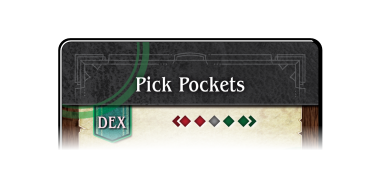

# A Thousand Faces of Adventure: Player's Guide

*playtest version* VERSION DATE

*find latest version at https://1kFA.com*

*email sjb@ezide.com*

**Cross through together into an unknown world, share your fantastic story, and
return a hero of myth!  Welcome to A Thousand Faces of Adventure!**

<!--
**Like board games? Get a kick out of those online Dungeons & Dragons videos?
Want to try improv?  Welcome to A Thousand Faces of Adventure!**
-->

<!--
1kfa is a structured improv game of heros and adventure.
-->

# A World Needs Inhabitants

The world is forged. The rivers run, the stars hang in the sky, and the winds whisper across empty lands.

But it is not alive yet.\
It needs heroes — wanderers, dreamers, schemers, fools.\
It needs you.

Now that you've completed the Universe Creation activity in the Table Guide, it's time to bring your Player Character (PC) into being:\
someone to walk the roads, clash with dangers, chase dreams, and carve their name into the myths still waiting to be told.

---

# Should You Read This Guide?

If you’re stepping into the role of **Player**, this guide is for you.

Your main job will be to bring a character to life through the choices you make and the words you say.\
You'll be part of a *conversation*, helping shape the story not only through action, but through imagination, asking questions, and chiming in when someone inspires you.

Think of your character like a hero in a movie — and use them as if you're the actor, or the writer, or the director. The stance will vary with what feels right to you at the moment.\
You'll be asked to describe what your character says, does, feels, and remembers.\
You'll contribute to building the world, responding to challenges, and making the story feel real and alive.

If that sounds exciting, *A Thousand Faces of Adventure* is built for you.\
This game invites players who are ready to improvise with their friends, and breathe life into a world of trials, triumphs, and transformation.

---

# What This Guide Does

This guide will prepare you for play by covering:

- **The Physical Components**\
  Learn about your Deckahedron, character sheet, move cards, tokens, and how to set up your play area.

- **Character Creation**\
  Step-by-step procedures to build a character ready for adventure.

- **The Player's Toolbox**\
  Practical narrative tools and procedures — including useful principles to support roleplay, and the nuts-and-bolts rules for how to use all of your physical components.

- **Reference Materials**\
  A glossary, detailed explanations of move cards, and visual references to help you find what you need during play.

# Components

## Character Sheet

 * Spaces for various facts about your PC
 * Attributes (Dex / Int / Str)
 * Affordances for Deckahedron, Discard pile, Exhaustion pile

## Deckahedron

{ width=2.5inch }

(If you do not have a physical copy of this game, you can find a digital
Deckahedron at [1kFA.com/table](http://www.1kFA.com/table) )

Every player except the GM gets a Deckahedron. Inspect your Deckahedron.
You should have 20 cards.  There are 4 symbols, or "suits", on the fronts and
backs of the cards:

Name      | suit                                    | odds                              | color  | rank
----------|-----------------------------------------|-----------------------------------|--------|-------
Anvil     | { width=0.5inch }     | the weakest odds        | red    | rank 1
Blade     | { width=0.5inch }         | below average odds      | blue| rank 2
Crown     | { width=0.5inch } | above average odds      | yellow | rank 3
Dragon    | { width=0.5inch }         | the best odds           | green | rank 4

`TODO`
 * Parts of a card face
   * Rank
   * Primary Result
   * Optional results
   * d6 and d4 results
   * Zodiac symbols

When you begin a game, shuffle your Deckahedron and place it face-down in front of you.

## Move Cards

`TODO`
 * Dramatic Action moves
 * Combat moves
 * Downtime moves
   * Not used in the One-shot campaign

## Layout

`TODO: illustration of player-facing layout`

# Character Creation

## Formatting Note

This section uses the same structure as Universe Creation:\
**One person reads aloud**, while the rest of the table follows along and participates.

For Character Creation, that reader should be the **GM**.\
The GM reads aloud the boxed or blockquoted text, guiding the players step-by-step through the process.

These read-aloud sections are written to be spoken exactly as written, but feel free to paraphrase if it helps the tone or flow at your table.\
The goal is to make this process easy, shared, and engaging — so everyone can focus on bringing their characters to life.

Just like before, you don’t need to rush. Feel free to pause, ask questions, go off on tangents, or laugh together. Then recenter and keep going. You're building something.

---

## Choose Move Cards

Get the deck of Move Cards from the supply.\
If you are playing a One-Shot campaign, remove any cards with a **“9”** or **“30”** printed in the corner.

Lay out all three cards marked with an **“A”** in the corner.

Then add more cards depending on the number of PCs:

| Number of PCs | Additional Cards |
| ------------- | ---------------- |
| 1             | 3                |
| 2             | 6                |
| 3             | 8                |
| 4             | 13               |
| 5             | 15               |

You can select these additional cards at random or let the GM curate the spread.

Lay the additional cards *on top of* the three initial ones, forming **three
“streams”**. Each new card should leave only the *title* of the lower
card visible; the new card should cover up the details of the card below it.
You can rotate the streams if needed, so players on opposite sides of the
table can read them right-side-up.

The GM reads aloud:

> These are called Move Cards. You're going to take turns choosing, and I’ll be here to explain how they work and answer questions.
>
> This process will give each of you three Move Cards — your character’s special starting gifts, talents, or powers.
>
> Later in the game, you’ll be able to “Study Under a Master” to gain more.
>
> There are a lot of choices here, and we don’t want to get bogged down in the details. For now, you’re just choosing by title.\
> Read through *just the titles* and ask yourself, “Does this sound like something I’d want my character to do?”
>
> We’ll learn how the cards work later.\
> This game is about improvisation, not perfection — so go with your gut and pick three cards that look fun to you.

Players should use **The Rule Beneath All Rules** to determine pick order.

Once each player has three Move Cards, move on to the next step. Hold onto them — these are the seeds of your character's legend.

## Choose Dex / Int / Str

Each character has three core traits: **Dexterity (Dex)**, **Intelligence (Int)**, and **Strength (Str)**.
These traits don’t restrict what you can attempt — they shape how your character approaches challenges, and how the consequences unfold.

You have **6 points** to distribute across your three traits.
Each point increases a trait’s *rank* — from **Anvil** to **Blades**, **Crown**, and up to a maximum of **Dragon**.

The ranks are:

- **Anvil** (1)
- **Blades** (2)
- **Crown** (3)
- **Dragon** (4)

Each trait must be assigned at least **Anvil (1)**.
No trait may go higher than **Dragon (4)**.

The GM reads aloud:

> Your character has three traits: Dexterity, Intelligence, and Strength.
> Find those on the character sheet.\
> They describe *how* your character acts, solves problems, and overcomes
> adversity.
>
> You’ll assign **6 points** across these three traits to give them a rank.
>
> - You must assign at least **Anvil (1)** to each trait.
> - No trait can go above **Dragon (4)**.
> - You have exactly 6 points to spend.
>
> Think about what your character relies on when the world turns against
> them. Are they fast? Cunning? Strong?\
> What are they not so great at?

Once all players have chosen their trait ranks, move to the next step.

## Choose a Name

Now that the PCs have their basic shape, it’s time to choose their names.

The GM reads aloud:

> Now let’s give your character a name.
>
> You can invent one, borrow from your favorite fantasy stories, or draw
> inspiration from the Touchstone List.
>
> Don’t worry about getting it perfect. Choose something that feels fun
> to say, or that makes you curious about who this person might become.

Players should write their character’s name on their sheet, bold and
large so everyone around the table can read it, before continuing.

## Cut from the Worldcloth

At this point, the characters have names, attributes, and a few special Move Cards. Now it’s time to sketch the outline of who they are in the world — where they came from, what they care about, and what attachments they have to the setting.

The GM reads aloud:

> After players announce their name, it’s time to cut your character from the cloth of this world — to define what makes them stand apart.
>
> I’m going to ask each of you a couple of questions. Your answers will help the rest of us get a feel for your character.

The GM doesn't ask each question to each player; they address a question to just one player, then move on, asking the next question to the next player, and so forth. Remember the Rule Beneath All Rules here: allow space for interruptions, tangents, and riffing, and then re-center the table.

For each bulleted question, add a follow-up question of your own. How do the players' responses relate to the established Touchstone List? What further detail would you like to know? Follow your curiosity. This will warm up your improvisational energy and spark ideas for the opening scene of your story.

If you can't think of a follow-up question, you can default to this one:

- Why does that complicate your character's life?

This conversation might also add details to the world, such as what kinds of species and religions exist.

- What species is your character — human, or something else from our Touchstone List?
- Is your character righteous, hewing to moral norms, or do they get their hands dirty, taking opportunities wherever they find them?
- What work or calling defines your character’s life — how do they earn respect, survive, or make trouble?
- Does your character believe in gods? Is there some kind of spiritual practice or religious organization for them?
- What kind of life does your character know best — wandering the wilds, the streets of a city, or somewhere in between?
- How old was your character when they had their closest encounter with Death? Were they its witness -- or its agent?
- What station does your character hold in the world’s eyes — and what happens when they step into a crowd?

Not everyone will get asked every question, but everyone will *start thinking about* how each of these questions applies to their character. With some depth and dimensionality in mind, a player will be better able to imagine creative outcomes to the situations their character is confronted with.

As you're asking the players these questions, practice **Ludic Listening** and also measure the expectations they have for the game.

This is a game where characters start off as scrappy adventurers. If a player is telling you their character is a fire demon, a ten-year-old shoe-shine boy, or a computer hacker, a conversation is needed to establish how that character can fit into the rules.

## Initiation to Mystery

The GM reads aloud:

> Since this is a game about taking risks, I'm going to give you an opportunity to get some bonuses when you get risky.\
> We're going to create what are called **Initiations to Mystery**.
>
> An Initiation to Mystery is a thematic goal your character might try to achieve during the story.\
> You'll write it in the designated spot on your character sheet, and place an **XP token** and a **✔ token** there as well.
>
> When your character *takes a big risk* to pursue this goal, you’ll earn XP, and the ✔ token will advance a scene’s progress bar.\
> (We’ll explain how those effects work later.)
>
> To choose your Initiation to Mystery, the player on your left will read you two options from a list. You’ll pick one, and that becomes your character’s personal Initiation to Mystery.  You then read propose 2 different options to the player on your right and everyone will take their turn like that.

Here are the available Initiations to Mystery:

- Expose an embarrassment
- Locate a prize
- Extract a secret
- Become enamored
- Sell your services
- Break down a barrier
- Choose a side
- Be an agent of justice
- Take pity on the desperate
- Start a grudge
- Consort with the unsavory
- Believe an impossible claim
- Get called out on your boasting

Once chosen, players keep their XP and ✔ tokens on the Initiation to Mystery spot of their sheet. They are not available to spend yet.

When a character first *takes a big risk* in pursuit of their Initiation to Mystery — by the method or for the reason written on the Initiation to Mystery spot — the player:

- Claims the XP token
- Advances a ✔ token to a scene’s progress bar of their choice

Initiations to Mystery are especially helpful for players newer to roleplaying games — they provide a personal goal that can inspire bold choices and keep the story moving.

# Weapons and Items

The GM reads aloud:

> Now let’s give your characters some equipment.
>
> We'll start with the mandatory stuff. First of all, everyone gets 2 **Pack Cards**. You can use these with the *"Good Thing I Brought..."* move.

Give each player 2 Pack Cards. Pack Cards are just white-side green cards.

> Next, does anyone have a Move Card with the "RECEIVE CARDS" tag?

### RECEIVE CARDS Phase

There are 3 Move Cards tagged with "RECEIVE CARDS":

- **Use a Magic Item** — take 1 magic item of your choice
- **Channel the Living Light** — take *Sigil of the Living Light*
- **Entreat the Blood Bound** — take *Blade of Echoes*

### 2 Item Cards Phase

> Next, everyone gets to choose 2 **Item Cards** for their character. These can be weapons, armor, or other items with mechanical significance.\
> This game comes with some cards to get us started, but we can also write things on blank cards.
>
> In stories like the one we're about to tell, your character probably has a weapon. Without one, their *attack power* will only be 1.\
> These are the Weapon Cards included with the game, but we can also make reasonable new ones based on our Touchstone List.
>
> When your character strikes an enemy with a weapon, their attack power is 1d4. You'll have future opportunities to increase this using the *"Tales of a Weapon"* move.

Lay out the included Weapon Cards. Use blank cards to copy or invent new ones.

If a player describes an unusual or epic weapon, that's fine — just remind them that all characters begin the game with a d4 attack power regardless of how dramatic the weapon seems.

> Next up: armor or a shield. Armor passively absorbs attack power. Shields can nullify it, but only after a test of your Dexterity.

Lay out the Armor and Shield cards. If two players want the same kind of item, use a blank card to make a second copy.

Players don’t have to choose only from weapons, armor, and shields. After the RECEIVE CARDS phase, each player can also choose **1 magic item** as one of their two Item Cards — even if they didn’t take the *"Use A Magic Item"* move. Just be sure they understand the difficulty of using magic items at the *wild* level.

Any time there’s a blank on a card, the player should fill it in so that everyone knows exactly what the item is.

`TODO: link to weapon and armor lists`

### Magic Item Charges and Capacity

Instruct every player with a Magic Item card to mark the **3** spot on the capacity gauge. Then give them 3 green cards from the supply, white-side up, to place on their item as charges.

### Aside: A Feather Can Make You Slower

Players may wonder: Why does a ring or pair of boots have an encumbrance penalty? How can something so small slow you down?

The answer: **That’s for you to explain**. Maybe the boots are cursed, or the ring hums with a heavy magical presence. The fiction is yours to interpret — but the rule stands.

Items chosen during character creation **always apply their encumbrance penalty**, even if their narrative form seems light or symbolic.

This doesn't mean every item in the game will weigh your character down. During play, a letter from the king or the eggs of a cursed salamander might appear — and those may be weightless or handled purely through narrative. But starting gear is balanced with cost — and that includes the burden it brings.

## Character Creation Complete

You’ve done it — you’ve brought your character into the world.

You’ve chosen their name, their gifts, their gear, and their tangled place in the world’s weave. You’ve given them a past and a purpose. Now, it’s time to discover what fate has in store.

From here, the GM Guide picks up the thread. You’ll shape The Hearth — the bond that ties these adventurers together — and build the first scene of your story: a moment of danger, a call to action, or something stranger still.

But before you dive into that first breath of shared narrative, the next chapter of this guide will show you the tools for your PC: how to act, react, and improvise with clarity and confidence.

# Toolbox

To play *A Thousand Faces of Adventure*, you'll need two kinds of tools: **narrative tools** and **mechanical tools**.

Narrative tools help you think like a hero — they’re guidance and mindsets for how to act, speak, and grow inside the story. They make your character feel alive, and your actions feel meaningful.

Mechanical tools are the physical stuff of play: flipping cards, tracking tokens, reshuffling decks. Knowing how to operate your components lets the game deliver tension, structure, and surprise to your story.

Apply the narrative and mechanical tools to your *responsibilities* as a player. It’s your job to animate the character, take bold action, and stay engaged with the shared fiction. These tools will help you move with confidence, speak with purpose, and dive headfirst into the unknown.

## Heroic Transformation

> "Fortune and glory, kid. Fortune and glory."
> — *Indiana Jones and the Temple of Doom*

Every mythic story is about **transformation**. *A Thousand Faces of Adventure* is a game about your character growing from humble beginnings as a **scrappy adventurer** into someone who will have an epic impact on their world.

{ width=2.5inch }

During Character Creation, you will determine  aspects of your character's history, social and economic circumstances, and personality. These are the **fictional** aspects of the character. You will also use the game's rules to determine all the **mechanical** aspects of the character.

The terms *mechanical* and *mechanism* describe aspects of the game
that concern rules, numbers, and procedures.

Mechanically, characters start out just a little more powerful than a common villager. Your character will have more stamina than a townsperson and will start with three special moves — but that's all that separates them from Michel the stable-hand and Constance the librarian.

You can invent any backstory you like, but you may need to answer questions about how it fits the character's game limitations. Nothing stops you from creating a hulking, seven-foot barbarian with a rich history of warring and slaughtering enemies. But at the beginning of the game, a little bad luck may see that barbarian suffer a sound drubbing at the hands of a farmer and his overprotective goat.

To make this barbarian feel authentic, you'll need a narrative conceit or justification — maybe they're a drunkard, battle-worn, or magically cursed — that explains why the character begins at a "scrappy adventurer" level.

As your character adventures in the world, they will gain experience and equipment, making them worthy of the title "hero." Over time, they may unlock legendary abilities, form deep bonds with companions, and confront choices that shape not only their fate — but the fate of entire realms. You might rise from outlaw to oracle, from exile to queen. Each tale unfolds differently, but every step builds toward a transformation only your table could have imagined.\
See [Character Advancement](#character-advancement) for more details.

As a player, you'll enjoy this journey most if you embrace the full sweep of transformation. Let your character stumble. Let them doubt, flinch, falter — and then let them rise. Give weight to their humble beginnings so that their final, dragon-confronting moment sings with meaning. You're not just watching a myth — you're living one, from yearning spark to cacophonous storm.

---

As you play, ask yourself:

- What part of my character *needs to change*?
- What lesson is the world trying to teach them?
- What mask do they wear — and what truth lies beneath it?
- What scars will shape their legend?

## Probe The Unknown

> “A day may come when the courage of men fails, when we forsake our friends and break all bonds of fellowship. But it is not this day.”
>
> — Aragorn, The Lord of the Rings: The Return of the King

In this game, consequential moments all begin the same way: **a PC does something uncertain, risky or meaningful**.

That moment triggers a **Move** — a specific rule that guides what happens next.

*Moves don’t trigger themselves*.  The game only responds when **you** do something bold, curious, or dangerous. If you play it safe, nothing happens. The world waits.

That means the real power is in your hands. If you want surprise, drama, progress — you have to *probe the unknown*.

When you feel unsure what to do:

- Investigate something mysterious.
- Tune your heart to something buried deeply.
- Ask a dangerous question.
- Cross a forbidden threshold.
- Unleash your mischief or foolishness.
- Charge at your adversaries

Remember, even a failure moves the story forward. You'll gain:

- **XP**
- **Narrative momentum** (new complications, discoveries, twists)
- **Progress** on the scene or achievement of a stake

Think of this  as a **tool you can keep in your pocket**. When the story feels needful, when you're waiting for the next big thing — pull this out. Remember your character's curiosity, or mischief, or sheer reckless courage. Use it to push forward. Every risk you take sends a ripple through the story — the world stirs, new paths open, and consequences unfold.

## Buttons or Beats

...
You have your own personal play style.

Name your moves or not.

Your style can change depending on the state of the game

You may prefer button pushing in combat interludes, for example.

Advantage to button pushing: the GM doesn't have to interpret

Advantage to beats: you can stay immersed and just say what flows from the fiction.

## **Triggering, Resolving, and Interpreting Moves**

A move is triggered when your character takes an action that is **uncertain**, **risky**, or **meaningful**.\
You don’t declare “I’m making a move” — instead, you **describe what your character does**, and the GM decides when a move has been triggered.

From there, resolution unfolds in a set sequence: you trigger the move, resolve it using the **Deckahedron** and **Move Cards**, then interpret the result and fold it back into the story. Some moves may also instruct you to gain resources or mark progress — if so, follow those instructions during resolution.

 { width=2.5inch }

### Step-by-Step Procedure

- **Trigger**\
  A move begins when your character takes action that aligns with a move’s description or dramatic purpose. The text of each move should provide clear context for the GM to decide if one is triggered, but the table can sometimes help identify when it happens or which move fits best. Use the tool of Fictional Positioning in this decision.

  Take note of which attribute this move is resolved with.  If there are multiple choices, the table should agree one one before the next step.

  Examples:

  - Charging at your adversaries - triggers Mix It Up or Defy Danger
  - Speaking from the heart - triggers Unfold Mystery or Defend
  - Reaching into  magical energies - triggers Use A Magic Item or Channel the Living Light

Remeber to use the tool of Fictional Positioning when considering whether a move is triggered.

(*Example fictional trigger: When you attack someone from surprise ...*)

**Fiction Supports the Move:**

**Player:** “I blend into the crowd, then step behind the captain as he’s shouting orders. I draw my knife and strike low.”
**GM:** “He doesn’t know you’re there, and he’s distracted. You’ve got the drop on him -- *Backstab* triggers.”

The fiction provides both surprise and a clear positional advantage, meeting the move’s requirements.

**Fiction Doesn’t Support the Move:**

**Player:** “I want to use *Backstab* on the troll.”
**GM:** “How are you approaching?”
**Player:** “I just run up with my sword drawn.”
**GM:** “It roars and turns to face you before you’re even close. You’ve got its full attention -- no element of surprise here.”

Charging a foe head-on gives no fictional support for a sneak attack. *Backstab* doesn’t trigger.

- **Flip**\

{ width=2.5inch }

  Draw and reveal one or more cards from the **Deckahedron**.

  By default, draw one card. Only if you have advantage or disadvantage (see below) do you draw more.

- **Resolve**

{ width=2.5inch }

  On their character sheet, find the PC's rank for the attribute decided on above (Dex, Int or Str).  Then find that rank on the card that was drawn, and it's associated primary result. When using advantage or disadvantage, look through all the revealed cards' primary results, and use the best (advantage) or worst (disadvantage) card from here on (this is the *resolving card*).

  - **Rank** (Anvil, Blades, Crown or Dragon)
  - **Primary result** (ranging from ✗ to ✔✔)

    Take note of any secondary results on the cards, found in the center of the resolving card. See the rules below for their effects.
  - **Secondary result** (Wound cards, blessing cards, XP cards)

Place all the revealed cards on your discard pile, keeping the resolving card on top.

- **Interpret**\
  Take the primary result and find the text on the Move card that matches it. Perform the actions and answer any questions indicated by the matching text on the Move card.  Also perform any mechanical actions demanded by the secondary results at this point.

  Next, interpret these actions in the narrative.\
  This is where narration reclaims the lead. The text of the Move may provide questions to answer, but if you’re otherwise unsure how to begin, the GM can answer either of these questions:

  - If this were a movie, how would the result of the move be shown on screen?
  - How do the elements established in the scene respond?

## For example,

You're playing a character named Kresk.  You say:

> Kresk sees the pit of spikes in front of him, but isn't scared.
> He just takes a running start and mightily leaps over the pit,
> landing safely on the other side.

The GM interjects:

> Ok, sounds good, but let's see if Kresk's legs are strong enough.
> Please flip Defy Danger with your strength.

Here, "Defy Danger" is the move, and "strength" (Str) is the chosen
attribute.

Find the description of the Defy Danger move in your Base Moves
(it's at the very beginning).
Next, on the character sheet, see that Kresk has rank 3 (Crown) Str.
Flip over the top card of your Deckahedron and look for that Crown suit.

Let's say the flipped card shows ✔ next to the Crown.
The Defy Danger move reads "You do it, but there's a new complication".
When you look to the GM to interpret this outcome, they begin to
improvise:

> You leap through the air, landing with a thud on the other
> side of the pit, kicking up a cloud of dust on this forgotten
> jungle trail. Rising to your feet, you notice that more than
> dust has been stirred. The sounds of movement and a threatening
> rattle alerts you to something approaching from inside the pit.
> What do you do?

## Advantage and Disadvantage

Some moves will tell you to "flip with advantage" or "take +1 advantage." Others might say "flip with disadvantage" or even "your foe gains advantage." The phrasing varies, but the effect is always the same: it changes how many cards you flip, and how you resolve the result.

Advantage and disadvantage can also come from the fiction — including when the GM spends Shadow Points to shift the odds against you (see the GM Guide).

* You must flip **exactly the number of cards** equal to your **net advantage or disadvantage**, up to a maximum of **3 cards**.
* Advantage and disadvantage **cancel each other out**. (e.g. 2 advantage and 1 disadvantage = 1 net advantage.)
* You always ***resolve*** **the flip using exactly one card**.
* With **advantage**, you must choose the card with the **highest** primary result.
* With **disadvantage**, you must choose the card with the **lowest** primary result.
* If there is a **tie** for highest or lowest, you may choose freely among the tied cards.

Your choice determines both the outcome of the move and any secondary effects (like XP). All flipped cards go to your discard pile, with the chosen card on top.

## Primary Results

| ✗  | miss               | GM Move            | Shadow point |
| ✓  | success and shadow | grey progress      | |
| ✔  | success            | green progress     | |
| ✔✔ | double success     | two green progress | |

GM Move happens on an ✗ (non-FAST card)

See the GM Guide for rules on the scene results

## Secondary Results

### XP

{ width=2.5inch }

Resolving flips is how players acquire experience points (XP).
XP are a player's most important mechanical currency in the game.

Some Deckahedron cards show an experience point symbol in the middle.
After a flip is *resolved* by one of these cards, take one XP from the
supply.

You may only do this when the card *resolves* a flip. (ie, when flipping
multiple cards, only if the *XP card* was the one from which
the ✗ or ✔ symbols were used to interpret the result of the move)

XP are a currency you spend to activate other rules in the
game. See the Moves reference below for descriptions of how XP can
be spent.

### Critical Success

{ width=2.5inch }

One of the 20 cards in your Deckahedron is the "Critical Success card". It
has a ✔✔ symbol on every edge and a circular green symbol in the middle.

If you *resolve a flip* with the Critical Success card, you can do one of
two things:

 * Draw a Blessing card from the supply and put it in your discard pile.
 * Answer the question "How has your PC's practice finally paid off, or what
   epiphany led them to achieve more mastery in this move?" Then spend
   XP 1-for-1 to go up levels in the move that was just resolved.

### Return Card

Blessing cards

{ width=2.5inch }

Note the symbol in the center of the Blessing cards.  This indicates
that the card should be returned to the supply.

Some move cards will instruct you to take Blessing cards. When instructed
to do so, draw one Blessing card at random from the supply, and place
it in your discard pile.

Blessing cards improve your Deckahedron by giving you better chances to
succeed at moves.

Whenever a move is *resolved* by a Blessing card, return the Blessing card
to the supply rather than keeping it in your discard pile.
(Shown by the symbol in the center of the blessing card)

### Wounds

{ width=1.1inch }

Wound cards can be used to represent different fictional aspects. They
usually represent literal wounds, but may also be used for the effects of
disease, poison, or other effects inflicted by monsters or the environment.

Unlike the other secondary effects, a wound card's happens both **when it resolves a 
flip** and **when it is moved into the exhaustion pile**. See below for more details on
that.

Whenever a wound card's secondary effect is activated, do these 3 things:

 * (Optional) Answer: "What sound or noise is emitted by the PC as they endure their wound or affliction?"
 * Add a new one-unit stake to the scene, entitled "Fortify (PC's name)". If this stake is not achieved by the end of the scene, the PC wil be incapacitated at the end of the scene.
 * (If that stake has already been added to the scene, add another unit to it)
 * Lose one Stamina point

See the [Combat chapter](#combat---stamina-and-wounds) for more details on wounds.

### Secondary Results from Moves

(Channel the Living Light, ...)

(Should I talk about shadow points from FAST moves?  GM Move triggers?)

## Interpreting a Flip

{ width=2.5inch }

| ✗  | GM Move            | Shadow point |
| ✓  | grey progress      | |
| ✔  | green progress     | |
| ✔✔ | two green progress | |

Triggering a move doesn't just resolve numbers or move tokens — it advances the story.

Moves have two outputs: **mechanical consequences** and **narrative consequences**. Interpreting a flip means seeing how the outcome reshapes the situation, shifts momentum, or alters the danger. Here's how to do it:

### 1. **Apply the Mechanical Consequences**

Each move tells you what to do when a flip is resolved. This often includes:

* Marking progress bars
* Adding or expending tokens (Stamina, Items damage, Charges, etc.)
* Activating or halting specific effects
* Choosing from a list of 2 or 3 options (as prompted by the move)

Always resolve these mechanical effects first. They are not optional — they are the cost or reward of your choices.

If the move does not otherwise specify what happens on an ✗, the ✗ result triggers a **GM Move** — a special case where narrative control shifts to the GM. When this happens, the GM follows the procedures in the GM Guide to apply pressure, introduce twists, or escalate danger.

### 2. **Answer the Move’s Question(s)**

Most move cards include one or more narrative prompts — questions that must be answered based on the result. These might be:

* **Player-facing questions**, like “How was your attack focused on part of the foe's body?”
* **GM-facing questions**, like “Does the armor need to be surrendered or destroyed?”

These narrative hooks are *calls to action* — invitations to add detail, alter the scene, or introduce twists. You don’t have to answer them alone; collaborate if you’re stuck. Once answered, they provide Fictional Positioning for further actions.

If one of the options is impossible (fictionally or mechanically), it may
not be chosen. Choose one of the other options instead.

### 3. **Repaint the Scene**

Once the consequences are resolved and questions are answered, the GM (or the table) should take a breath to **reestablish the scene**. Ask:

* Has the setting changed?
* What are the present threats? Has danger diminished? Has a new danger emerged?
* Are the stakes clearer — or more dire?

Use the **scene-establishing questions** to frame this update. Repainting the scene helps ground the narrative in the moment after impact.

### 4. **Keep the Story Moving**

Finally, the GM turns to a different Player at the table:

> "What do you do?"

That question is the heartbeat of the game — it keeps the story alive, moment to moment, breath to breath.

## Moves tagged *FAST*

As the conversation transits around the table, players will
have informal "turns" where they talk about the actions their PC takes.
The game works best when this "spotlight" is moved around fairly
so each player can contribute. The spotlight typically follows a single
character's actions until they trigger, then resolve a move.

Some move descriptions have the *FAST* symbol. This indicates
they can be paired with another move during your character's
moment in the spotlight.

*FAST* moves are like "bonus" moves that augment, or quickly follow the
initially triggered move.

Characters will trigger **at most one** *FAST* move during their moment
in the spotlight.
Otherwise the pace of the game can slow down, and other players may feel
like they aren't getting a fair share.

{ width=5inch }

Examples of cards tagged *FAST* include Unknown Benefactor,
Where It Hurts, and Shield.

A moment in the spotlight might see your swordsman character triggering
the move Mix It Up, causing damage to a foe, and then also triggering
Where It Hurts as you describe the sword delivering a stunning blow,
clanging loud and hard against the foe's helmet.

Or, your professor of alchemy character might trigger Defy Danger as they
jump out of the way of a toppling bookcase. After you flip an ✗, the GM
may start enumerating the attack power your character must suffer, to which you
could respond by invoking Unknown Benefactor to cancel the attack's effects.

## Reshuffling

After every flip, any face-up Deckahedron card is placed, face-up, in a
*discard pile*. (Later, you will start another pile of cards called an
*Exhaustion pile*. Keep them separate.)

At any time other than during a flip, you may take your
*discard pile* and shuffle it back into your Deckahedron.

Whenever your Deckahedron has 5 or fewer cards, you **must** take
your *discard pile* and shuffle it back into your Deckahedron.

## Teamwork Flips

Before a flip is executed, if other players have characters in the same
scene as the character taking action, and there is nothing in the fiction
preventing it, those other players may choose to have their characters
*aid* the "spotlighted" character. They just chime in before the flip and
say how their character helps out.

Another time the Teamwork Flip is triggered is when the characters are
all bound together in joint success or joint failure.
(eg, Defying Danger when the whole party is in a canoe traveling over
whitewater)
In that case, the GM asks the players "who is taking the lead?".
That "lead" character is the "spotlighted" character, and the
other players are supporting them.

The spotlighted player flips as they normally would, the supporting players
say how their characters are helping and each flip one Anvil.

The players choose the best result to resolve the flip.

Only the card that resolved the flip can have secondary results, and any
such secondary results apply only for the player who played it.

If there are any negative consequences (damage, danger, etc) from the
result, all the participating characters must suffer them.

# Combat - Stamina and Wounds

Your character will confront violent foes and dangerous obstacles. Will
they endure exertion and injury to keep venturing forward, or will they
be disfavoured by fate and end up broken, spent, or collapsed?

In a fight, a character is running, dodging, striking, and being struck
by their foe.
All of this action is scary and exhausting.
A character gets weaker as this exchange goes on, even if they
dodge every blow.

This weakening is represented by cards from your Deckahedron being lost
into your *Exhaustion pile*.

In any kind of real-world boxing or martial arts match, the later rounds
find the athletes worn down, their footwork less animated, and their
guard drops more frequently.
The contest is not always decided with a knockout punch, it often comes
down to who can endure.

In this spirit, in-game combat typically causes cards to be lost to the
*Exhaustion pile*, and the players are encouraged to narrate these
mechanistic outputs as this type of stamina loss.

With that said, there is also a Wound mechanism, described below.

## Incapacitation / Bust-on-3

When a Deckahedron contains only 3 or fewer cards, even after an
opportunity to reshuffle, that character is incapacitated.
At the point when the player's Deckahedron hits this number, their
character's fate is up to the game rules and the GM.

## The Four Ds

When your character gets attacked or falls victim to some other danger,
you have choices about exactly how they are affected. They may dodge,
and just lose Stamina, they may stand stubbornly against a blow,
perhaps absorbing it with their armour, or they may be wounded by it.

The procedure for making these decisions is called "The Four Ds":

 1. Reveal
 2. Reduce
 3. Reap / Remand / Remit
 4. Regale
 
 1. [Denominate](#denominate) - reveal cards to find the numerical *attack power*
 2. [Deduct](#deduct) from the *attack power* by using cards or taking Wounds
 3. [Distribute](#distribute) tokens
 4. [Describe](#describe) the outcomes in the fiction

## Denominate / Reveal

When your character suffers the consequences of violence, you reveal
cards and read the numbers shown. Use the top card from either your
Deckahedron or your Exhaustion pile, whichever is larger, shuffling if
necessary to ensure unpredictability.

When a move calls for "1d4", read the number shown inside the triangle.
When a move calls for "1d5", read the number shown inside the square.
If there is no number, that card doesn't count. Just ignore it and
use the next card.

{ width=5cm }
{ width=5cm }

When a move calls for "1d10", add both numbers shown in the triangle
and the square. If there is no number in the triangle or the square,
consider it a zero for the purposes of addition.

Note, this "1d10" process does not produce results uniformly
between 1 and 10, but instead produces results along a specially-designed
"2-to-10 curve", which has been chosen to provide statistical results
that create a pleasing and dramatic experience.

In rare cases the instructions of a move will explicitly declare the
amount of *attack power*, so you won't have to reveal cards.

Put the revealed card in your discard pile.

## Deduct / Reduce

After the *attack power* is known, you can choose to lower it by
using *move cards* like Good Cardio and Mystic Breathwork
or *item cards* like Shield, or by taking a Wound.

You can always choose to absorb the **entire** amount of *attack power* by
taking a single Wound.

Otherwise, cards that negate or absorb *attack power* can be used to
reduce the total. Generally, you take Exhaustion or Wound tokens from
the supply and place them on the designated space on the card.

{ width=2.5inch }

----

Let's say your character was attacked with a sword and the dice were rolled
and summed up to 7. You can either take 7 Exhaustion tokens (thus losing 7
Stamina points), or choose to take one *Wound token* (see below) instead.

Let's further say your character had lost 3 Stamina points earlier in the
battle. With only 7 Stamina points left, it's a wise time to take a Wound.

## Distribute / Reap

In the **third step**, you will lose cards from your Deckahedron according
to the remaining *attack power*.

Remember the Bust-On-3 rule. If this process reduces the cards in your
Deckahedron to 3 or fewer (even after reshuffling in your discard pile),
then your character is incapacitated.
To win at combat, a character's foes must be subdued or pacified before
this happens.

Once *incapacitated*, the character can take no further actions.
It is up to the GM to decide what this incapacitation means - whether
the character is dead, unconscious, or otherwise unable to act.

### Losing or Expending Stamina

Reveal cards from your Deckahedron face-up until you have revealed
exhaustion symbols equal to the remaining *attack power*.
Take all of the revealed cards, *including the cards without
exhaustion symbols*, and put them face-down in your Exhaustion pile.

{ width=2.5inch }

**Only with wound cards**, activate the secondary result effect.

If you haven't started an Exhaustion pile, start a new one.  Keep it
separate from your Deckahedron and discard pile.

If your Deckahedron does not contain enough cards, you **must**
reshuffle your *discard pile* into the Deckahedron and continue.

Note: you *may* choose to reshuffle your *discard pile* back into the
Deckahedron *before* moving cards onto their *Exhaustion pile*.

### Taking Wounds

{ width=2.5inch }

Wounds are a long-term source of trouble for your charcter. When wounded,
all intelligent creatures seek to cure their condition as a high priority.

When you choose to take a Wound, or if the rules demand that you take one:

  1. The GM will describe how your character was wounded
  2. Randomly draw a *wound card* from the supply and place it in your
     *discard pile*. It will now start cycling between your Deckahedron
     and your *discard pile*.

Wound cards can be used to represent different fictional aspects. They
usually represent literal wounds, but may also be used for the effects of
disease, poison, or other effects inflicted by monsters or the environment.

To get rid of a wound, the Seek Help move must be triggered.  See the detailed move rules below.

## Describe / Regale

Finally, the **fourth step**: you interpret those results into the
narrative.  Did your character dive into the dirt?  Did they take a punch
to the jaw and respond with a bloodied grin?  Did the spear bounce right
off their steel breastplate?

| *The act of taking a risk, deciding how*
| *to get hurt, and then later, deciding when and*
| *how to heal, with each stage having its*
| *sacrifices and benefits, is a miniature echo of*
| *the overall structure of the Hero's Journey*
| *campaign. Starting in comfort, choosing to*
| *cross a threshold, deciding which fork to take*
| *in a road of trials, then returning.*

# Equipment

During [character creation](mod_guide_gm.md#character-creation), you
receive two Pack cards and take some Item cards.
These cards represent equipment carried by your character that interacts
with mechanisms of the game.

Daily-use amounts of money and food are not tracked. It is assumed
your character will always be able to scrounge a meal somehow.
Unless it is relevant to the drama of the fictional situation or
inspired by the Touchstone List (see the GM Guide), small monetary
transactions may be abridged or assumed.

It is also not necessary to exactly measure movement speed or the sizes
of all the gear carried or to track the body part to which the gear
is strapped.

Your character has a movement speed, a certain lightness-of-foot,
they carry a certain amount of equipment and items,
and perhaps even a certain amount of wealth or treasure.

There are some moves that are affected by how much *stuff*
a character carries. These moves have a "Encumbrance Penalty" section,
and describe how carried equipment affects their outcomes.

At any time that makes sense in the fiction, a character can drop items
and equipment.

## Pack - Precious and regular

{ width=2.5inch }

Throughout the game, your character will gain, lose, and trade equipment
and supplies that are worth tracking. These items don't need to be specified
until they actually get used. Instead they are tracked with anonymous Pack
cards.

White-side green cards represent "regular" Pack and black-side green cards
represent "precious" Pack.
Precious Pack is something that is found precious by *someone*. It may be
something made of a rare metal like gold, or it may be simply a full
waterskin offered to a parched NPC in the desert.

If the specifics of a Pack card get concretely established in the fiction,
and the card is not immediately spent, the Pack card should be returned to
the supply and a blank Item card should be taken to replace it, with the name
or details of the item written on it.

Your character starts off with 2 Pack cards, enabling the move Good Thing
I Brought...

## Good Thing I Brought...

{ width=2.5inch }

Adventurers are always finding themselves in tricky situations. Luckily,
they come prepared with adventuring gear. They have been known to carry
50 feet of rope, smelling salts, books of racy poems, sometimes even a
3-day-old pork chop to distract hounds or hungry goblins.

It's a fact. You know this and A Thousand Faces of Adventure knows this, so
you won't be asked to keep fine-grained notes of every candle and spare
button in your character's inventory.

Reasonable daily-use items are presumed to be in your character's pack. If
you're unsure, remember this game is a conversation, so just ask the table.

But sometimes you will be in a situation where having that 50 feet of rope
or an old pork chop would really *solve a problem* for your character.

When your character reaches into their pack and produces the item that
solves their current problem or helps them overcome a challenge, just say
what it is and execute the "Good Thing I Brought..." move.

The Pack cards represent the adventuring gear a character has brought along.
But you do not need to declare exactly what that gear is until you're in
a situation where you need something specific.

If the "Good Thing I Brought..." move is executed and the newly "declared"
equipment is something that can be returned to the backpack after
use, write its name down on a blank card and exchange that card for the
"anonymous" Pack card(s) that were the cost of "Good Thing I Brought...".

If 2 Pack cards are spent, and the character ends up with one card returning
to their backpack, future Encumberance Penalty calculations will change.
Use the fiction to justify that. Maybe they didn't have
*exactly* what they needed, so one piece of equipment had to be consumed
to create the necessary tool, in a MacGuyver-esque fashion.

If the equipment is something that gets consumed immediately when used,
the 1 or 2 Pack cards just get returned back to the supply.

## Item Damage

{ width=2.5inch }

Damage to items is represented as black-side red cards.

The "Bust-on-3" mechanism is used to represent damage.

The first two times an item is damaged, place a red card on the Item card,
black-side-up.

*If an item already has 2 red cards on it*, and it is damaged again,
it is destroyed. Return it and the red cards to the supply.

All mundane (non-magical) items can be damaged. Usually this happens
as the result of a GM move.

To repair items, see the move [Sharpen and Stitch](#sharpen-and-stitch)

# Magic

<!-- TODO remove trademarked references -->
Magic is an element that pervades stories of fantasy. It can be obscure
and stemming from nature like in Lord of the Rings, it can be elemental and
allegorical like in The Wheel of Time, and it can be linguistic and
self-aware like in The Invisibles.

To avoid presuming too much about the narrative, the rules do not dictate
the nature of magic or the "how" of magic. That's for you to decide during
play.
The rules provide a mechanical foundation and some optional narrative paths.
You are invited to take this well-tested framework, play with it, and expand
into it.

Is magic woven from subtle threads that pervade the universe? Is it based
on words of power? Is it high technology hidden in the planet's crust
by alien benefactors? Is it copied exactly from a concept in your Touchstone
List? You decide.

The rules give you a way to have scrappy adventurers begin with magic items.
These artifacts have 3 charges, and are rechargeable during Rest.
Your character can eventually build themselves up in power to a point where
they can cast magic spells without needing the items.

The rules also give names for two sources of magical power, "The Living
Light" and "The Blood-Bound". It's up to you to give these names narrative
meaning, if you want.

One thing to keep in mind is that characters may attempt any move that
resolves with Str / Dex / Int.
(See [Move Levels](#move-levels)
So even if moves like Use a Magic Item or Fundamental Magic were not chosen
at character creation or gained via Study Under a Master, any character may
attempt them.

That said, using magic invokes some of the more complicated rules.
Players are challenged with managing and balancing
charges, capacity, stamina, requirements, and narrative effect. This kind
of play is ideal for players excited by complexity and the potential
of explorable branches.

#### The ONGOING tag

Upon triggering the Use a Magic Item move, a character "flows magical
energy" into the item. Then the magical effects happen.

Some magic effects happen immediately.

Some magic effects persist even after the flow of magical energy into
the item has ceased. (eg, `_` of Sensation)

Some magic items have the ONGOING tag, and their effects persist
only as long as magical energy flows into the item. It is up to the
player to declare when their character ceases the flow of magical energy.
If the flow of magical energy continues, they are not considered *idle*
for the purposes of the Rest and Seek Help moves.

#### Charges and Capacity

{ width=2.5inch }

By default, magic items have capacity for 3 charges.
An item is considered "depleted" when all its charges are used.
The term used for a card's maximum number of charges is "capacity"
or "charge capacity".

The number of charges a magic item *currently* has is tracked by
keeping green cards underneath it.

When a magic item loses a charge, take one of the green cards
and place it back in the supply. When there are no more green cards
underneath it, it is *depleted* and cannot be used.

 

Charge capacity can be gained and lost. Every time it changes, players
should mark the new capacity on the Magic Item card

If the charge capacity decreases below 1, all the bonds that held
the item together dissipate, including the bonds of matter. Return the
card to the supply.

## Use a Magic Item

{ width=2.5inch }

When a character holds a magic item and flows energy into it, the player
flips Int, and on any result other than ✗, the item activates and the
effects described on the magic item card happen.

Using a magic item causes it to lose a charge. This loss can be avoided
with moves like Entreat the Blood-Bound and Channel the Living Light.

Following that, results of ✅︎ and ✔✔ cause a further cost to be incurred,
as chosen from the list by the GM or the player, respectively.

**Note:** if the magic item being used is a magical weapon,
another choice is available: "the weapon is damaged".

The RECEIVE CARDS tag: when a player chooses this card during character
creation or Study Under a Master, they also receive 1 magic item of their
choice.

## Entreat the Blood-Bound

 { width=2.5inch }

If it has not yet been established, when a player first uses this move, it's
a great time for the GM to ask them a question: "Who or what is the
Blood-Bound?" 

| **GM Note:** *this is a great way to stretch your*
| *improv muscles. Say "Yes, and..." no matter if*
| *they identify the Blood-Bound as tiny, parasitic*
| *insects or as monstrous, extra-dimensional dark gods.*

When a player chooses this card during character creation or Study Under a
Master, they also receive the item Blade of Echoes.

## Channel the Living Light

{ width=2.5inch }

If it has not yet been established, when a player first uses this move, it's
a great time for the GM to ask them: "Who or what is the Living Light?"

When a player chooses this card during character creation or Study Under a
Master, they also receive the item Sigil of the Living Light.

# Notes on Moves

## Destiny Forewritten

{ width=2.5inch }

Sometimes you plan out something really great, and then you resolve
a flip, and don't get the results you need.

Invoking Destiny serves as sort of a "mulligan" in those situations, but it
also provides a way to develop your character's backstory and personality.

After a player makes a flip, and before the consequences of the flip are
described, any player can declare, "I invoke Destiny!". It may be a player
other than the player that flipped.

After the declaration, the prior flip is ignored. (It is not *resolved*.)

The declaring player then answers one of these questions about their character:

 * What special preparations equipped them for this moment?
 * What aspect of their backstory empower them against this challenge?
 * How does their bond with another PC spur them into action?
 * What advantage do they take of another character's personality?

Based on the answer, the GM determines which attribute will be tested by
a new flip.
The declaring player must spend between 1-3 XP to make a new flip, with one
level of advantage when spending 2 XP, or two levels of advantage for 3 XP.

The original move is then *resolved* with the result of this new flip.
If the declaring player was different from the player that triggered the move,
any results like XP go to the player who played the resolving card.

## Taking a Breather

{ width=2.5inch }

**Taking a Breather** is a move that a character can take during combat.
This action allows a character to regain up to 4 Stamina points.

The player may use either Intelligence or Dexterity to perform the **Take a
Breather** action.

If they use Intelligence, they say how they execute a tactic or
recognize a favourable position that lets them gather their breath
and their wits.

If they use Dexterity, they say how they maneuver into a safe position
that offers some temporary safety.

Regaining Stamina may be done either by taking cards from the
*Exhaustion pile* and putting them into the *discard pile*,
or by returning Exhaustion tokens to the supply.

When recovering cards from the *Exhaustion pile*, the player may choose any
cards they want, but may not flip them face-up if they are face-down.

When combat or a pursuit ends, and it is appropriate for the narrative
(e.g. when there's a scene transition and the characters reasonably have
a few minutes to catch their breath), the players may **Take a Breather**
using Str as a *FAST* move (ie, no GM move triggers if the result is ✗ or ✅︎).

## Good Cardio

{ width=2.5inch }

This card makes a character an especially resilient fighter and athlete.

In a combat encounter, a player will usually trigger an aggressive move like
Mix It Up or Volley. During their turn in the spotlight, the player can also
trigger one more move, as long as it has the *FAST* tag.
Good Cardio is one such card, and allows the character to regain some of
their lost Stamina points, and stay in the action longer.

Good Cardio has an additional effect that passively prevents a character
from losing Stamina in the first place. Instead of losing a point of Stamina,
an Exhaustion token can be placed in the first "slot" of the card. If the
character goes up *move levels* (see below), a new slot opens up for each
level the move is increased. Only one token can be placed in a slot.

---

# SESSION 2 RULES

---

# The Session Opener

Every session after the first session, there is a special move to execute
at the very beginning, **The Session Opener**. It is a player's opportunity
to generate an extra XP.

Your GM will lead you through a story recap and pose some questions about
your character.  Then you will be given the opportunity to **Ask for
notes** and **Give notes** to your fellow players.

After this exercise, all participating players will receive an XP.

The details of the Session Opener are described in
[the GM Guide](mod_guide_gm.md).

# Equipment: acquisition, upgrade, and repair

## Sharpen and Stitch

{ width=2.5inch }

Sharpen and Stitch is a way to repair damaged items by spending Pack cards.

This move must be executed alongside the Rest move.

## Shop / Procure

{ width=2.5inch }

When the Shop / Procure move is used, the scene can be described as an
everyday shopping trip or a thieving and bribery escapade, or anything
else that makes sense in the narrative, so long as the mechanical
outcome would be certain.

The GM presents to the player 4 cards of any mix of items: mundane,
magical, a special commodity established in the narrative, or even
something purely decorative. It is ok for the GM and player to discuss
the items beforehand to any level of detail, and it is also ok for the
player to outright say what they want to go shopping for.

The GM should be honest with the narrative, stay true to their goals and
try to provide the kind of fun the player has signaled they want to have.

The GM shouldn't present a player a card the character is unable to
use.

### Mundane Items: Armor, weapons, etc

There are mundane items in A Thousand Faces of Adventure, as well as magical
ones. This text includes rules for weapons, shields, and armour. But characters
may have other items as well. Those other items may just be decorative or
they may have narrative value (carrying around a small barrel of brandy may
earn you a welcome from the thirsty dwarves you meet).

<!--
You can even create rules of your own for certain classes of item.
See the [Extending 1kFA](#extending) chapter for hints on how
to do that.
-->

#### Weapons

Weapons cards describe what the character has armed themself with. These
cards might describe "weaponry" rather than a single item, as the Many
Knives card demonstrates.

Weapons have "power": d4, d6, or d10. This determines what die to
roll when you roll attack power. Generally players can increase
weapon power with the [Tales of a Weapon](#tales-of-a-weapon) move.

The GM should decide if the weaponry incurs any additional costs when
calculating encumbrance penalties. Is the item particularly heavy or large?

Here are the default weapons available to characters:

Name             |  notes
-----------------|--------------
_ Sword          |
Many Knives      | At close range, can be thrown. Maximum power is d6
_ Bow            | Long range, not usable at melee range

#### Armour

When an armour-clad character would normally take Harm or a Wound, the
player may put the Harm or Wound token into an appropriate empty slot on
their Armour card. This represents the character getting lucky, and their
armour absorbing the attack instead of their body. Better armour has
more chances to protect its wearer.

The armour available to characters during character creation is the weakest
kind. This kind of armour has 1 slot that can absorb a Harm or a Wound.

When a character goes shopping, goes a-thieving, discovers treasure, or loots
a battlefield, the GM may offer new, more useful armour with more slots drawn
on it.

The GM should take a blank card from the supply, and draw up to 3 slots on
the card. A slot shall be designated to receive either:

 * 1 Harm token
 * or 1 Harm *or* Wound token

The table should decide if the armour incurs any additional costs when
calculating encumbrance penalties -- better armour tends to be heavier.
Any increased encumbrance penalty should be written on the card.

The player should write a descriptive name for the armour like
"Padded" or "Chainmail" or "Full plate" and write that at the top of a card.
The description will impact the narrative -- it's hard to sneak or swim in
full plate armour.

Here are some example armours:

Suggested Name   | slots                | encumbrance modifier
-----------------|----------------------|----------------------
Leather Armour   | 1 Harm/Wound         |
Padded Armour    | 2 Harm, 1 Harm/Wound | counts as 2 items
Full Plate       | 3 Harm/Wound         | counts as 4 items

#### Shields

Shields provide a way to avoid Harm and Wound tokens, but they test a
character's Dex to do so.

To make a Shield card, first the GM chooses the ✔✔✔, ✔✔, and ✅︎ effects by
choosing 3 sequential effects from this list:

 * Avoid the *x*
 * Avoid the *x*, but choose to lose 1 Stamina or this item takes 1 damage
 * Avoid the *x*, lose 1 Stamina
 * Avoid the *x*, lose 1 Stamina and this item takes 1 damage

The *x* can be either:

 * Harm
 * Harm or Wound

Then the GM and player come up with a name for this kind of shield together,
using the same rules as the Armour name-creation above.

The fictional description of the "shield" has mechanical consequences. For
example, the edge of steel shield could reasonably be used to attack a foe,
so the character would have 1d4 attack power with Mix It Up. But a character
with no weapon and only leather bracers on their wrists, the character would
be "unarmed", doing just 1 attack power.

Blocking attack power with a shield is a *FAST* move,
and players may not make more than one *FAST* move per turn in the spotlight.

## More Power

Some cards show a "power gauge" that indicates whether the *attack power*
(in the case of a weapon) or *effect* (in the case of a magic item) will
use a d4, d6, or d10.

{ width=2.5inch }

After character creation, an armed PC will be rolling 1d4 for their attack
power. This can be increased later on in the game via the moves Tales of a
Weapon and Obsessive Contemplation.

## Tales of a Weapon

{ width=2.5inch }

The GM should decide whether the weapon will incur any extra cost when
calculating an encumbrance penalty.
Is the item particularly heavy or large? The GM should weigh that
cost against the weapon's other features.

## Obsessive Contemplation

{ width=2.5inch }

When using a Precious Item that is just represented by a Pack card,
swap the Pack card with a new blank Magic Item card and write a description
and charge capacity on the new card.

# Character preservation and recovery

## Bravely Run Away

{ width=2.5inch }

When players find themselves on the losing side of a battle, or want to
avoid a daunting threat, they may choose to run away. If their characters
are positioned in a way that their escape is possible, according to the
established fiction, use this move.
The players temporarily lose narrative control and the GM will say
where the characters end up.

There may also be a Stamina cost (or Stamina gain) depending on how weighed
down the characters were by their equipment.

The GM can resolve this move by:

 * putting the characters somewhere completely safe
 * putting the characters in a place where some (new or old) danger exists,
   but is, for the moment, not directly threatening the characters
 * spending a *Shadow point* and starting the Pursuit Mini-game
 * spending a *Shadow point* and landing the characters in a place where
   they must directly confront or defy a new danger

## Healing

Throughout the game, players are asked to decide how their
characters get hurt, how they respond to being hurt, and how they recover
from their injuries.

This is a small-scale echo of the whole story - the Hero's Journey itself.
At the center of the Hero's Journey is a moment of pain that the hero
must fully endure before finding relief - either through their own action or
with the help of their friends. The Hero's Journey is a myth that teaches
us how to take care of ourselves, and so this game holds a puzzle where the
players to learn how to take care of their characters.

## Resting

{ width=2.5inch }

*Resting* is an action that a character may take when they are out of combat,
not traveling, and have several hours to devote to rest (sleeping qualifies).

 * Step 1: Return all *Exhaustion* tokens to the supply
 * Step 2: Count the *Harm* and *Wound* tokens on your *Exhaustion pile*
 * Step 3: Keep that many cards (player chooses which ones) in your
   *Exhaustion pile*, put the rest into your *discard pile*
 * Step 4: Return one *Harm* token to the supply
 * Step 5: Say who you blame for your injuries

When resting, magic items that are not being used regain all charges, up
to their charge capacity. Take green cards from the supply to represent
the charges.

You may gird all your armour, where applicable.
Remove all Harm and Wound tokens from your armour cards and from move cards
that represent armour effectiveness (eg, Like A Second Skin).

Time devoted to *Resting* cannot also be devoted to learning skills,
studying with a teacher, or any other action that takes mental or physical
effort.

The Harm token returned to the supply in Step 4 may come from your
*Exhaustion pile* or from a slot on a move card (eg, Bloody But Unbowed).

It is possible that the object of blame named in step 5 is the character
themself.

## Seek Help

{ width=2.5inch }

*Seeking Help* is an action that a character may take when they are in a
peaceful environment where external resources with healing powers are
available.

Eg, if they are in a primitive camp possessing medicine men or a
contemporary city with doctors and hospitals or a tranquil oasis infused
with healing magic.

That the healing powers are *external* is important. Seek Help is a move
where players acknowledge their characters' limits and cannot do
everything on their own.

When you spend a day healing (not at The Hearth):

 * Step 1: Describe your character's healing experience
 * Step 1: Return all *Exhaustion* tokens to the supply
 * Step 1: Return all *Harm* tokens to the supply
 * Step 1: Return all *Wound* tokens to the supply
 * Step 1: Put all the cards in your *Exhaustion pile* into your *discard pile*
 * Step 1: For every *wound card* you have, draw one *blessing card*
 * Step 1: Answer the question: "In what way has your PC been brought closer to forgiveness?"

When you spend a day healing at The Hearth:

 * Step 1: Describe your character's healing experience
 * Step 1: Return all *Exhaustion* tokens to the supply
 * Step 1: Return all *Harm* tokens to the supply
 * Step 1: Return all *Wound* tokens to the supply
 * Step 1: Return all *wound cards* tokens to the supply
 * Step 1: Put all the cards in your *Exhaustion pile* into your *discard pile*
 * Step 1: Answer the question: "In what way has your PC been brought closer to peace?"

As with *Resting*, time spent *Seeking Help* cannot also be used in
activities that take effort.

Magic items that are not being used regain all charges, up to
their capacity.

You may gird all your armour, where applicable.
Remove all Harm and Wound tokens from your armour cards.

# Character advancement

## Study Under a Master

{ width=2.5inch }

This move steps your character towards becoming a powerful force in
the world.

When your character is in a town (a village, city, etc. -- any safe
place where resources and commerce present themselves), you can spend 2 XP
to either:

 * Increase the level of a move you already have
   (See [Move Levels](#move-levels)
 * Take a new move card from the supply

If you want to take a move card that another player already has or one that
was scribbled over in a previous campaign, or just has been ruined by spilled
beer, you can copy the text onto a new card.

## Move Levels

Some Move cards have icons on them that indicate "levels". These levels
represent how good your character is at that skill. For example, the move
Pick Pockets has 5 icons.

{ width=2.5inch }

These are the "move levels" for Pick Pockets.
From left to right, these icons are called:

 * { width=0.5inch } wild or "2 red"
 * { width=0.5inch } novice or "1 red"
 * { width=0.5inch } "studied" or "base level"
 * { width=0.5inch } expert or "1 green"
 * { width=0.5inch } master or "2 green"

If you chose Pick Pockets during character creation, you would receive
the card and your character would be "studied" in the skill.

## Increased Move Levels

Later, you can go up a level in Pick Pockets. (Either by using the Study
Under a Master move, or when you resolve a Pick Pockets flip and happen
to get a *Critical Success card*
See [Critical Success](#critical-success)
)

With a pencil, circle or underline the expert, or "1 green" symbol on the
Pick Pockets card.

{ width=2.5inch }

With Pick Pockets leveled up, any time you perform that move in the future,
you will add an advantage card when you flip.

Because the Pick Pockets card shows the "2 green" icon, you can repeat this
process again later, which would let you add 2 advantage cards when you flip.

## Decreased Move Levels

But what about the "red" levels?

Any PC can attempt any move that is performed by flipping Str, Dex, or
Int -- even if the player doesn't have that move card!

For any such moves, all characters start at the lowest level shown on the
card.  This will be either the "wild" or "novice" level.

For Example, every character, at any time, can attempt to hit two opponents
in combat (via Goreography). Every character can attempt to cast a spell (via
Fundamental Magic). But, their odds are very low.

You can attempt moves even if you don't meet the requirements shown.

Just as the "expert" and "master" levels cause the flip to be done with
advantage, the "wild" and "novice" levels cause the flip to be done with
disadvantage.

 * { width=0.5inch } flip with 2 levels of disadvantage
 * { width=0.5inch } flip with 1 level of disadvantage

If you perform a "wild" level move, and you resolve that flip with a
*Critical Success card*, you can spend 1 XP to graduate to "novice" level.

If you choose to do so, take the move card and underline or circle the
"1 red" symbol on it.

----

# Advanced and Optional Rules

----

# Combat in the 9-hour and 30-hour Campaigns

If you are playing the One-Shot Campaign, you can skip this section. The
Harm token rules are for the longer campaign formats.

In the 3-hour campaign, the second phase is a choice between just 2 things:
losing Stamina or taking a Wound. In longer campaigns, the choice is
more granular.

## Second Phase, "Deduct / Reduce"

During the second phase of resolving a combat action, players may choose
to take a Wound as explained before, and also a new choice:
to turn any 3 *attack power* into Harm tokens instead.

For example, there are 4 ways to handle an *attack power* of 7:

 * Lose cards from your Deckahedron until 7 exhaustion symbols are revealed
 * Take 1 Harm token and lose cards until 4 exhaustion symbols are revealed
 * Take 2 Harm tokens and lose cards until 1 exhaustion symbol is revealed
 * Take 1 Wound

## Third Phase, "Distribute"

Think of that boxing match again.  If Stamina represents dancing, ducking,
and dodging, then Harm represents a sprain, bruise or cut from a blow that
connects.
These rules are also for representing mental strain that is so significant
that the negative effects last for a while.

*Attack power* turns into Harm tokens at *exactly* a rate of 3-to-1. You
cannot choose a Harm token when facing an *attack power* of 2.

When you are instructed to take a Harm token:

 * **If you already have 2 Harm tokens on your Exhaustion pile**:
    - You may
 * **Otherwise**:
    1. Lose the top card of your Deckahedron to your *Exhaustion pile*
    2. Place a *Harm token* on your *Exhaustion pile*

> Note, you will see this "Bust-on-3" pattern repeated in many
> of A Thousand Faces of Adventure's rules

{ width=2.5inch }

# Mini-games

## Corner-matching Mini-games

Some moves can be resolved by laying out Deckahedron cards into certain
shapes such that the the Chinese Zodiac symbols on the corners match up.

During corner-matching mini-games, the corner symbols of Wound and Blessing
cards are *special*. The Blessing cards have a "dragon" symbol,
which is *wild* -- it matches all other symbols except for the "goat"
symbols on the Wound cards.
The corners of Wound cards show the "goat" symbol, which does not match
any other symbol, not even itself.

### Pick Locks

In the Pick Locks mini-game, the player attempting the move must draw
three cards from the top of their Deckahedron and put them down on the
table, face-up.

They must then arrange the cards corner-to-corner in a line such that
the touching corners show the exact same symbol.

`TODO: illustration of Pick Locks mini-game`

At any time during the mini-game, they may put one of the cards into
their Exhaustion pile (Stamina is lost to mental exhaustion) and replace
it with a new card from the top of their Deckahedron. The play may do
this as many times as they like.

While the player is attempting the mini-game, play continues at the table,
with other players making moves and time moving forward in the world
while the character concentrates on their lockpicking task.

At any point in the mini-game, the player can abandon the attempt, and
the result shall be interpreted as though they flipped an ✗.

### Fundamental Magic

`TODO: illustration of Fundamental Magic mini-game`

The Fundamental Magic mini-game works the same as the Pick Locks mini-game,
except that the player starts with 4 cards and must create a "box" shape.

# The Pursuit Mini-game

When dangerous foes are chasing the PCs, use these rules
to determine what happens.

When a player first declares that they are going to Bravely Run Away

`TODO: finish`

 * Other players declare whether their character joins
 * One character is declared the "rabbit":
   * If the PCs are being pursued: whichever PC triggered Bravely Run Away
   * If the PCs are chasing an NPC: whichever PC has the most Items + PACK

 * Take the top card of your deckahedron, and choose any orientation. Place
   it in front of you.
 * Place shadow tokens on the center of the card equal to the foe's stamina bid.
   This cannot exceed the foe's stamina.
 * Place green tokens on the center of the card for the participating players'
   stamina bid. The rabbit may bid an amount up to their current stamina. Each
   other player may bid one stamina.
 * Take the next card from your deckahedron, and place it either *away from*
   the player or *closer to* the player. Such that one zodiac symbol matches.
 * If *away from*, move the foe bid pile to the center of the new card, leaving
   behind a token for every ✔ between where the pile was to where it lands.
     * If the foe bid pile is emptied, the players have won the Pursuit
 * If the card must be placed *closer to* the player, move the players' bid
   pile to the center of the new card, and for every ✔ between the card
   centers, a participating player must volunteer to take all of those tokens
   and place them next to their deckahedron until the end of the pursuit.
   A single player must take all the tokens; the amount cannot be split between
   two players.
     * If the players' bid pile is emptied, the players have lost the Pursuit
 * As each card is placed, narrate how the scene changes in a way that
   corresponds to the mechanical outcome.
 * If the card *cannot* be placed, the GM makes a move. (equivalent of flipping
   an ✗)
 * Continue placing cards until the Pursuit ends in one of the above outcomes

## Ending the Pursuit

 * All cards that have been placed in front of the rabbit go into their discard
   pile
 * Whether the Pursuit is won or lost, all players with tokens next to their
   deckahedron must expend that much stamina

 * If the players lost the pursuit, a Combat Scene begins, with the PCs either
   cornered or surrounded
 * If the players won the pursuit, a ✔ is added to the Scene Progress Bar. The
   GM will narrate the outcome.

 * Best 3 of 5 rounds
 * Rabbit flips solo
   * Add the rabbit's Str + Dex, then subtract their encumbrance penalty (the
     count of all their Item and Pack cards)
   * Find their flip rank on the table below
 * For the rounds 2 through 5, the rabbit flips, but can be helped by any of
   the other joining PCs. The best result between the rabbit's flip and
   the helper's resolves the round. Each one of the rounds can be helped
   by Int, Str, or Dex, without repeating. The help must be justified by
   the attribute.
   * Int
     * Hiding
     * Using words to influence a crowd
   * Str
     * Climbing a wall
     * Making a great leap
   * Dex
     * Sliding / tumbling down an embankment
     * Dancing across a precarious rooftop
     * Jumping from the balcony onto a waiting horse
 * The last flip must be made by the rabbit alone.
 * If the pursuers ever win 2 flips in a row, they can make a move in the middle
   of the pursuit if appropriate, like firing a volley of arrows or sounding
   some kind of alarm

| Str + Dex - Encumbrance | Flip:          |
| ------------- | ------------------------ |
| less than 0   | Anvils 2x disadvantage   |
| 0             | Anvils with disadvantage |
| 1             | Anvils |
| 2             | Blades |
| 3             | Crowns |
| 4             | Dragons                |
| 5             | Dragons with advantage |

# Player vs Player

This game is a tool for telling stories about a group of characters that
work together to overcome some danger that threatens them all. The details
of their alliance are discovered through play, and those details can include
tension and disagreement. This section provides rules for the tensions to
be exhibited in the narrative, but also guides the resolution of
those tensions to a state where the characters are afterward unified
against their common, non-player, foes.

## Combat

When a player asserts their character violently against another player's
character, the rules are special. In general, negative consequences are only
applied by consent. These are different than the rules for fighting NPCs
and monsters.

Fights among player characters can be great to introduce drama and increase
tension in your narrative. But they are designed so that one player cannot
force another player out of the decision making process. The narrative
you create is a *shared* one.

When a player's character attacks another player's character, moves are
triggered as they would normally be, and costs are paid (eg, if the attacker
uses a magic item, they may lose a charge), but there are differences:

 * Secondary effects of flips are **not** resolved.
 * Attack power is not rolled

Instead of rolling attack power, the *defender* alone describes the negative
consequences (if any) their character suffers. This includes loss of
resources (like Stamina / Harm / Wounds) as well as narrative consequences.

Optionally, the attacker may also describe negative consequences for their
own character, mimicking the way the Mix It Up move causes both the
attacker and defender to suffer attack power.

The GM can still collaborate with the players to describe narrative outcomes
of the altercation, and may even use the situation to bring dangers to bear,
but may not reduce player resources as a result of the specific action.

Intra-party conflict can provide some of the most interesting and dramatic
moments of a campaign. Those moments arise from a group of friends at the
table collaborating together.

## Theft, persuasion, mind-control

Just as in PvP combat, when one player tries to:

 * reduce another player's resources
    - eg, by using the Pick Pockets move
 * use a move to dictate another player's character's action
    - eg, by using mind control magic

Secondary effects of cards are not resolved, and the *defender* gets to say what the result was.

# 30-hour Campaigns: Green rings

If you are playing the One-Shot Campaign or 9-hour Campaign, you can skip
this section.

## Green rings

<!-- Summary -->
At the beginning of a 30-hour campaign, some move cards will be put into
envelopes. When you *Study Under a Master*, you will only be able to choose
the enveloped cards if you can arrange your current move cards to form the
number of rings shown on the envelope.
<!-- /Summary -->

`TODO: this bit should go in the GM Guide`

Place the following cards inside the envelope marked with one green ring:

 * Mystic Breathwork
 * Fury
 * Slide
 * Not On My Turf
 * Void Transfusion

Then, place the following cards inside the envelope marked with two green
rings:

 * Goreography
 * Derring-Do
 * Fundamental Magic
 * Breach the Dam

The moves inside these envelopes cannot be learned during *Study Under a
Master* until the character has already built up some skill.

Take a look through the move cards and see that there are partial rings
printed on them - either in the corners or on the sides.

When you receive a new move card, arrange your own move cards in such a
way that the most rings are completed. If your cards can arrange to show
1 ring, you may remove a card from the single green ring envelope and put
it in the supply.  If you can arrange them to show 2 rings, you may remove
a card from either envelope and put it in the supply.

{ width=2.5inch }

For example, if your card arrangement had the cards *Pick Pockets* and
*Not On My Turf* next to each other, you could complete a ring.
If you didn't have the *Not On My Turf* card, but instead had the *Fury*
card, you could arrange it next to *Pick Pockets* to complete a ring.

You do not have to keep your cards in this arrangement while you play.

----

# Appendices

----

# Diceless Play

Rolling dice is a fun, tactile experience, but not every table has the dice
that A Thousand Faces of Adventure asks for.
In that case, it is possible to play without owning the physical dice.
Each Deckahedron card has symbols that can be used in their place.

# Glossary

1d4, 1d6, 1d10
: This is notation that means "one four-sided die", "one six-sided die", etc.

attack power
: the number representing how powerful an attack is

charge capacity
: the maximum amount of charges a magic item card has

depleted
: the state of a magic item without any remaining charges

halve
: When you roll dice and *halve* the value, divide by 2 and then round up
to the nearest whole number. 4 becomes 2, 3 becomes 2, 2 becomes 1, etc.

idle
: A magic item is idle only if magical energy is no longer flowing through it

melee
: When the details of the fiction put two combatants close enough to each
other such that their handheld weapons might connect

More Power
: Permanently changing the kind of dice that are rolled when certain Item
cards are used

NPC
: Non-Player Character (a character controlled by the GM)

PC
: Player Character (a character controlled by a non-GM player)

ranged (or "at range")
: When the details of the fiction put two combatants far enough apart that
their handheld weapons could not connect

session
: The contiguous period of time that you're at the table, playing the game.
Roughly 3 hours

the supply
: The area on the table where all the cards and tokens are kept

town
: Any place that offers food, shelter, exchange of goods, and the company
of others. It could be a primitive circle of huts or a sprawling city

XP
: "experience point" or "experience points"

# Components

`TODO illustration of all components and their names`
