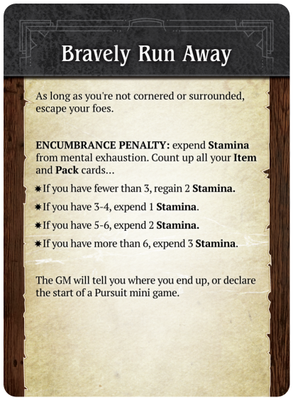

# A Thousand Faces of Adventure: Player's Guide

*playtest version* VERSION DATE

*find latest version at https://1kFA.com*

*email sjb@ezide.com*

**Cross together into an unknown world, share your fantastic story, and
return a hero of myth!  Welcome to A Thousand Faces of Adventure!**

<!--
**Like board games? Get a kick out of those online Dungeons & Dragons videos?
Want to try improv?  Welcome to A Thousand Faces of Adventure!**
-->

<!--
1kfa is a structured improv game of heros and adventure.
-->

# Welcome to Roleplaying

A Thousand Faces of Adventure is a tool for telling a story. This story
is written live by you and your friends, sitting around a table.

This story is improvisational, interactive, and collaborative.

The rewards for playing are laughter and excitement while you play,
followed up with years of warm conversations that start with *"Remember that
time we were playing A Thousand Faces of Adventure and..."*

### Skip me to character creation!

If you are an experienced RPG player you might want to jump ahead past this
indroductory hulabaloo and rules reference, and start playing with the first
activity available to you. Typically in RPGs, this means "character
creation", which is often done as a solo, "homework" activity before the
whole table comes together to play.

A Thousand Faces of Adventure is designed to be played by a group of friends
the moment everyone's together at the table. Character creation will be an
interactive activity that requires your friends. Open the GM Guide and look
under the **Begin a Campaign** section for more details.

This Player's Guide is a manual of all the procedures a non-GM player might
need during play.

This game falls in the category of games called *conversation*. It may seem
weird to think of *conversation* as a "game", but it will help you understand
how everything fits together.
This perspective lets you rely on your existing knowledge and expertise at
conversation "games".
Life has already taught you about how, in a conversation, you take turns,
make offerings, interrupt politely, and listen with interest,
so you're already an expert at the foundational rules of this game.

## How to make a great story

Imagine the audience for this story is the inner children of all the players.
What evokes the feelings we had when we were children playing pretend? Can
you remember being 11 years old and watching a spectacular Steven Spielberg
movie?  Or maybe a cheap-but-awesome Sam Raimi movie?

You are going to collaborate with all the other players to make this story,
so when it's your turn to narrate, think of what will give your friends around
the table a thrill, put them in suspense, ratchet up their feelings of tension,
or make their jaws drop with awe.

Sometimes inner children get a big kick out of blood and guts.
Your inner child might giggle at the "adult" scenes in an HBO series.
If you don't know what topics your friends consider "off-limits",
it is a good idea to ask and tell before you start playing.

The story that emerges is not a precisely crafted
thing. That's ok. It doesn't have to be high art or even a cartoon on Adult
Swim. It gets shaped by each player, and when your turn comes, you
adapt, do your best improvisational
["Yes, and"](https://en.wikipedia.org/wiki/Yes%2C_and...)
, and see where it goes from there.
**It might sound like chaos, but with some faith in your friends, you
will delight at how the plot solidifies, and how real the characters
become.**

## Specifically, What to do

To play the game, one person will take on the role of the
Game Master, or "GM".  The other people will be called simply "Players".

### The GM

The GM's job is to help everyone follow the rules of the game, and
say stuff. Occasionally they will write notes and scribble some quick
numerical facts.

The imagined world and its inhabitants will be narrated mainly by the GM.

### The Players

Player, your narrative contribution will mainly be your character.

{ width=2.5inch }

Most of your time will be spent saying stuff. You are part of a conversation.
Ask questions, use your imagination, chime in when someone inspires you.
Think about your character like a hero of a movie, and try playing as
the writer of the movie, or the director, or immerse yourself like a method
actor standing in the character's boots and seeing with their eyes.

A Thousand Faces of Adventure invites you to:

 * Describe your character and their actions
   * Act out their dialogue
   * Describe *how* they act
      - flourishes and stunts
      - their facial expressions, voice, and body language
   * Tell what they say / hear / see / smell / taste / feel
   * Describe their thoughts & memories
   * Chime in when they interact with or support the other characters
 * Tell parts of the story
   * Tell your character's backstory
   * Contribute ideas and assert facts when the GM asks questions
   * Refer to your **moves** to generate more ideas and see what boundaries you can push

As the conversation unfolds, the rules will chime in as well.  When that
happens you will be called do things beyond just "saying stuff":

 * Flip cards from your Deckahedron
 * Move tokens around
 * Roll dice

This guide will teach you how to do those things.

### Your Character: A Scrappy Adventurer

A Thousand Faces of Adventure is a game about your character growing
from humble beginnings as a **scrappy adventurer** into someone who will
have an epic impact on their world.

{ width=2.5inch }

During [character creation](mod_guide_gm.md#character-creation), you
will get to determine all aspects of your character's history, social
and economic circumstances, and personality.
These are fictional aspects of the character. You will use the game's
rules to determine all the *mechanical* aspects of the character.

The terms *mechanical* and *mechanism* describe aspects of the game
that concern rules, numbers, and procedures.

Mechanically, characters start out just a little bit more powerful than a
common villager.  Your character will have more stamina than a townsperson,
and will start with three special moves, but that's all
that separates them from Michel the stable-hand and Constance the librarian.

`TODO: fluff with one-sentence example characters`

You can invent any backstory you like, but you may need to answer questions
about how the backstory fits the character's game limitations.
Nothing stops you from creating a hulking, 7 foot tall barbarian, with a rich
history of warring and slaughtering enemies, but at the very beginning of
the game, a little bad luck may see that barbarian suffer a sound
drubbing at the hands of a farmer and his overprotective goat.

So to make this barbarian feel authentic, you'll need to invent
some narrative conceit or justification (drunkard? battle-worn? magically
cursed?) so that the character begins at a "scrappy adventurer" level.

As your character adventures in the world, they will gain experience and
equipment making them worthy of the title "hero".
See [Character advancement](#character-advancement) for more details.

# The Deckahedron

{ width=2.5inch }

The main activity in the game is "saying stuff", mostly stuff about your
character. Often, you'll say something that *triggers a move*, and that
move will be resolved using your Deckahedron.

(If you do not have a physical copy of this game, you can find a digital
Deckahedron at [1kFA.com/table](http://www.1kFA.com/table) )

Every player except the GM gets a Deckahedron. Inspect your Deckahedron.
You should have 20 cards.  There are 4 symbols, or "suits", on the fronts and
backs of the cards:

Name      | suit                                    | odds                              | color  | rank
----------|-----------------------------------------|-----------------------------------|--------|-------
Anvil     | { width=0.5inch }     | the weakest odds        | red    | rank 1
Blade     | { width=0.5inch }         | below average odds      | blue| rank 2
Crown     | { width=0.5inch } | above average odds      | yellow | rank 3
Dragon    | { width=0.5inch }         | the best odds           | green | rank 4

Shuffle your Deckahedron and place it face-down in front of you.

When your character does something active in the game, like "triggering"
a move or aiding teammates, you will use the Deckahedron to "flip"
a card. At other times, you will also use your Deckahedron to "reveal",
"discard", and "exhaust" cards.
These actions are described below.

## Flipping

Whenever your character attempts something risky, where the outcome is
not certain, it will "trigger" a move. The GM will name which move has
triggered and call for you to take your Deckahedron and "flip".

Find the description of the named move either in the Base Moves or on
a Move Card.
It will specify which of your character's "attributes" -- Dex, Int, or
Str -- will be used to resolve the flip.
(Sometimes there are multiple attributes listed. In this case, chose
the one that makes the most sense in the narrative context)

| **GM Note:**
| *A subjective judgement is sometimes needed to decide between Dex,*
| *Int, or Str, or between two moves that may be reasonably triggered*
| *by the character's narrated action.*
| *You may always ask the player to provide more detail before settling*
| *on these decisions.*
| *If there is ever remaining ambiguity after the players have had an*
| *opportunity to discuss and clarify, the GM has final authority to*
| *make this decision*

 { width=2.5inch }

Take the top card of your Deckahedron and flip it face up.
Next, look to your character sheet, at the chosen attribute -- Dex, Int, or
Str -- to find its suit (Anvil, Blades, Crown, or Dragon).

 { width=2.5inch }

On the face of the flipped card, find that suit symbol.
The "result" of the move is the ✗ or ✔ symbols next to that suit.

(When you flip, keep in mind that the GM needs to read the result. Being
consistent with how you orient the card will help simplify the GM's
bookkeeping and keep up the pace of the game.)

 { width=2.5inch }

Finally, read the instructions on your move card.
It tells you and the GM how to interpret the ✗s and ✔s.

## For example,

You're playing a character named Kresk.  You say:

> Kresk sees the pit of spikes in front of him, but isn't scared.
> He just takes a running start and mightily leaps over the pit,
> landing safely on the other side.

The GM interjects:

> Ok, sounds good, but let's see if Kresk's legs are strong enough.
> Please flip Defy Danger with your strength.

Here, "Defy Danger" is the move, and "strength" (Str) is the chosen
attribute.

Find the description of the Defy Danger move in your Base Moves
(it's at the very beginning).
Next, on the character sheet, see that Kresk has rank 3 (Crown) Str.
Flip over the top card of your Deckahedron and look for that Crown suit.

Let's say the flipped card shows ✔✔ next to the Crown.
The Defy Danger move reads "You do it, but there's a new complication".
When you look to the GM to interpret this outcome, they begin to
improvise:

> You leap through the air, landing with a thud on the other
> side of the pit, kicking up a cloud of dust on this forgotten
> jungle trail. Rising to your feet, you notice that more than
> dust has been stirred. The sounds of movement and a threatening
> rattle alerts you to something approaching from inside the pit.
> What do you do?

## Reshuffling

After every flip, any face-up Deckahedron card is placed, face-up, in a
*discard pile*. (Later, you will start another pile of cards called an
*Exhaustion pile*. Keep them separate.)

At any time other than during a flip, you may take your
*discard pile* and shuffle it back into your Deckahedron.

Whenever your Deckahedron has 5 or fewer cards, you **must** take
your *discard pile* and shuffle it back into your Deckahedron.

## Interpreting the result of a flip

When a player's character performs a move, the player executes a flip,
and the GM leads the table interpreting the narrative result, based on the
text of the move.

 { width=2.5inch }

Usually ✔✔✔ means an unfettered success,
and ✔✔ means success, but with complication.

When the result is a single ✅︎, it sometimes means the same as a ✔✔,
but often it is slightly worse.

As you read this section it may help to lay out the move cards in
front of you.

| **GM Note:** *Any time a flip results in a single ✅︎*
| *the GM gains a* **Shadow point** *-- even when the*
| *move card says it has the same narrative effect*
| *as a ✔✔.*

Note: some move descriptions give choices between several options.
If one of the options is impossible (fictionally or mechanically), it may
not be chosen. Choose one of the other options instead.

When the result is ✗, it is the GM's turn to make a move. The GM narrates
the consequences of the move the player just attempted and has license to
take the narrative where they like.

See the GM Guide for explanations of *Shadow points* and for a list
of moves the GM is allowed to make.

### Exceptions on ✅︎ and ✗ flips

Sometimes a move does not say how a ✅︎ should be interpreted. In that case,
the GM gets to make a move, just like ✗.

Rarely, a move will have instructions for how to interpret a ✗ result.
These instructions should be executed, but might only be *part* of the
GM's move -- the GM gets to decide if they have more to add.

When the move is a *FAST* move, the GM does not get to make a move on
a ✗. Instead, the GM just gains 2 *Shadow points*.

## Moves tagged *FAST*

Some move descriptions have the *FAST* symbol. This indicates
they can be used in conjunction with another move during your character's
moment in the spotlight.

As the conversation shifts around the table, players will
have informal "turns" where they talk about what actions their character
is taking. The game works best when this "spotlight" is moved around fairly
so each player can contribute. The spotlight typically follows a single
character's actions until they trigger, then resolve a move.

*FAST* moves are like "bonus" moves that augment, or quickly follow the
initially triggered move.

Characters will trigger **at most one** *FAST* move during their moment
in the spotlight.
Otherwise the pace of the game can slow down, and other players may feel
like they aren't getting a fair share.

{ width=5inch }

Examples of cards tagged *FAST* include Unknown Benefactor,
Where It Hurts, and Shield.

A moment in the spotlight might see your swordsman character triggering
the move Mix It Up, causing damage to a foe, and then also triggering
Where It Hurts as you describe the sword delivering a stunning blow,
clanging loud and hard against the foe's helmet.

Or, your professor of alchemy character might trigger Defy Danger as they
jump out of the way of a toppling bookcase. After you flip an ✗, the GM
may start enumerating the attack power your character must suffer, to which you
could respond by invoking Unknown Benefactor to cancel the attack's effects.

## Other ways to flip: Advantage / Disadvantage

Some flips are a little more complicated. There are moves that
instruct you to "take +1 advantage" or "flip with advantage".
Sometimes you are given the opposite
instruction "flip with disadvantage" or "your foe gets advantage".

### Advantage

With an advantage, flip over your top card as usual, and then
flip over the next card as well.
Compare the results (the number of ✗s or ✔s next to the relevant suit)
and *resolve the flip* with the card that has the **best** result.

If it's a tie, you may choose whichever card to be the card that *resolves
the flip*.

After, all flipped cards go face-up in your *discard pile*.

#### Complete Flip Rule

You must flip over all the cards you were instructed to, even if the first
card shows ✔✔✔.

### Disadvantage

With a disadvantage, do the same thing, but use the **worst** result.

Acting against a foe that has advantage is mechanically identical to your
character having disadvantage.

### Multiple Advantages / Disadvantages

Advantage or disadvantage can stack. Flips can accumulate up to 2
advantage or 2 disadvantage, meaning that you flip **3 cards in total**
and take the **best** or **worst**, respectively.

No flip may use more than 3 cards in total, so stacking advantage beyond
2 is just ignored.

It is possible a situation might arise where you are instructed to both
"flip with advantage" and "flip with disadvantage".
If this happens, simply add up all the advantages, and then subtract all
the disadvantages to arrive at a "net advantage" or "net disadvantage".
The maximum number of cards per flip is still 3, so even if the
"net disadvantage" is -3, you only flip 3 cards and take the worst.

## XP cards

{ width=2.5inch }

Resolving flips is how players acquire experience points (XP).
XP are a player's most important mechanical currency in the game.

Some Deckahedron cards show an experience point symbol in the middle.
These are XP cards.
After a flip is *resolved* by an XP card, take one XP from the supply.

You may only do this when the card *resolves* a flip. (ie, when flipping
multiple cards, only if the *XP card* was the one from which
the ✗ or ✔ symbols were used to interpret the result of the move)

XP are a currency you spend to activate "meta" parts of the
game. See below for moves that let you "break" or "bend" rules, or partially
take control of the narrative.

## Blessing cards

{ width=2.5inch }

Some move cards will instruct you to take Blessing cards. When instructed
to do so, draw one Blessing card at random from the supply, and place
it in your discard pile.

Blessing cards improve your Deckahedron by giving you better chances to
succeed at moves.

Whenever a move is *resolved* by a Blessing card, return the Blessing card
to the supply rather than keeping it in your discard pile.

## Wound cards

Sometimes you flip over a wound card and must lose a Stamina point. See the
[Combat chapter](#combat---stamina-and-wounds).

## Teamwork Flips

Before a flip is executed, if other players have characters in the same
scene as the character taking action, and there is nothing in the fiction
preventing it, those other players may choose to have their characters
*aid* the "spotlighted" character. They just chime in before the flip and
say how their character helps out.

Another time the Teamwork Flip is triggered is when the characters are
all bound together in joint success or joint failure.
(eg, Defying Danger when the whole party is in a canoe traveling over
whitewater)
In that case, the GM asks the players "who is taking the lead?".
That "lead" character is the "spotlighted" character, and the
other players are supporting them.

The spotlighted player flips as they normally would, the supporting players
say how their characters are helping and each flip one Anvil.

The players choose the best result to resolve the flip.

Only the card that resolved the flip can generate XP, and only
for the player who played it.

If there are any negative consequences (damage, danger, etc) from the
result, all the participating characters must suffer them.

Supporting players may not Do a Flashback on Teamwork Flips.

## Flips only happen when the situation is uncertain or risky

A GM only calls for a flip when the situation is uncertain or risky for
the character. If the outcome is certain, the GM may just narrate what
happens. Or they may ask clarifying questions.

This game is a conversation between people, so there is variability
in how it plays out. Different GMs will draw their line of certainty at
different places.

Consider a situation where the GM has described your character, Kresk,
waking up after making camp in a forest. Beside Kresk is a squirrel,
nibbling an acorn.

You might respond by saying,

"Kresk wants that acorn! I Mix It Up with the squirrel!"

It would be bizarre, but completely within the rules for the GM to write
up some stats for the squirrel (1 Stamina, 1 attack power), and begin a
melee combat between Kresk and the squirrel, and ask you to flip Str
to resolve the Mix It Up move.

But the GM will more likely interpret your action, as described, as having
a *certain* outcome. Perhaps the GM will respond:

 * "As you raise your fist to smash the squirrel, it darts off into the
   forest, never to be seen again."
 * "How is Kresk going to overcome the squirrel's natural speed and reflexes?"
 * "You smash your fist down and flatten the rodent. Strangely, it didn't
   even flinch. Does this odd behaviour remind Kresk of the rumors he heard
   about this forest being enchanted?"

### Pushing buttons or staying in character

The GM doesn't always have to invoke a move and call for a flip.  But in
this example, the player literally names a move ("I Mix It Up...").
That's a strong signal to the GM, and the GM is likely to follow strong
signals.

If you enjoy playing in a style where things flow like a narrated story,
from question to answer, from description to dialogue and naturally back
around again, rather than pushing a limited set of buttons laid out in
front of you, try playing without *naming* the moves. Just describe what your
character does in a natural way.

"Kresk wants that acorn! I slam my fist down on the squirrel!"

### Moves Depend On the Fiction

Because uncertainty is a key requirement before a flip is called for,
the fiction that you and your friends establish *matters*.

If a character threatens a towering Mountain Giant with a punch (that would
only reach the Giant's lower shin),
the GM will not call for a Parley flip. A wound to the arm or hand might be
described in such a way that would clearly make using a bow for Volley or
Called Shot impossible. Or successful application of an Amulet of Amiability
might mean that Pick Pockets can be skipped - the affected NPC might just offer
to share their precious items.

# Combat - Stamina and Wounds

Your character will confront violent foes and dangerous obstacles. Will
they endure exertion and injury to keep venturing forward, or will they
be disfavoured by fate and end up broken, spent, or collapsed?

In a fight, a character is running, dodging, striking, and being struck
by their foe.
All of this action is scary and exhausting.
A character gets weaker as this exchange goes on, even if they
dodge every blow.

This weakening is represented by cards from your Deckahedron being lost
into your *Exhaustion pile*.

In any kind of real-world boxing or martial arts match, the later rounds
find the athletes worn down, their footwork less animated, and their
guard drops more frequently.
The contest is not always decided with a knockout punch, it often comes
down to who can better endure the exertion.

In this spirit, in-game combat typically causes cards to be lost to the
*Exhaustion pile*, and the players are encouraged to narrate these
mechanistic outputs as this type of stamina loss.

With that said, there is also a Wound mechanism, described below.

## Incapacitation / Bust-on-3

When a Deckahedron contains only 3 or fewer cards, even after an
opportunity to reshuffle, that character is incapacitated.
At the point when the player's Deckahedron hits this number, their
character's fate is up to the game rules and the GM.

## The Four Ds

When your character gets attacked or falls victim to some other danger,
you have choices about exactly how they are affected. They may dodge,
and just lose Stamina, they may stand stubbornly against a blow,
perhaps absorbing it with their armour, or they may be wounded by it.

The procedure for making these decisions is called "The Four Ds":

 1. Reveal
 2. Reduce
 3. Reap / Remand / Remit
 4. Regale
 
 1. [Denominate](#denominate) - reveal cards to find the numerical *attack power*
 2. [Deduct](#deduct) from the *attack power* by using cards or taking Wounds
 3. [Distribute](#distribute) tokens
 4. [Describe](#describe) the outcomes in the fiction

## Denominate / Reveal

When your character suffers the consequences of violence, you reveal
cards and read the numbers shown. Use the top card from either your
Deckahedron or your Exhaustion pile, whichever is larger, shuffling if
necessary to ensure unpredictability.

When a move calls for "1d4", read the number shown inside the triangle.
When a move calls for "1d5", read the number shown inside the square.
If there is no number, that card doesn't count. Just ignore it and
use the next card.

{ width=5cm }
{ width=5cm }

When a move calls for "1d10", add both numbers shown in the triangle
and the square. If there is no number in the triangle or the square,
consider it a zero for the purposes of addition.

Note, this "1d10" process does not produce results uniformly
between 1 and 10, but instead produces results along a specially-designed
"2-to-10 curve", which has been chosen to provide statistical results
that create a pleasing and dramatic experience.

In rare cases the instructions of a move will explicitly declare the
amount of *attack power*, so you won't have to reveal cards.

Put the revealed card in your discard pile.

## Deduct / Reduce

After the *attack power* is known, you can choose to lower it by
using *move cards* like Good Cardio and Mystic Breathwork
or *item cards* like Shield, or by taking a Wound.

You can always choose to absorb the **entire** amount of *attack power* by
taking a single Wound.

Otherwise, cards that negate or absorb *attack power* can be used to
reduce the total. Generally, you take Exhaustion or Wound tokens from
the supply and place them on the designated space on the card.

{ width=2.5inch }

----

Let's say your character was attacked with a sword and the dice were rolled
and summed up to 7. You can either take 7 Exhaustion tokens (thus losing 7
Stamina points), or choose to take one *Wound token* (see below) instead.

Let's further say your character had lost 3 Stamina points earlier in the
battle. With only 7 Stamina points left, it's a wise time to take a Wound.

## Distribute / Reap

In the **third step**, you will lose cards from your Deckahedron according
to the remaining *attack power*.

Remember the Bust-On-3 rule. If this process reduces the cards in your
Deckahedron to 3 or fewer (even after reshuffling in your discard pile),
then your character is incapacitated.
To win at combat, a character's foes must be subdued or pacified before
this happens.

Once *incapacitated*, the character can take no further actions.
It is up to the GM to decide what this incapacitation means - whether
the character is dead, unconscious, or otherwise unable to act.

### Losing or Expending Stamina

Reveal cards from your Deckahedron face-up until you have revealed
exhaustion symbols equal to the remaining *attack power*.
Take all of the revealed cards, *including the cards without
exhaustion symbols*, and put them face-down in your Exhaustion pile.

{ width=2.5inch }

If you haven't started an Exhaustion pile, start a new one.  Keep it
separate from your Deckahedron and discard pile.

If your Deckahedron does not contain enough cards, you **must**
reshuffle your *discard pile* into the Deckahedron and continue.

Note: you *may* choose to reshuffle your *discard pile* back into the
Deckahedron *before* moving cards onto their *Exhaustion pile*.

### Taking Wounds

{ width=2.5inch }

Wounds are a long-term source of trouble for your charcter. When wounded,
all intelligent creatures seek to cure their condition as a high priority.

When you choose to take a Wound, or if the rules demand that you take one:

 * **If you already have 2 wounds**:
    - your character is incapacitated
 * **Otherwise**:
    1. The GM will describe how your character was wounded
    2. Randomly draw a *wound card* from the supply and place it in your
       *discard pile*. It will now start cycling between your Deckahedron
       and your *discard pile*.

#### A Wound Card

{ width=1.1inch }

Wound cards can be used to represent different fictional aspects. They
usually represent literal wounds, but may also be used for the effects of
disease, poison, or other effects inflicted by monsters or the environment.

Having a *wound card* in your Deckahedron causes **flips** to become
more risky.

Whenever a wound card is revealed in the course of a **flip**:

 * (Optional) Say or act out the guttural noise emitted by your character
 * You must immediately stop flipping (eg, if you were
   instructed you to "flip 3", you stop short once you hit
   the wound card - resolve the move with only the card(s) you flipped.
   This overrides the **Complete Flip Rule**)
 * Lose one Stamina point

## Describe / Regale

Finally, the **fourth step**: you interpret those results into the
narrative.  Did your character dive into the dirt?  Did they take a punch
to the jaw and respond with a bloodied grin?  Did the spear bounce right
off their steel breastplate?

| *The act of taking a risk, deciding how*
| *to get hurt, and then later, deciding when and*
| *how to heal, with each stage having its*
| *sacrifices and benefits, is a miniature echo of*
| *the overall structure of the Hero's Journey*
| *campaign. Starting in comfort, choosing to*
| *cross a threshold, deciding which fork to take*
| *in a road of trials, then returning.*

# Equipment

During [character creation](mod_guide_gm.md#character-creation), you
receive two Pack cards and take some Item cards.
These cards represent equipment carried by your character that interacts
with mechanisms of the game.

Daily-use amounts of money and food are not tracked. It is assumed
your character will always be able to scrounge a meal somehow.
Unless it is relevant to the drama of the fictional situation or
inspired by the Touchstone List (see the GM Guide), small monetary
transactions may be abridged or assumed.

It is also not necessary to exactly measure movement speed or the sizes
of all the gear carried or to track the body part to which the gear
is strapped.

Your character has a movement speed, a certain lightness-of-foot,
they carry a certain amount of equipment and items,
and perhaps even a certain amount of wealth or treasure.

There are some moves that are affected by how much *stuff*
a character carries. These moves have a "Encumbrance Penalty" section,
and describe how carried equipment affects their outcomes.

At any time that makes sense in the fiction, a character can drop items
and equipment.

## Pack - Precious and regular

{ width=2.5inch }

Throughout the game, your character will gain, lose, and trade equipment
and supplies that are worth tracking. These items don't need to be specified
until they actually get used. Instead they are tracked with anonymous Pack
cards.

White-side green cards represent "regular" Pack and black-side green cards
represent "precious" Pack.
Precious Pack is something that is found precious by *someone*. It may be
something made of a rare metal like gold, or it may be simply a full
waterskin offered to a parched NPC in the desert.

If the specifics of a Pack card get concretely established in the fiction,
and the card is not immediately spent, the Pack card should be returned to
the supply and a blank Item card should be taken to replace it, with the name
or details of the item written on it.

Your character starts off with 2 Pack cards, enabling the move Good Thing
I Brought...

## Good Thing I Brought...

{ width=2.5inch }

Adventurers are always finding themselves in tricky situations. Luckily,
they come prepared with adventuring gear. They have been known to carry
50 feet of rope, smelling salts, books of racy poems, sometimes even a
3-day-old pork chop to distract hounds or hungry goblins.

It's a fact. You know this and A Thousand Faces of Adventure knows this, so
you won't be asked to keep fine-grained notes of every candle and spare
button in your character's inventory.

Reasonable daily-use items are presumed to be in your character's pack. If
you're unsure, remember this game is a conversation, so just ask the table.

But sometimes you will be in a situation where having that 50 feet of rope
or an old pork chop would really *solve a problem* for your character.

When your character reaches into their pack and produces the item that
solves their current problem or helps them overcome a challenge, just say
what it is and execute the "Good Thing I Brought..." move.

The Pack cards represent the adventuring gear a character has brought along.
But you do not need to declare exactly what that gear is until you're in
a situation where you need something specific.

If the "Good Thing I Brought..." move is executed and the newly "declared"
equipment is something that can be returned to the backpack after
use, write its name down on a blank card and exchange that card for the
"anonymous" Pack card(s) that were the cost of "Good Thing I Brought...".

If 2 Pack cards are spent, and the character ends up with one card returning
to their backpack, future Encumberance Penalty calculations will change.
Use the fiction to justify that. Maybe they didn't have
*exactly* what they needed, so one piece of equipment had to be consumed
to create the necessary tool, in a MacGuyver-esque fashion.

If the equipment is something that gets consumed immediately when used,
the 1 or 2 Pack cards just get returned back to the supply.

## Item Damage

{ width=2.5inch }

Damage to items is represented as black-side red cards.

The "Bust-on-3" mechanism is used to represent damage.

The first two times an item is damaged, place a red card on the Item card,
black-side-up.

*If an item already has 2 red cards on it*, and it is damaged again,
it is destroyed. Return it and the red cards to the supply.

All mundane (non-magical) items can be damaged. Usually this happens
as the result of a GM move.

To repair items, see the move [Sharpen and Stitch](#sharpen-and-stitch)

# Magic

<!-- TODO remove trademarked references -->
Magic is an element that pervades stories of fantasy. It can be obscure
and stemming from nature like in Lord of the Rings, it can be elemental and
allegorical like in The Wheel of Time, and it can be linguistic and
self-aware like in The Invisibles.

To avoid presuming too much about the narrative, the rules do not dictate
the nature of magic or the "how" of magic. That's for you to decide during
play.
The rules provide a mechanical foundation and some optional narrative paths.
You are invited to take this well-tested framework, play with it, and expand
into it.

Is magic woven from subtle threads that pervade the universe? Is it based
on words of power? Is it high technology hidden in the planet's crust
by alien benefactors? Is it copied exactly from a concept in your Touchstone
List? You decide.

The rules give you a way to have scrappy adventurers begin with magic items.
These artifacts have 3 charges, and are rechargeable during Rest.
Your character can eventually build themselves up in power to a point where
they can cast magic spells without needing the items.

The rules also give names for two sources of magical power, "The Living
Light" and "The Blood-Bound". It's up to you to give these names narrative
meaning, if you want.

One thing to keep in mind is that characters may attempt any move that
resolves with Str / Dex / Int.
(See [Move Levels](#move-levels)
So even if moves like Use a Magic Item or Fundamental Magic were not chosen
at character creation or gained via Study Under a Master, any character may
attempt them.

That said, using magic invokes some of the more complicated rules.
Players are challenged with managing and balancing
charges, capacity, stamina, requirements, and narrative effect. This kind
of play is ideal for players excited by complexity and the potential
of explorable branches.

#### The ONGOING tag

Upon triggering the Use a Magic Item move, a character "flows magical
energy" into the item. Then the magical effects happen.

Some magic effects happen immediately.

Some magic effects persist even after the flow of magical energy into
the item has ceased. (eg, `_` of Sensation)

Some magic items have the ONGOING tag, and their effects persist
only as long as magical energy flows into the item. It is up to the
player to declare when their character ceases the flow of magical energy.
If the flow of magical energy continues, they are not considered *idle*
for the purposes of the Rest and Seek Help moves.

#### Charges and Capacity

{ width=2.5inch }

By default, magic items have capacity for 3 charges.
An item is considered "depleted" when all its charges are used.
The term used for a card's maximum number of charges is "capacity"
or "charge capacity".

The number of charges a magic item *currently* has is tracked by
keeping green cards underneath it.

When a magic item loses a charge, take one of the green cards
and place it back in the supply. When there are no more green cards
underneath it, it is *depleted* and cannot be used.

 

Charge capacity can be gained and lost. Every time it changes, players
should mark the new capacity on the Magic Item card

If the charge capacity decreases below 1, all the bonds that held
the item together dissipate, including the bonds of matter. Return the
card to the supply.

## Use a Magic Item

{ width=2.5inch }

When a character holds a magic item and flows energy into it, the player
flips Int, and on any result other than ✗, the item activates and the
effects described on the magic item card happen.

Using a magic item causes it to lose a charge. This loss can be avoided
with moves like Entreat the Blood-Bound and Channel the Living Light.

Following that, results of ✅︎ and ✔✔ cause a further cost to be incurred,
as chosen from the list by the GM or the player, respectively.

**Note:** if the magic item being used is a magical weapon,
another choice is available: "the weapon is damaged".

The RECEIVE CARDS tag: when a player chooses this card during character
creation or Study Under a Master, they also receive 1 magic item of their
choice.

## Entreat the Blood-Bound

 { width=2.5inch }

If it has not yet been established, when a player first uses this move, it's
a great time for the GM to ask them a question: "Who or what is the
Blood-Bound?" 

| **GM Note:** *this is a great way to stretch your*
| *improv muscles. Say "Yes, and..." no matter if*
| *they identify the Blood-Bound as tiny, parasitic*
| *insects or as monstrous, extra-dimensional dark gods.*

When a player chooses this card during character creation or Study Under a
Master, they also receive the item Blade of Echoes.

## Channel the Living Light

{ width=2.5inch }

If it has not yet been established, when a player first uses this move, it's
a great time for the GM to ask them: "Who or what is the Living Light?"

When a player chooses this card during character creation or Study Under a
Master, they also receive the item Sigil of the Living Light.

# Notes on Moves

## Do a Flashback

{ width=2.5inch }

Sometimes you plan out something really great, and then you resolve
a flip, and don't get the results you need.

A Flashback serves as sort of a "mulligan" in those situations, but it also
provides a way to develop your character's backstory and personality.

After a player makes a flip, and before the GM describes the consequence of
the flip, the player can declare they're going to `do a flashback`.

The player spends 1 XP. Then they describe how something
that happened in the past particularly prepared their character for
this situation.

Then the original flip is ignored, and a new flip is executed, using the same
advantage or disadvantage as the original flip.

The player may then spend additional XP to "bump up" the result.
Each XP spent increases the result, from ✗ to ✅︎ to ✔✔ to ✔✔✔.

Technically, this flip is *resolved* only after the XP are spent, so if the
new card was an *XP card*, the player should take an XP from the supply only
*after* they finished spending their XP to "bump up" the results.

### Mercy Flashbacks

Players may find themselves in a situation where they forgot to do something
when they had the chance, like use healing magic while they were resting,
or leveling up a move before they left a town, or getting some key
information from an NPC before that NPC died.

As long as the player and the GM both agree that the player had the necessary
resources when the action was available, the GM may allow the player to
spend those resources and effect that action now, as a "Mercy Flashback".

The player must spend one XP, in addition to whatever cost the action incurs.

Even the most conscientious of us sometimes loses track of small details,
so the cost is kept "cheap" at only one XP. But there must be a cost.
It is necessary to keep the flow of the game going. This is a game of improv
storytelling, and improv means rolling with the punches sometimes.

## Critical Success

{ width=2.5inch }

One of the 20 cards in your Deckahedron is the "Critical Success card". It
has a ✔✔✔ symbol on every edge and a circular green symbol in the middle.

If you *resolve a flip* with the Critical Success card, you can do one of
two things:

 * Say how your character's practice has finally paid off, or how they had
   an insight or epiphany about the move they just accomplished. Spend
   XP 1-for-1 to go up levels in the move that was just resolved.
 * Take a Blessing card from the supply and put it in your discard pile.

## Taking a Breather

{ width=2.5inch }

**Taking a Breather** is a move that a character can take during combat.
This action allows a character to regain up to 4 Stamina points.

The player may use either Intelligence or Dexterity to perform the **Take a
Breather** action.

If they use Intelligence, they say how they execute a tactic or
recognize a favourable position that lets them gather their breath
and their wits.

If they use Dexterity, they say how they maneuver into a safe position
that offers some temporary safety.

Regaining Stamina may be done either by taking cards from the
*Exhaustion pile* and putting them into the *discard pile*,
or by returning Exhaustion tokens to the supply.

When recovering cards from the *Exhaustion pile*, the player may choose any
cards they want, but may not flip them face-up if they are face-down.

When combat or a pursuit ends, and it is appropriate for the narrative
(e.g. when there's a scene transition and the characters reasonably have
a few minutes to catch their breath), the players may **Take a Breather**
using Str as a *FAST* move (ie, no GM move triggers if the result is ✗ or ✅︎).

## Good Cardio

{ width=2.5inch }

This card makes a character an especially resilient fighter and athlete.

In a combat encounter, a player will usually trigger an aggressive move like
Mix It Up or Volley. During their turn in the spotlight, the player can also
trigger one more move, as long as it has the *FAST* tag.
Good Cardio is one such card, and allows the character to regain some of
their lost Stamina points, and stay in the action longer.

Good Cardio has an additional effect that passively prevents a character
from losing Stamina in the first place. Instead of losing a point of Stamina,
an Exhaustion token can be placed in the first "slot" of the card. If the
character goes up *move levels* (see below), a new slot opens up for each
level the move is increased. Only one token can be placed in a slot.

---

# SESSION 2 RULES

---

# The Session Opener

Every session after the first session, there is a special move to execute
at the very beginning, **The Session Opener**. It is a player's opportunity
to generate an extra XP.

Your GM will lead you through a story recap and pose some questions about
your character.  Then you will be given the opportunity to **Ask for
notes** and **Give notes** to your fellow players.

After this exercise, all participating players will receive an XP.

The details of the Session Opener are described in
[the GM Guide](mod_guide_gm.md).

# Equipment: acquisition, upgrade, and repair

## Sharpen and Stitch

{ width=2.5inch }

Sharpen and Stitch is a way to repair damaged items by spending Pack cards.

This move must be executed alongside the Rest move.

## Shop / Procure

{ width=2.5inch }

When the Shop / Procure move is used, the scene can be described as an
everyday shopping trip or a thieving and bribery escapade, or anything
else that makes sense in the narrative, so long as the mechanical
outcome would be certain.

The GM presents to the player 4 cards of any mix of items: mundane,
magical, a special commodity established in the narrative, or even
something purely decorative. It is ok for the GM and player to discuss
the items beforehand to any level of detail, and it is also ok for the
player to outright say what they want to go shopping for.

The GM should be honest with the narrative, stay true to their goals and
try to provide the kind of fun the player has signaled they want to have.

The GM shouldn't present a player a card the character is unable to
use.

### Mundane Items: Armor, weapons, etc

There are mundane items in A Thousand Faces of Adventure, as well as magical
ones. This text includes rules for weapons, shields, and armour. But characters
may have other items as well. Those other items may just be decorative or
they may have narrative value (carrying around a small barrel of brandy may
earn you a welcome from the thirsty dwarves you meet).

<!--
You can even create rules of your own for certain classes of item.
See the [Extending 1kFA](#extending) chapter for hints on how
to do that.
-->

#### Weapons

Weapons cards describe what the character has armed themself with. These
cards might describe "weaponry" rather than a single item, as the Many
Knives card demonstrates.

Weapons have "power": d4, d6, or d10. This determines what die to
roll when you roll attack power. Generally players can increase
weapon power with the [Tales of a Weapon](#tales-of-a-weapon) move.

The GM should decide if the weaponry incurs any additional costs when
calculating encumbrance penalties. Is the item particularly heavy or large?

Here are the default weapons available to characters:

Name             |  notes
-----------------|--------------
_ Sword          |
Many Knives      | At close range, can be thrown. Maximum power is d6
_ Bow            | Long range, not usable at melee range

#### Armour

When an armour-clad character would normally take Harm or a Wound, the
player may put the Harm or Wound token into an appropriate empty slot on
their Armour card. This represents the character getting lucky, and their
armour absorbing the attack instead of their body. Better armour has
more chances to protect its wearer.

The armour available to characters during character creation is the weakest
kind. This kind of armour has 1 slot that can absorb a Harm or a Wound.

When a character goes shopping, goes a-thieving, discovers treasure, or loots
a battlefield, the GM may offer new, more useful armour with more slots drawn
on it.

The GM should take a blank card from the supply, and draw up to 3 slots on
the card. A slot shall be designated to receive either:

 * 1 Harm token
 * or 1 Harm *or* Wound token

The table should decide if the armour incurs any additional costs when
calculating encumbrance penalties -- better armour tends to be heavier.
Any increased encumbrance penalty should be written on the card.

The player should write a descriptive name for the armour like
"Padded" or "Chainmail" or "Full plate" and write that at the top of a card.
The description will impact the narrative -- it's hard to sneak or swim in
full plate armour.

Here are some example armours:

Suggested Name   | slots                | encumbrance modifier
-----------------|----------------------|----------------------
Leather Armour   | 1 Harm/Wound         |
Padded Armour    | 2 Harm, 1 Harm/Wound | counts as 2 items
Full Plate       | 3 Harm/Wound         | counts as 4 items

#### Shields

Shields provide a way to avoid Harm and Wound tokens, but they test a
character's Dex to do so.

To make a Shield card, first the GM chooses the ✔✔✔, ✔✔, and ✅︎ effects by
choosing 3 sequential effects from this list:

 * Avoid the *x*
 * Avoid the *x*, but choose to lose 1 Stamina or this item takes 1 damage
 * Avoid the *x*, lose 1 Stamina
 * Avoid the *x*, lose 1 Stamina and this item takes 1 damage

The *x* can be either:

 * Harm
 * Harm or Wound

Then the GM and player come up with a name for this kind of shield together,
using the same rules as the Armour name-creation above.

The fictional description of the "shield" has mechanical consequences. For
example, the edge of steel shield could reasonably be used to attack a foe,
so the character would have 1d4 attack power with Mix It Up. But a character
with no weapon and only leather bracers on their wrists, the character would
be "unarmed", doing just 1 attack power.

Blocking attack power with a shield is a *FAST* move,
and players may not make more than one *FAST* move per turn in the spotlight.

## More Power

Some cards show a "power gauge" that indicates whether the *attack power*
(in the case of a weapon) or *effect* (in the case of a magic item) will
use a d4, d6, or d10.

{ width=2.5inch }

After character creation, an armed PC will be rolling 1d4 for their attack
power. This can be increased later on in the game via the moves Tales of a
Weapon and Obsessive Contemplation.

## Tales of a Weapon

{ width=2.5inch }

The GM should decide whether the weapon will incur any extra cost when
calculating an encumbrance penalty.
Is the item particularly heavy or large? The GM should weigh that
cost against the weapon's other features.

## Obsessive Contemplation

{ width=2.5inch }

When using a Precious Item that is just represented by a Pack card,
swap the Pack card with a new blank Magic Item card and write a description
and charge capacity on the new card.

# Character preservation and recovery

## Bravely Run Away

{ width=2.5inch }

When players find themselves on the losing side of a battle, or want to
avoid a daunting threat, they may choose to run away. If their characters
are positioned in a way that their escape is possible, according to the
established fiction, use this move.
The players temporarily lose narrative control and the GM will say
where the characters end up.

There may also be a Stamina cost (or Stamina gain) depending on how weighed
down the characters were by their equipment.

The GM can resolve this move by:

 * putting the characters somewhere completely safe
 * putting the characters in a place where some (new or old) danger exists,
   but is, for the moment, not directly threatening the characters
 * spending a *Shadow point* and starting the Pursuit Mini-game
 * spending a *Shadow point* and landing the characters in a place where
   they must directly confront or defy a new danger

## Healing

Throughout the game, players are asked to decide how their
characters get hurt, how they respond to being hurt, and how they recover
from their injuries.

This is a small-scale echo of the whole story - the Hero's Journey itself.
At the center of the Hero's Journey is a moment of pain that the hero
must fully endure before finding relief - either through their own action or
with the help of their friends. The Hero's Journey is a myth that teaches
us how to take care of ourselves, and so this game holds a puzzle where the
players to learn how to take care of their characters.

## Resting

{ width=2.5inch }

*Resting* is an action that a character may take when they are out of combat,
not traveling, and have several hours to devote to rest (sleeping qualifies).

 * Step 1: Return all *Exhaustion* tokens to the supply
 * Step 2: Count the *Harm* and *Wound* tokens on your *Exhaustion pile*
 * Step 3: Keep that many cards (player chooses which ones) in your
   *Exhaustion pile*, put the rest into your *discard pile*
 * Step 4: Return one *Harm* token to the supply
 * Step 5: Say who you blame for your injuries

When resting, magic items that are not being used regain all charges, up
to their charge capacity. Take green cards from the supply to represent
the charges.

You may gird all your armour, where applicable.
Remove all Harm and Wound tokens from your armour cards and from move cards
that represent armour effectiveness (eg, Like A Second Skin).

Time devoted to *Resting* cannot also be devoted to learning skills,
studying with a teacher, or any other action that takes mental or physical
effort.

The Harm token returned to the supply in Step 4 may come from your
*Exhaustion pile* or from a slot on a move card (eg, Bloody But Unbowed).

It is possible that the object of blame named in step 5 is the character
themself.

## Seek Help

{ width=2.5inch }

*Seeking Help* is an action that a character may take when they are in a
peaceful environment where external resources with healing powers are
available.

Eg, if they are in a primitive camp possessing medicine men or a
contemporary city with doctors and hospitals or a tranquil oasis infused
with healing magic.

That the healing powers are *external* is important. Seek Help is a move
where players acknowledge their characters' limits and cannot do
everything on their own.

When you spend a day healing:

 * Step 1: Describe your character's healing experience
 * Step 2: Return all *Exhaustion* tokens to the supply
 * Step 3: Return all *Harm* tokens to the supply
 * Step 4: Count the *Wound* tokens on your *Exhaustion pile*
 * Step 5: Keep that many cards (player chooses which ones) in your
   *Exhaustion pile*, put the rest into your *discard pile*
 * Step 6: Return all *wound cards* to the supply (but not *Wound* tokens)
 * Step 7: Say who you are closer to forgiving
 * Step 8: If you are at The Hearth, return all *Wound* tokens to the supply

As with *Resting*, time spent *Seeking Help* cannot also be used in
activities that take effort.

Magic items that are not being used regain all charges, up to
their capacity.

You may gird all your armour, where applicable.
Remove all Harm and Wound tokens from your armour cards.

# Character advancement

## Study Under a Master

{ width=2.5inch }

This move steps your character towards becoming a powerful force in
the world.

When your character is in a town (a village, city, etc. -- any safe
place where resources and commerce present themselves), you can spend 2 XP
to either:

 * Increase the level of a move you already have
   (See [Move Levels](#move-levels)
 * Take a new move card from the supply

If you want to take a move card that another player already has or one that
was scribbled over in a previous campaign, or just has been ruined by spilled
beer, you can copy the text onto a new card.

## Move Levels

Some Move cards have icons on them that indicate "levels". These levels
represent how good your character is at that skill. For example, the move
Pick Pockets has 5 icons.

{ width=2.5inch }

These are the "move levels" for Pick Pockets.
From left to right, these icons are called:

 * { width=0.5inch } wild or "2 red"
 * { width=0.5inch } novice or "1 red"
 * { width=0.5inch } "studied" or "base level"
 * { width=0.5inch } expert or "1 green"
 * { width=0.5inch } master or "2 green"

If you chose Pick Pockets during character creation, you would receive
the card and your character would be "studied" in the skill.

## Increased Move Levels

Later, you can go up a level in Pick Pockets. (Either by using the Study
Under a Master move, or when you resolve a Pick Pockets flip and happen
to get a *Critical Success card*
See [Critical Success](#critical-success)
)

With a pencil, circle or underline the expert, or "1 green" symbol on the
Pick Pockets card.

{ width=2.5inch }

With Pick Pockets leveled up, any time you perform that move in the future,
you will add an advantage card when you flip.

Because the Pick Pockets card shows the "2 green" icon, you can repeat this
process again later, which would let you add 2 advantage cards when you flip.

## Decreased Move Levels

But what about the "red" levels?

Any PC can attempt any move that is performed by flipping Str, Dex, or
Int -- even if the player doesn't have that move card!

For any such moves, all characters start at the lowest level shown on the
card.  This will be either the "wild" or "novice" level.

For Example, every character, at any time, can attempt to hit two opponents
in combat (via Goreography). Every character can attempt to cast a spell (via
Fundamental Magic). But, their odds are very low.

You can attempt moves even if you don't meet the requirements shown.

Just as the "expert" and "master" levels cause the flip to be done with
advantage, the "wild" and "novice" levels cause the flip to be done with
disadvantage.

 * { width=0.5inch } flip with 2 levels of disadvantage
 * { width=0.5inch } flip with 1 level of disadvantage

If you perform a "wild" level move, and you resolve that flip with a
*Critical Success card*, you can spend 1 XP to graduate to "novice" level.

If you choose to do so, take the move card and underline or circle the
"1 red" symbol on it.

----

# Advanced and Optional Rules

----

# Combat in the 9-hour and 30-hour Campaigns

If you are playing the One-Shot Campaign, you can skip this section. The
Harm token rules are for the longer campaign formats.

In the 3-hour campaign, the second phase is a choice between just 2 things:
losing Stamina or taking a Wound. In longer campaigns, the choice is
more granular.

## Second Phase, "Deduct / Reduce"

During the second phase of resolving a combat action, players may choose
to take a Wound as explained before, and also a new choice:
to turn any 3 *attack power* into Harm tokens instead.

For example, there are 4 ways to handle an *attack power* of 7:

 * Lose cards from your Deckahedron until 7 exhaustion symbols are revealed
 * Take 1 Harm token and lose cards until 4 exhaustion symbols are revealed
 * Take 2 Harm tokens and lose cards until 1 exhaustion symbol is revealed
 * Take 1 Wound

## Third Phase, "Distribute"

Think of that boxing match again.  If Stamina represents dancing, ducking,
and dodging, then Harm represents a sprain, bruise or cut from a blow that
connects.
These rules are also for representing mental strain that is so significant
that the negative effects last for a while.

*Attack power* turns into Harm tokens at *exactly* a rate of 3-to-1. You
cannot choose a Harm token when facing an *attack power* of 2.

When you are instructed to take a Harm token:

 * **If you already have 2 Harm tokens on your Exhaustion pile**:
    - You may
 * **Otherwise**:
    1. Lose the top card of your Deckahedron to your *Exhaustion pile*
    2. Place a *Harm token* on your *Exhaustion pile*

> Note, you will see this "Bust-on-3" pattern repeated in many
> of A Thousand Faces of Adventure's rules

{ width=2.5inch }

# Mini-games

## Corner-matching Mini-games

Some moves can be resolved by laying out Deckahedron cards into certain
shapes such that the the Chinese Zodiac symbols on the corners match up.

During corner-matching mini-games, the corner symbols of Wound and Blessing
cards are *special*. The Blessing cards have a "dragon" symbol,
which is *wild* -- it matches all other symbols except for the "goat"
symbols on the Wound cards.
The corners of Wound cards show the "goat" symbol, which does not match
any other symbol, not even itself.

### Pick Locks

In the Pick Locks mini-game, the player attempting the move must draw
three cards from the top of their Deckahedron and put them down on the
table, face-up.

They must then arrange the cards corner-to-corner in a line such that
the touching corners show the exact same symbol.

`TODO: illustration of Pick Locks mini-game`

At any time during the mini-game, they may put one of the cards into
their Exhaustion pile (Stamina is lost to mental exhaustion) and replace
it with a new card from the top of their Deckahedron. The play may do
this as many times as they like.

While the player is attempting the mini-game, play continues at the table,
with other players making moves and time moving forward in the world
while the character concentrates on their lockpicking task.

At any point in the mini-game, the player can abandon the attempt, and
the result shall be interpreted as though they flipped an ✗.

### Fundamental Magic

`TODO: illustration of Fundamental Magic mini-game`

The Fundamental Magic mini-game works the same as the Pick Locks mini-game,
except that the player starts with 4 cards and must create a "box" shape.

# The Pursuit Mini-game

When dangerous foes are chasing the PCs, use these rules
to determine what happens.

When a player first declares that they are going to Bravely Run Away

`TODO: finish`

 * Starting player declares
 * Other players declare whether their character joins
 * One character - the one with the most Items + PACK is declared
   the "rabbit"
 * Best 3 of 5 rounds
 * Rabbit flips solo
   * Add the rabbit's Str + Dex, then subtract their encumbrance penalty (the
     count of all their Item and Pack cards)
   * Find their flip rank on the table below
 * For the rounds 2 through 5, the rabbit flips, but can be helped by any of
   the other joining PCs. The best result between the rabbit's flip and
   the helper's resolves the round. Each one of the rounds can be helped
   by Int, Str, or Dex, without repeating. The help must be justified by
   the attribute.
   * Int
     * Hiding
     * Using words to influence a crowd
   * Str
     * Climbing a wall
     * Making a great leap
   * Dex
     * Sliding / tumbling down an embankment
     * Dancing across a precarious rooftop
     * Jumping from the balcony onto a waiting horse
 * The last flip must be made by the rabbit alone.
 * If the pursuers ever win 2 flips in a row, they can make a move in the middle
   of the pursuit if appropriate, like firing a volley of arrows or sounding
   some kind of alarm

| Str + Dex - Encumbrance | Flip:          |
| ------------- | ------------------------ |
| less than 0   | Anvils 2x disadvantage   |
| 0             | Anvils with disadvantage |
| 1             | Anvils |
| 2             | Blades |
| 3             | Crowns |
| 4             | Dragons                |
| 5             | Dragons with advantage |

# Player vs Player

This game is a tool for telling stories about a group of characters that
work together to overcome some danger that threatens them all. The details
of their alliance are discovered through play, and those details can include
tension and disagreement. This section provides rules for the tensions to
be exhibited in the narrative, but also guides the resolution of
those tensions to a state where the characters are afterward unified
against their common, non-player, foes.

## Combat

When a player asserts their character violently against another player's
character, the rules are special. In general, negative consequences are only
applied by consent. These are different than the rules for fighting NPCs
and monsters.

Fights among player characters can be great to introduce drama and increase
tension in your narrative. But they are designed so that one player cannot
force another player out of the decision making process. The narrative
you create is a *shared* one.

When a player's character attacks another player's character, moves are
triggered as they would normally be, and costs are paid (eg, if the attacker
uses a magic item, they may lose a charge), but there are differences:

 * XP cards do not generate XP if they resolve a flip
 * Critical Success cards cannot be used to go up levels in moves
 * Attack power is not rolled

Instead of rolling attack power, the *defender* alone describes the negative
consequences (if any) their character suffers. This includes loss of
resources (like Stamina / Harm / Wounds) as well as narrative consequences.

Optionally, the attacker may also describe negative consequences for their
own character, mimicking the way the Mix It Up move causes both the
attacker and defender to suffer attack power.

The GM can still collaborate with the players to describe narrative outcomes
of the altercation, and may even use the situation to bring dangers to bear,
but may not reduce player resources as a result of the specific action.

Intra-party conflict can provide some of the most interesting and dramatic
moments of a campaign. Those moments arise from a group of friends at the
table collaborating together.

## Theft, persuasion, mind-control

Just as in PvP combat, when one player tries to:

 * reduce another player's resources
    - eg, by using the Pick Pockets move
 * use a move to dictate another player's character's action
    - eg, by using mind control magic

XP cards do not generate XP, Critical Success cards cannot
be used to go up levels, and the *defender* gets to say what the result was.

# 30-hour Campaigns: Green rings

If you are playing the One-Shot Campaign or 9-hour Campaign, you can skip
this section.

## Green rings

<!-- Summary -->
At the beginning of a 30-hour campaign, some move cards will be put into
envelopes. When you *Study Under a Master*, you will only be able to choose
the enveloped cards if you can arrange your current move cards to form the
number of rings shown on the envelope.
<!-- /Summary -->

`TODO: this bit should go in the GM Guide`

Place the following cards inside the envelope marked with one green ring:

 * Mystic Breathwork
 * Fury
 * Slide
 * Not On My Turf
 * Void Transfusion

Then, place the following cards inside the envelope marked with two green
rings:

 * Goreography
 * Derring-Do
 * Fundamental Magic
 * Breach the Dam

The moves inside these envelopes cannot be learned during *Study Under a
Master* until the character has already built up some skill.

Take a look through the move cards and see that there are partial rings
printed on them - either in the corners or on the sides.

When you receive a new move card, arrange your own move cards in such a
way that the most rings are completed. If your cards can arrange to show
1 ring, you may remove a card from the single green ring envelope and put
it in the supply.  If you can arrange them to show 2 rings, you may remove
a card from either envelope and put it in the supply.

{ width=2.5inch }

For example, if your card arrangement had the cards *Pick Pockets* and
*Not On My Turf* next to each other, you could complete a ring.
If you didn't have the *Not On My Turf* card, but instead had the *Fury*
card, you could arrange it next to *Pick Pockets* to complete a ring.

You do not have to keep your cards in this arrangement while you play.

----

# Appendices

----

# Diceless Play

Rolling dice is a fun, tactile experience, but not every table has the dice
that A Thousand Faces of Adventure asks for.
In that case, it is possible to play without owning the physical dice.
Each Deckahedron card has symbols that can be used in their place.

# Glossary

1d4, 1d6, 1d10
: This is notation that means "one four-sided die", "one six-sided die", etc.

attack power
: the number representing how powerful an attack is

charge capacity
: the maximum amount of charges a magic item card has

depleted
: the state of a magic item without any remaining charges

halve
: When you roll dice and *halve* the value, divide by 2 and then round up
to the nearest whole number. 4 becomes 2, 3 becomes 2, 2 becomes 1, etc.

idle
: A magic item is idle only if magical energy is no longer flowing through it

melee
: When the details of the fiction put two combatants close enough to each
other such that their handheld weapons might connect

More Power
: Permanently changing the kind of dice that are rolled when certain Item
cards are used

NPC
: Non-Player Character (a character controlled by the GM)

PC
: Player Character (a character controlled by a non-GM player)

ranged (or "at range")
: When the details of the fiction put two combatants far enough apart that
their handheld weapons could not connect

session
: The contiguous period of time that you're at the table, playing the game.
Roughly 3 hours

the supply
: The area on the table where all the cards and tokens are kept

town
: Any place that offers food, shelter, exchange of goods, and the company
of others. It could be a primitive circle of huts or a sprawling city

XP
: "experience point" or "experience points"

# Components

`TODO illustration of all components and their names`
