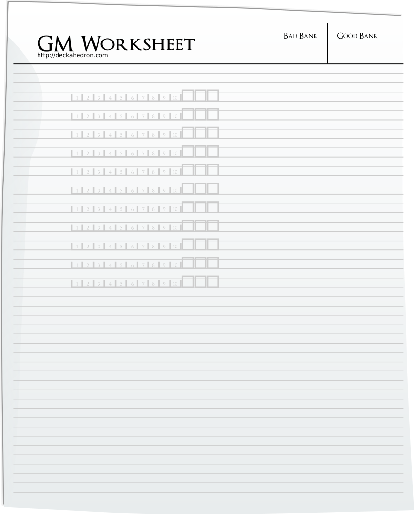
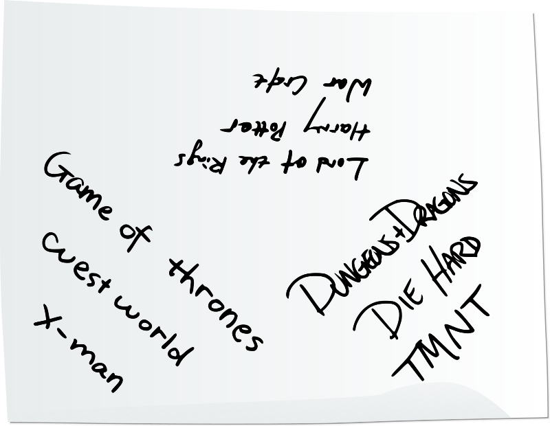

# A Thousand Faces of Adventure: Table Guide

*playtest version* VERSION DATE

*find latest version at https://1kfa.com*

*email sjb@ezide.com*

----

# The Pitch

There are thousands of games out there.

Why gather your friends around *this* one?

*A Thousand Faces of Adventure* offers a unique mix of drama, strategy,
and mystical storytelling. That's the promise, but it only reveals itself
through *playing*, not *reading*. So how do you draw your friends to the
table?

You know your friends best -- as you look over this list, think about
what they love, what excites them, and what they're looking for in their
next great adventure.

- **The Hero’s Journey at the Center**\
  Like the stories behind the best blockbuster movies and classic myths,
  your friends will play protagonists who must face adversity to transform
  themselves -- and their world.

- **Tactile Play that Feels Alive**\
  Players interact directly with cards and tokens, not just character
  sheets. Actions have physical weight, bringing the energy of a board game
  into a storytelling experience.

- **Play Your Favorite Universe**\
  Love a swords-and-magic setting from books, shows, or other media? *A
  Thousand Faces* is designed to support almost any fantasy world with
  minimal prep.

- **Dramatic Surprise Moments**\
  At the flip of a card, consequences explode into the scene. Everyone
  feels the tension and triumph at the exact same instant -- fast, shared,
  and unforgettable.

- **A True Game to Master**\
  Under the hood lie layered, interlocking systems. Players who love
  skillful choices, emergent strategy, and deep gameplay will find plenty
  to explore and perfect.

- **A Story You Build Together**\
  The world, the myth, the change -- all of it emerges through
  collaboration. No single player carries the weight. Every voice matters.

Every table will create a story no one else could -- a myth shaped by the
choices, triumphs, and heartbreaks you lived through together.

# Definitions: Players, Characters, the Table

**GM (Game Master)**  
The GM is a player who frames scenes, manages stakes, and guides the
story’s structure.

**Player**  
A player is anyone participating in the game, including the GM, though
sometimes “player” is used to specifically contrast with the GM.

**The Table**  
The Table is the collective group of players and GM, sharing
responsibility for the story.

**Narrative**  
The narrative is the evolving story built through events and descriptions
created by the group.

**Character**  
A character is a fictional persona who lives in the world of the story
and acts within it.

**PC (Player Character)**  
A Player Character (PC) is a character controlled by a player (not the
GM), and is a protagonist of the story.

**NPC (Non-Player Character)**  
An NPC is any character controlled by the GM to populate the world,
create challenges, or offer opportunities for the PCs.

## What is a roleplaying game?

In *A Thousand Faces of Adventure*, you and your friends will collaborate
to tell an improvisational, interactive story. It is built moment-by
moment through conversation, imagination, and shared decisions.

The story you create won’t be a carefully scripted novel. It doesn't need
to be high art -- it’s a living thing, shaped by everyone at the table.

## How to Make a Great Story

Imagine your audience is the inner children of everyone at the table.

What would thrill you if you were eleven years old again? Think of the
awe and wonder you felt watching a spectacular Spielberg movie -- or even
the scrappy, kinetic energy of a Sam Raimi film.

When it’s your turn to narrate, think about what might give your friends
a rush: action, suspense, twists, tension, triumphs!

Always remember: it's improv, not some blueprinted, pre-engineered thing.
**Have faith in your friends, and you are sure to delight at how the
emerging plot solidifies, and how real the characters become.**

## How Play Works

Play is a conversation. The GM and Players take turns imagining the
world, acting through their characters, and reacting to each other.

Sometimes the rules will chime in, asking you to answer direct questions,
flip cards, or move tokens.  But most of the time, you'll just be **saying
things**, **imagining**, and **building the story together.**

# Should You Read This Guide?

Yes. Everyone sitting down to play *A Thousand Faces of Adventure* should
read this guide.

---

*“Myth is the secret opening through which the inexhaustible energies of
the cosmos pour into human cultural manifestation.”*  
— Joseph Campbell, *The Power of Myth*

---

The *Player Guide* and *GM Guide* offer rules specific to the
responsibility you'll take on — whether you’re piloting a hero through
the world, or managing the narrative flow behind it. *This* guide is for
everyone. It describes how we listen, how we create, how we treat
silence, risk, and uncertainty. It’s the starting place -- the rulebook
that sparks the imagination and opens the world.

---

## What This Guide Does

- **Brings people together**\
  That’s why it opens with *The Pitch* — a shared starting point for
  excitement, tone, and expectations.

- **Equips everyone with tools**\
  The *Toolbox* gives practical techniques for pacing, collaboration,
  decision-making, and emotional rhythm. These aren't just for GMs — they
  work best when the whole table knows how to use them.

- **Provides the initial world-building activity**\
  The *Universe Creation* section helps every player contribute to the
  tone, constraints, and flavor of the world before the first card is
  flipped. Together you will create your orienting "north star" -- and the
  world it shines upon.

---

# Toolbox

The Toolbox is a collection of shared arts — quiet techniques that help
align and animate the table. Here you’ll find ways to speak with intention,
to listen like the world depends on it, and to step forward when the
silence asks you to. These are the tools that turn a group of players
into a fellowship, and a game into a living myth.

## The Rule Beneath All Rules

**You already know the most important rules**

**The Rule Beneath All Rules** comes before any mechanisms, moves, or
guidance. It’s the ground under the game: the recognition that *we are
people, sitting at a table together, playing a game built on 
conversation.*

> "We can easily imagine people amusing themselves in a language-game
> with imaginary objects."
> - Ludwig Wittgenstein, Philosophical Investigations

In classic RPG traditions, "Rule Zero" often gave the GM ultimate
authority. In *A Thousand Faces of Adventure*, we turn that concept
inside out. The Rule Beneath All Rules is a "zeroth" rule, but one that
puts everyone on equal footing. It says: before you are a GM or a PC,
you're friends, peers, and collaborators.

This is a game about mythic stories. But at the deepest level, it’s also
just a conversation. And conversation is something each of us begins
learning from the moment we can speak. Over the years, we learn—often
without realizing it—how to listen for pauses, how to take turns, how to
sense when someone needs space or wants to be invited in. We learn to
read body language, to avoid interrupting -- **or** *to* interrupt with
purpose and urgency. These small human calibrations are what make
dialogue flow.  And they’re the same skills that make tabletop
roleplaying sing.

The same things that make a conversation work -- **politeness,
turn-taking, yes-anding, bids for connection, respecting boundaries,
sharing the spotlight, grace, compromise, and listening well**
-- also make this game work. These are more-core-than-core mechanisms.

Like any conversation, you don't need permission to take a break,
to say "no thanks", or to check in with someone after a heavy moment. If
something’s not fun, weird, or hitting wrong, talk about it. That’s not a
disruption -- that’s part of the game.

Conversations can be surface-level, or they can be intimate, inviting the
exploration of deeper themes, the questioning of boundaries, and
offering opportunities for personal growth, for our heroes, yes, but most
impactfully, for ourselves. Just as with non-game conversations, it falls
to each participant to thoughtfully discern how much space the others at
the table have for deeper, more personal content. Practicing awareness
for individual comfort levels is paramount to ensuring a safe and
rewarding experience.

The game *is* a conversation. The rest of the rules build upward from here.

## Narrative Authority Waterfall

**Everyone creates the fun**

The **Narrative Authority Waterfall** describes how storytelling flows
around the table: from the Game Master (GM) outward to the players, then
back again—like a cascade. It should feel like a structured conversation
with a mild hierarchy. When the game calls upon the GM, they may take the
task alone, or instead invite the table into the current, to add their
own creativity, questions, or elaboration.  Everyone’s contributions are
always bound by the rules of the game, the solid basin of earth and rock
that shapes and contains the current.

This principle applies to all parts of the game—worldbuilding, roleplay,
mechanical resolution, and narrative development.

### The GM Has First Say

When called upon by the rules, or by the expectant silence of the players,
the GM speaks first. Their duty is to keep the story moving along according
to the Campaign Guide and to keep the pace of play steady.
It is the GM's privileged position to lead the creation of the narrative.
But this role doesn’t require narrative virtuosity or constant spontaneity.
It is completely acceptable to immediately throw it open to the table at
those moments, and simply facilitate.  What's important is that questions
about what’s happening, what’s at stake, what’s changing are answered
by *someone*.

### Contributions Flow from the Table

The GM invites others to add to the story at any moment: describing a
location, proposing a complication, imagining a cultural detail, or
building on what’s just happened. These additions are accepted through
**mutual assent** -- a shared sense that the contribution fits the
Touchstone List's setting, feels right, and respects the moment.

Players are encouraged to offer ideas, and GMs are empowered to accept,
adapt, or redirect them. This relieves pressure from the GM to carry the
creative burden alone. It creates space for GMs to *listen* as well as lead.

### The Rules Contain the Flow

All contributions—GM and player alike—must stay within the **boundaries of
the game's written rules**.
This ensures consistency, fairness, and the feeling that outcomes are
earned, not arbitrarily decided.

Whether it's interpreting a flip, introducing new character details, or
defining a new piece of lore, the contributions must:

 * Follow the structure laid out in the game
 * Feel true to the world of the Touchstone List
 * Honor what the mechanics allow or prohibit
 * Avoid overriding consequences already in play

The rules aren’t barriers to storytelling—they’re the frame that makes
shared creativity stable and meaningful.

By flowing within these boundaries, every idea gains structure, and every
twist earns its place in the story.

### Waterfall, Not Podium

The Narrative Authority Waterfall allows narrative responsibility to flow,
not pool. The GM provides guidance, but the table shapes the current. No one
needs to be brilliant on command. The rules provide structure. The group
provides the animating spirit. The story is something you all discover
together—through intention, response, and shared creative trust.

## Fictional Positioning

Fictional positioning is how the shared narrative constrains or enables the use of mechanics. It’s what tells you whether a move applies, what options are available, and how the outcomes land in the world.

If there’s no danger, you can’t “Defy Danger.” If your foe is an intangible ghost, “Mix It Up” might not work at all. The fiction isn’t decoration -- it sets the conditions for play. That’s fictional positioning.

See the Player Guide for the rules on Moves.

### A Shared Responsibility

Everyone at the table helps establish and maintain fictional positioning. That means:

* Describing what your character does, not just what move you want
* Noticing what’s already been established
* Tracking who has the high ground, who’s exposed, who’s watching
* Asking questions to clarify or enrich the fiction

If a move is triggered, you make it feel true in the fiction. If a move is *not* possible, the fiction should make that clear.

### Why It Matters

Fictional positioning tells the table:

* What moves are available or valid
* What kind of consequences are fair or obvious
* Whether a character has leverage, opportunity, or risk

It’s not just about triggering moves -- it’s about keeping the world consistent. If you’re clinging to a cliff, your options look different than if you’re standing at the edge. The fiction limits and enables everything that follows.

## Diegetic Dialogue

**Mechanical demands, immersive play**

Diegetic Dialogue is a technique that immerses you deeper in the game
world by using in-character role-playing to handle game rules and answer
the game's questions.

Instead of pausing the adventure and stepping outside the roles of
the heroes to address the mechanisms of the game, you may weave those
procedures directly into your in-character interactions.
By answering the game's questions and enacting its processes through
dialogue and roleplaying, you deepen immersion and make the world feel
alive.

For example, to answer "What is the ambiance of this ancient ruin?", you
might use one of these four voices to shape the tone and pace:

 * **Player Voice**: "This scene is all about mystery and the
   foreboding feeling of a powerful place, untouched for generations.
   Its secrets are covered in dust and cobwebs drape from every corner".
 * **Narrator Voice**: "The air hangs heavy with the scent of ages,
   the guide cautiously descends the stairs, tearing delicate strands
   of spider silk that drape across crumbling archways and statuary".
 * **Character Voice**: "Ugh, can't swing a cat without hitting a
   cobweb in this place. And it smells like… well, old stones and
   forgotten secrets.'"
 * **Character-to-Character Voice**:
   * **Player A (as Elara the Elf)**: "Cobwebs! Ptah! Do you sense
     anything, Kaelen? The air feels... dead."
   * **Player B (as Kaelen the Mystic)**: "Not death, but an
     unfathomable slumber. As if time itself has settled heavily
     upon these stones."

You can choose which voice to use at any time.  Player Voice is the most
straightforward, and reduces cognitive load, especially for new players.
Narrator voice is the default for the GM, and especially common when
setting up a scene.
Character voice enhances immersion, and Character-to-Character voice
elevates that feeling even further.

Character-to-Character voice can be used to *build up* answers to the
game's questions. When the game presents a question, 
use your character's dialogue to explore it and find the answer
interactively with other players.
Simply start an in-character dialogue contribution, and let your fellow
players follow suit. This method is a delightful mental juggling act,
embodying your character's personality while collaborating with others
to satisfy the game's needs.
Each line of dialogue becomes a building block, inspiring the next, and
guiding you organically toward a shared understanding.

There is no *best* voice. The players form the narrative together and choose
which voices to use, creating either a more forward-charging and
mechanical experience, or a more immersive and embodied one.
What do the players find most rewarding? What challenges do they want to
concentrate on? Diegetic Dialogue is a tool to be wielded to the table's
preferences.

Find the voice that fits, the one that enhances your group's enjoyment.
Whether you favor a direct, mechanical approach or a deep immersion,
Diegetic Dialogue is a versatile tool. Use it to
shape your game, remembering that even as your characters speak and
interact, the game's rules provide the framework for your shared story –
the silent voice of Destiny guiding your adventure.

## Answer the Silent Call

A Thousand Faces of Adventure requires players to represent a world of
danger, and characters driven to confront that danger. But moments of
uncertainty will arise, and occassionally the table falls silent.

* Players may hesitate when the next move isn't obvious.
* Characters may find themselves stuck between bad options.
* The GM may pose a call for action or sacrifice, and no volunteer rises.

In worlds of ancient magic, dangerous quests, and heavy choices, it is
natural for even the bravest heroes to pause, falter, argue, or wait too
long. That’s part of the drama.

**Answering the Silent Call** means resolving that pause -- boldly,
playfully, imperfectly.

### Practical Tools for the Silence

When faced with silence, players and GMs can:

- **Use Diegetic Dialogue**: Speak as your character would. Even small
  gestures like "I don't trust this," or "We must choose swiftly," can
  reignite momentum.
- **Act on a Spark**: Act on a half-formed idea. Trust that momentum
  will create clarity. "I step forward and speak for us."
- **Ask for Clarification**: "What are the consequences if we refuse?"
- **Frame an Inner Conflict**: "My character hesitates, torn between fear
  and duty."

If you’re the GM and silence lingers, offer a *question* rather than an 
*answer*. Questions invite players back into motion. Examples:

- **Explore the Hesitation**: Ask a player, "What does your character
  fear will happen if they wait too long?" or "Who in the group does your
  character look to for guidance right now?"
- **Prompt for Courage**: Ask, "What memory or oath gives your character
  the strength to act now?" or "Who would your character refuse to abandon,
  even if it meant danger?"
- **Focus on Bonds**: Ask, "Which ally does your character trust most in
  this moment, and why?"
- **Reveal Inner Conflict**: Ask, "What internal struggle is your
  character feeling at this crossroads?"
- **Offer a Temptation**: Ask, "What risky but tempting option flashes
  through your character’s mind?"
- **Lift from the Touchstone List**: Reintroduce an image, threat, or
  motif from the Touchstone List and ask, "How does this suddenly
  appear in the scene?"

Or if all else fails:

> **Suddenly, Ogres!**

Injecting a sudden Combat or Pursuit Scene isn’t a punishment—it’s a
return to motion. It reminds everyone that the world breathes with or
without them. The scene doesn't even need initial narrative consistency;
that will be for everyone at the table to later explain and incorporate
into the narrative.

### Encouragement in Uncertainty

Players should *play through* hesitation. Let characters express panic,
selfishness, or foolhardiness. Even choosing "badly" is choosing mythically.

Answering the Silent Call is not about knowing the perfect move. It's
about remembering that the world of the story is alive—and that you, as
players and GM, are its heartbeat.

When in doubt: step forward. Speak. Choose. Play.

## Ludic Listening

**Attend to signals for the *kind* of fun we want to have**

Ludic Listening is attentively observing player behavior to determine
what kinds of experiences, emotions, and story rhythms resonate with your
group in real time. It’s not about reading minds or surveying preferences
in advance -- it's about learning through play.

*Ludic* is Latin for "of or relating to play." Ludic Listening means
paying attention to how other players play -- and letting that shape how
you engage with the mechanisms and respond to the game's questions.

### What to Listen For

Players signal their preferences in many ways:

 * The kinds of questions they ask (“Is this a cursed place?” vs “How
   many guards are posted?”)
 * What they zoom in on (NPC relationships? Environmental detail?
   Item mechanics?)
 * What makes them lean forward, laugh, or get quiet
 * Whether they narrate boldly or hesitantly
 * Whether they seem to love solving puzzles, optimizing cards, roleplaying
   emotionally, or just throwing chaos into the mix

None of these are right or wrong. The key is noticing.

### How to Use It

When you notice a pattern of engagement, use it to pose or answer
questions:

 * A player lights up at a mysterious clue? Ask them to interpret what
   it means.
 * A player seems checked out during social scenes? Let the next Skull
   progress bar increment lead to combat.
 * They roleplay grief during a Rest scene? Revisit that grief at
   the next threshold.
 * A player keeps careful track of their upgrades, buffs, and inventory?
   Give them opportunities to flex those resources at a critical moment.

The narrative doesn’t have to obey the players, but it should respond
to them.

### A Word on Inconsistency

Sometimes players will shift what they want -- mid-session, or even mid-scene.
That’s human. They don’t need to be consistent to be valid. Your job isn’t
to guess right 100% of the time, it’s to stay curious and adjust.

If you’re unsure what kind of fun a player wants, ask them directly. Or
better yet: ask a question inside the fiction that lets them steer.

### Ludic Listening and Meaning-Making

Beyond entertainment, Ludic Listening can foster personal
resonance, reflection, and even catharsis. Players often bring their real
lives to the table -- intentionally or not. You can honor that by weaving
echoes of their internal worlds into the story.

If you know a player is struggling with control, give them a scene where
control is lost and then regained. If someone’s grieving, let them speak
through a character who bargains with death. If a player lights up when
their character is promised redemption, don't shy away from letting the
player sacrifice the character to be later resurrected.

Joseph Campbell identifies four functions of myth:

 * **Mystical** – evoking awe and wonder, helping players touch
   something beyond themselves.
 * **Cosmological** – showing the universe as a coherent, meaningful whole.
 * **Sociological** – reinforcing or re-examining the rules and roles
   of the group.
 * **Pedagogical** – guiding individuals through life’s stages and inner
   challenges.

When you Ludically Listen you’re enacting all four functions. The game
becomes not just play, but myth in action.

Wield this with honor and responsibility. The key is sensitivity. Never
force the moment. Never center someone's pain without permission. But if
they open the door -- you can walk through it with them.

Remember the Rule Beneath All Rules. Be mindful of the level of intimacy
appropriate for your friends at the table, and don't push into this
meaning-making territory if you're unsure.

### Ludic Listening Is a Superpower

Combined with tools like the The Rule Beneath All Rules and
Narrative Authority Waterfall, Ludic Listening lets a GM run the game with
responsiveness, not pressure. You don't need to be an oracle. You just
need to care enough to notice what excites your friends and follow where
that energy leads.

# Universe Creation

##Formatting Note

Throughout this section, you’ll see some text presented as blockquotes.

These are meant to be read aloud at the table — by the GM or any willing player — to introduce ideas, invite choices, or set the tone. Reading them word-for-word is an easy way to guide the group with confidence, but feel free to paraphrase if that feels more natural.
We'll call the person reading aloud the *reader*.

## 1. Decide on Campaign Length

Before you begin character creation or choose a setting, decide how long your journey will be:

- **One-Shot** – A single-session adventure.
- **9-Hour Campaign** – Three sessions, each around 3 hours.
- **30-Hour Campaign** – A longer story arc, played over multiple sessions.

This choice will affect how quickly characters grow and how tightly scenes are structured. Details of how they differ are presented in the GM Guide.

---

### 2. Gather Game Components

The GM sheets,  Character sheets, and cards will be different based on the length of the campaign.

[TODO: explain how they're labeled / organized / where to download from]

The GM sheet tracks points and other key info.  For the Universe Creation activity, you will need the GM sheet and a blank piece of paper.

{ width=7cm }

### 3. Establish Touchstones

To create a setting everyone is excited about, the table builds a **Touchstone List** — a collection of references from pop culture that will shape the world’s tone, themes, and logic.

With the blank sheet of paper in the middle of the table, say this to your group:

> Before we start an adventure, we need to figure out what kind of world your characters come from.\
> We'll go through a 3-step process to build what's called a Touchstone List.\
> This will help define the setting and give us something to consult when your characters push the envelope and we ask "is that even possible in this world?"

---

#### Step 1: Brainstorm Titles

Ask everyone to grab a pen and write down a few titles from pop culture.

> Everyone, grab a pen or pencil and write a few titles from pop culture on this piece of paper. Think of books, movies, games, comics and shows whose settings inspire your imagination. Think of ones where you've imagined yourself inside those stories and thought about what decisions you would have made if you were those characters.
>
> Don’t overthink it, and don’t criticize or reject anyone’s title.\
> This is pure brainstorming — let ideas flow freely.\
> We’ll stop when everyone has added a few.

{ width=7cm }

---

#### Step 2: Narrow the List

Review the brainstormed titles together.

If some titles are drawn from genres not supported by the rules — for instance, centered on machine guns or interstellar travel —  explain that while *themes* may still inspire us, *setting details* from those titles might not work well.

This game works best with PCs who start off **scrappy** — not arriving swollen with immense powers, privilege, or status, but those who chafe against their current limitations in the world, and who will soon be daunted by the adventure they are called to. So be mindful of the superhero genre. PCs in this game have gifts that make them stand out, but at the start, they are not yet heroes, let alone, super-.

The final guidance before narrowing begins: the titles that are eventually chosen should be known to all the players, so if a title is not recognized by someone at the table, that is a mark against including it.

Then say:

> For step two, we’re going to narrow it down.\
> Each of us will take a turn circling **one** title on the list.\
> You can circle your own, or someone else’s — but only choose one, and don’t circle one that’s already been chosen.

{ width=7cm }

If more than three titles are circled, the GM has the privilege of selecting a final set of three.\
These become the **Touchstone List**, and should be copied onto the GM Worksheet.

The "Touchstone List" may be consulted when the table needs to make a judgment about whether facts being narrated cohere to the  universe you co-create. It can also be used to simply make calls on whether a PC's attempt at something is *uncertain* or *impossible* (remember, the GM only calls for flips when the outcome is uncertain).

Use the Touchstone List to ask: “Did anyone in _ do something like this?” (Fill in one of the titles from your list.)

It’s also something to consult for what’s not special. You don’t need to adjudicate actions taken by PCs if similar actions are glossed over in the Touchstone material — like travel, daily meals, or how a sword might be made of lasers.

The Touchstone List is also an early way that players can engage in Ludic Listening. What more do you know about your co-creators now that you’ve seen how they contributed to and interacted with the list? What are you becoming curious about?

---

#### Step 3: Set Expectations

The reader presents the Touchstone List:

> This is our "Touchstone List": [read the titles]
>
> Imagine this mashed-up universe.
>
> What kind of world could mash up pieces of each circled title?
>
> What palette of colors shines in the brightness of day?  What hues swirl in the night sky?
> What are its dominant features?
> What secrets lie hidden in the small places?
> What folk live there? Do their children play happily in the sun?
> What monsters lurk in the darkness?
> What weakness do the ambitious and powerful exploit?

These questions don’t need to be answered procedurally — they're here to stir the imagination. But if the table does start imagining out-loud, keep that discussion going for as long as it is productive.

The reader closes out the Universe Creation activity by hanging this in the air:

> Finally, who will *you* be in this world?
>
> *A Thousand Faces of Adventure* is a game about a group of scrappy
> adventurers who grow in power as we play.
> Your character will begin with gifts beyond the ordinary, but they'll
> still need to fight, suffer, and strive to transform into the hero
> Destiny demands.

# Congratulations

You’ve completed the first step of *A Thousand Faces of Adventure*: creating your shared universe.

This world will host the journey you are about to begin together.

Next, turn to the **Player Guide** to create your characters — the scrappy heroes who will carry your story forward.

