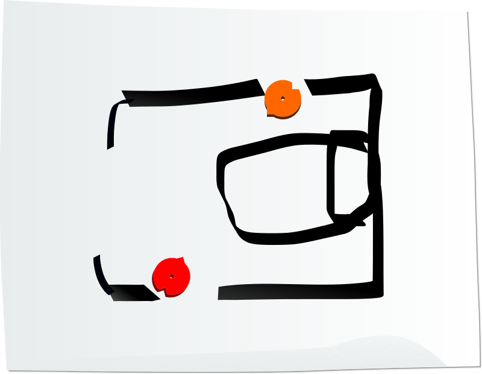

# First-time Players

To make your job of teaching the rules easier, this guide has
**scripts**. The scripts are written to be read by you to the players
at the table.

> Scripts are formatted like this.

If there is a player at the table who has never played A Thousand Faces of
Adventure before, read the Start Script and play Sarukkan's Chamber.

## Start Script

> Hi everyone! We're going to play A Thousand Faces of Adventure.
> This is going to be really fun, I'm glad you could join me for this!
> I'm reading
> directly from a script that was designed to get us started fast, by
> going over just enough of the rules for our first session, so please
> pay attention now so we can get to the fun of the game quickly!
> 
> A Thousand Faces of Adventure is a *narrative* game.
> 
> It's a storytelling game where we all collaborate and tell the story
> together.
> 
> I'm going to be the GM (it's short for Game Master), so I'm going
> to be responsible for the events in the world and the side characters
> (they're called NPCs or Non-Player Characters).
> 
> Each one of you is going to play a role, kind of like an actor does.
> You're going to control one character. You get to tell us everything
> they think and everything that they say and everything that they do.
> 
> Imagine we're making an awesome adventure movie with swords and magic.
> You're the actors just making stuff up as you go, and I'm a combination
> of director and cinematographer, trying to fill the story with excitement
> and drama and also deciding how the scenes go together and where the
> camera cuts to next.
> 
> But let me pause for a minute and get specific about what I mean by
> "you decide everything your character *does*".
>
> You can't just say "My character Tyrion runs up to the bad guy and
> punches him in the head and his head goes flying off".
> You *can* say "My character runs up to the bad guy and punches him in
> the head", then, because there's uncertainty about the outcome, and the
> degree to which Tyrion succeeds would matter in the story we're creating,
> it's my job as the GM to say you've *triggered a move*.
> The game rules will then answer the question "does it happen?" and
> tell us if the bad guy's head actually goes flying off.
>
> When a *move is triggered*, it's time to use the cards and dice to see
> what happens next. Triggering moves is a lot of fun. It's fun to succeed
> and it's fun to fail, because even in failure, new exciting stuff starts
> happening. When you trigger moves, you impact the narrative, consequences
> happen, and we're all going to get surprises when cards flip and dice roll.
>
> Besides face-punching, some other questions that might be answered by
> triggering moves are:
>
>  * Will the old librarian agree to hide me from my pursuers?
>  * Do I see the giant spider web in my path?
>  * Is there another way out of this burning tavern?
>  * Will this magical scepter work just one more time?
>
> The game isn't all triggering moves though.

Distribute a character sheet to each player.

> Most of this game is talking. That's why "Say Stuff" is written so boldly
> on the character sheets. I'm going to be asking you questions, you'll
> probably have lots of questions for me, and we're going to put everything
> together to make an epic story. It's gonna have adventure, battles, chases,
> discoveries, and magic.
>
> It's a fantasy story, so think dangerous, and take risks.
>
> Be true to your character's personality. Remember it's sort of like acting.
>
> Your character will start out as a scrappy adventurer, and rise in power
> to become a hero. Or villain. Or maybe they'll just die in the attempt.
> And maybe they'll be resurrected after that.
> 
> Each session will be about 3 hours.  We might spend a long time bouncing
> ideas off one another and dealing with each consequence in an
> improvisational way, or we might engage in a long battle with lots of dice
> rolling and card flipping.
> 
> There's no predetermined story, we're all in this together, and we're
> going to play to find out the details of what happens.
> 
> This first session will need about 40 minutes of preparation, though.
> Ten minutes has already gone by with this speech (it's almost over).
>
> Next, we're going to play Sarukkan's Chamber, a pre-made adventure for
> you to get the hang of the rules. It will be short. I'll set a timer
> for 10 minutes and end Sarukkan's Chamber when it goes off.
>
> Then we'll take 10 minutes to create a Touchstone List for our game.
>
> Then we'll do 10 minutes of Character Creation.
>
> And then, the adventure begins.
>
> Let's start!

## Your Deckahedron

Give each player a Deckahedron.

(Print-and-play and mobile app versions are available at www.1kFA.com)

> Here's a stack of 20 cards, it's called a Deckahedron.
> You'll use this to see how successful your character is when moves are
> triggered. It also represents your character's Stamina points, which
> we'll discuss later.
>
> Notice the 4 different colored symbols on the edges. They're named
> Anvil, Blades, Crown, and Dragon. When you *trigger a move*, I'm going
> to instruct you to flip the top card of your Deckahedron, and we'll see
> the result on the flipped-over side. There are 4 possible results:
>
> * ✔✔✔  : this means you succeed at the thing you tried
> * ✔✔  : this usually means something good happens, but maybe with a downside
> * ✔  : this usually means something "ok", or not-so-good happens
> * ✗ : this usually means that I get to say what happens and make my own move
>
> When I ask you to flip, I'm going to say something like "flip Anvil"
> or "flip Blades". That means you find the result on the edge that has
> that symbol.
>
> When you flip it over, please put it down in a way that everyone can clearly
> see the result. Try to orient your cards consistently so that we don't get
> confused about what your result is.
>
> Let's try it: everybody put your Deckahedron on the table and flip Blades.

Step the players through "flipping Blades" using the instructions in the
[Player's Guide](mod_guide_player.md)

Make sure each player understands how to execute a flip before you proceed.

## Your base moves

Give each player a Move Booklet

> Here are the basic moves.  You don't have to read this booklet unless you
> want to. I'll point out moves when they're triggered and we can read them
> together or you can just let me apply them.
>
> It's hard for me to do everything though, so the more you can participate,
> reading the text of your moves, and suggesting narrative outcomes,
> the smoother the game will run. Once we've had some practice, playing the
> game will feel like a collaborative story we're creating together.
>
> The move you'll be triggering the most will probably be Defy Danger, that's
> why it's on the first page. The moves in the back of the booklet are
> "downtime" moves which we won't need until much later.
>
> Let's go through an example of flipping Defy Danger. The move reads from
> top to bottom. First we would establish in the fiction how your character
> is defying danger, are they using their Str, Dex, or Int? Once that's
> decided, we would look at your character sheet to see what value that
> attribute is.  Let's say they were diving to the ground to avoid a spear
> that was thrown at them. That's Dex. Let's say their Dex was rank 3, or
> "Crown". So that's the side of the card we're going to look at.
> Flip your top card.  What result do you see on the "Crown" side?
>
> [Take the result, and if it is ✔s, ask the player to help you interpret
> a potential outcome using the Defy Danger move. If it is ✗, tell them how
> it would be your turn to make a GM move]
>

## Sarukkan's Chamber

You are going to be running a short tutorial game for 2-3 players. One will
control a female protagonist character, and one will control a male
protagonist.  If there is a third player, they will control a prisoner that
the other two characters discover in the first scene.

First, you will need names for the characters and setting of Sarukkan's
Chamber. Ask the players these 3 questions. This is an improvisation exercise.
Its purpose is to get the creative juices flowing and to signal to the
players that they have input over the story.

Ask the players for the name of a medieval fantasy city name.
Simply write down the answer. That will be the name of the setting.

Ask "What's a store where women buy clothing?". This time, twist the answer
a little to create the female protagonist's name. (eg, "Forever 21" might
turn into "Forva", "The Gap" into "Gappalina")

Ask "What's a city in Europe?". Again, twist this answer to create the male
protagonist's name with that. Stretch your creativity muscles.
(eg, "Paris" might turn into "Croissant", Maybe rearrange "London"
to "Donalo")

    This mini-game is a GM tool. Often, the players will look to you to
    come up with names of characters or places on the fly. Instead of
    sitting still and thinking for 30 seconds, you can throw some simple
    [lateral questions](#lateral-questions) like these back at them.

Ask each player to write down the names you just came up with on their
character sheet.

Next, instruct the players to fill out the attribute boxes on their
character sheet like so:

 * Both characters have 1 Intelligence (Anvil)
 * The female protagonist has 3 Dexterity (Crown) and 2 Strength (Blades)
 * The male protagonist has 2 Dexterity (Blades) and 3 Strength (Crown)

### Introduce Sarukkan's Chamber

Begin narrating the set-up.

> [Addressing her]
> _ (female protagonist), you are an acrobat.
> Your troupe of performers set off on the road to perform in the big
> city _ (city name). You were really excited, because your big brother lives
> there, and you haven't seen him since you were 13, and that was 10 years
> ago.
> 
> But your excitement soon turned to horror and despair. On the road, your
> troupe was overrun by masked horsemen. They attacked fiercely and without
> mercy. Your caravan guards fought bravely, but were outnumbered. You and
> your companion, Gwendolyn, were captured.
>
> [Ask the player]
> What was Gwendolyn's role in the troupe?
>
> In the chaos, you remember one phrase uttered by the marauders,
> "Deliver them to Sarukkan's."
>
> You endured days of travel shackled in a box, Gwendolyn tried to
> comfort you both by singing a song from her past,
>
> [Name the song, or do an impression of Gwendolyn singing a few bars.
>  try to make the song have something to do with Gwendolyn's role in
>  the troupe]
>
> Finally, you found yourself imprisoned in a small, dark, musty cellar
> room. Windowless, the only illumination is whatever lamplight filters
> through the cracks of the door.
>
> You could hear sounds from the hallway though, and on the second day,
> you heard Gwendolyn being removed from her cell. After that, only silence.
>
> [Dramatic pause]
>
> [Addressing him]
> _ (male protagonist) you are a thief-catcher.
> You're not too bright, but your boss, Gandlin, has taken you under his
> wing and taught you street wisdom. Merchants employ him to recover stolen
> valuables or they pay for simple retribution against the pilfering
> scoundrels. You provide the muscle. Gandlin provides the brains.
> He sniffs them out, you beat 'em up, and each of you shares in the reward.
>
> That's how it had been. Gandlin has now gone missing.
>
> He was investigating a series of thefts from
> private homes. There was some pattern to it -- artifacts or books taken,
> but no smashed windows or doors. The mystery of it had Gandlin
> obsessed, working sometimes until dawn.
>
> [Ask the player]
> What was Gandlin's favourite breakfast food?
>
> One dawn it was Gandlin that was taken.
> 
> [Describe the scene of Gandlin's disappearance, using the favourite
> breakfast food to paint the picture]
> 
> Following the trail of clues, you came to the locked gate to the yard
> behind Sarukkan's estate. Sarukkan was a powerful player in _ 's (city name)
> noble circles, but not much was known of him.
> 
> After jumping the wall, you didn't get much farther before you were
> surprised from behind and knocked out, waking up in a tiny, dirt-floored
> room in the cellar.
> 
> [Addressing both]
> But tonight, something changed. It was noisy tonight. Footsteps and
> conversations could be heard upstairs. It was some kind of party.
> And there were no guard patrols of the cellars. In parallel, but
> without bumping into each other, you both used the lapse to escape.
> 
> You freed yourself from your cell.
> 
> In some dark corner you grabbed a reveler and took their elaborate
> costume and mask for a disguise. Tonight must be a masquerade ball.
> 
> With no easy opportunity to exit, you kept evading attention by going
> upstairs, until you reached the third floor.
> 
> From different doors, you simultaneously enter an empty bedchamber.

At this point, take out a blank sheet of paper and draw this
incomplete map of Sarukkan's Chamber. Then drop a couple tokens
representing the players' characters on the paper. If you don't have
tokens, you can use coins or nuts or glass beads, anything handy.

{ width=7cm }

This map will let everyone know roughly where their character is
positioned. You don't always need this visual aid, but Sarukkan's
Chamber is a tutorial, so it's good to have some practice.

When you draw out a map of an environment like this, be very loose
and fast. Leave blanks. Rely on the imagination of the players to
fill in the details unless there's something whose position is important
to draw.

For example, a player might tell you that they look around the chamber for
an exit, and you might say "There's a large window at the front of
the room , but it's framed in iron. The ironwork looks old though, maybe
it's no longer sturdy?". That would be a good point to draw a few lines
to show where the window is in the room.

> You turn from the door you carefully and silently closed to see across
> the room, an apparent party guest in full wardrobe.
> 
> [Dramatic pause]
> 
> One last thing, with these masks on, you don't know this, but you're
> brother and sister.
> 
> What do you do?

Start a timer for 10 minutes.

This last question "What do you do?" is very important.

When you describe a situation, always end with this kind of prompt. Portray
a situation that demands a response. Always.

## But now what should I say?

> Where's the *rest* of the script?

If this is your first time being a GM, you might feel intimidated. That's
ok. Remember, this is not high art, this is improv. You are *playing* to
find out what happens.

Preparation is the watchword for first-time GMs.
Read the [Guidance](#guidance) section. Check out some
[examples](#examples) of how other GMs have run their games.

### Sarukkan's Chamber Details - take them or leave them

 * Luxurious canopy bed in the middle
 * Chamber is full of esoterica - bookcases and desks overflowing with books,
   sculptures, candlesticks, and votives
 * Chamber is empty of any adornments, the only feature is a bed and
   a precise circle of white powder in the center of the room
 * A window at the front of the room - an escape route?
 * An alarm triggers when a guard enters the room?
 * A creepy portrait of Sarukkan, whose eyes follow you as you move
 * A trap-door under the bed - where does it lead?

### Goals for Sarukkan's Chamber

Ideally, Sarukkan's Chamber should demonstrate what kind of game
this is.

A Thousand Faces of Adventure creates plot questions for players to answer:

 * Will the brother & sister who haven't seen each other in a
   decade discover each other's identities?
 * Will the brother & sister escape Sarukkan's imprisonment?
 * Will the brother & sister rescue Gandlin or Gwendolyn?
 * (3rd player variant) Will the reluctant guard choose to obey an
   evil master, or rebel?

A Thousand Faces of Adventure creates tension and action:

 * Potential combat against guards or kitchen staff or Sarukkan himself
 * Potential pursuits involving outsmarting or outmaneuvering pursuers
 * Potential to hatch plans and use available resources to set traps or
   defy traps that been set for them
 * Potential to use stealth and social manipulation with guards and
   party guests

Your group's playing of Sarukkan's Chamber doesn't have to *all of this*,
the players will make choices that surprise you. If they surprise you with
something unlikely or risky, be ready to declare that moves are triggered,
but also be ready to say "Yes, and..." to their crazy ideas.

It should also help teach the rules.

 * Work in an opportunity for each player to do a Deckahedron flip
 * If a player flips an XP card, that's an opportunity
   to explain how they earn XP
 * If a player flips the Critical Success card, that's an opportunity
   to explain the Critical Flip move
 * Ideally there will be a combat scene.
   (see the [Combat guidelines](#creating-a-combat-encounter))
   Try to get the PCs to attempt *Mix It Up* or *Volley*
 * When a PC loses Stamina, explain that losing 10 Stamina points
   will mean the character is incapacitated
 * The brother & sister may trigger *Discern* and *Unfold Mystery* moves
   when they try to reveal each others' identities
 * The *Discern* move often comes up when having a look around Sarukkan's
   Chamber itself.
 * If any player-versus-player combat happens, remember to use the PvP
   combat rules

It should also be a warm-up for your GM skills.

 * Remember: "Yes, and..."
 * Move the spotlight - be fair, let all players impact the narrative
 * Manage the pace. Let the PCs have some dialogue, but when it feels like
   they're hesitating, push quickly to the approaching dangers.
 * Get some guards into the room for a quick fight.
 * As the PCs gain the upper hand, show signs of another threat (maybe
   the wizard himself approaches - it's ok to tell the story of what's
   happening *off-camera*)
 * Play Sarukkan's Chamber *honestly*. Set the stakes the same as you would
   when you play a campaign
 * Observe your players for signals about what kind of fun they enjoy

After Sarukkan's Chamber, the players should now understand how the
Deckahedron works with character attributes to produce results that affect
the narrative. Ask the players if they get it, and explain again if there's
still any confusion.

### After the timer goes off

When the 10 minute timer goes off, you have a choice.

Take a look at your friends, are they having fun? Are they smiling, are they
looking at you eagerly to see what happens next, are they bantering with
each other about what actions to take, are they having in-character dialogues?

Sarukkan's Chamber is intended as a 10-15 minute tutorial, but if it seems like
everyone wants more, you can keep it going.

Ask the table if they want to keep going with this scenario. If not, just
skip forward to [Begin a Campaign](#begin-a-campaign).

But if they do want to continue, add in the next layer of rules before
jumping back into the action:

 * Any character still wearing their elaborate costume should get a card
   entitled "Costume". This is an Item card.
 * If the characters have acquired any significant items during their
   adventure so far, also make Item cards for those.
 * The characters do not get any Pack cards, as they were just prisoners

### Sarukkan's Chamber 3rd PC variant - The imprisoned guard

If you've got a 3rd player at the table, add a guard character.

Add another 5 minutes to the timer, so now Sarukkan's Chamber will end
after 15 minutes, not 10.

Ask "What's a domestic brand of beer?". Use that to create the 3rd
character's name. The guard can be any gender, has 3 Int, 2 Str, and 1 Dex.

Let them know that they'll get introduced about 5 minutes into the story.

After the first two PCs have had a chance to orient themselves to their
surroundings, and maybe have a dialogue with each other, introduce the
3rd PC

> [Addressing guard]
> _ (guard), you are a guard, but also a prisoner awaiting your doom.
>
> You were the newest hire in Sarukkan's staff, but you didn't even get to
> collect a week's wage before thing went sideways. Even on day one, you
> noticed some sketchy stuff going on around here.
>
> Your supervisor, Yogran the Rat had assigned you the simple duty of yard
> patrol, and when you passed by the cellar you could swear you heard the
> sounds of women crying. Yogran sternly rebuffed the complaint you made,
> and then he set you up.
>
> [Ask the player]
> What employee offense does Sarukkan have zero tolerance for?
>
> [Describe the way Yogran the Rat set up the player's character using that
> offense]
>
> The last thing you remember is being told that your soul will be used
> as fuel in a dark ritual on the night of the ball.
>
> You awaken now in Sarukkan's chamber, roused from your sleep by the sound
> of two voices.  You can speak, but your arms and legs are bound.
>
> [Ask the player]
> Where in the room are they storing you?
>
> What do you do?

